# AI Cohort Interview — Technical Architecture

**Status:** source-of-truth for the implementation on branch `interview-agent-2.0` as of 2026-08-29.
**Scope:** the AI Cohort milestone interview (`DAY_15` / `DAY_31`) at `/program/cohort-interview/[blueprint]`.
**Method:** every node, file, function and edge below was read from source. Anything the code does not do is marked **NOT IMPLEMENTED** or **PLANNED / FUTURE**.

> **What this is not.** The legacy *program exit interview* (`src/features/program/interview.ts`, `src/app/actions/program-interview-actions.ts`, `/api/program/interview/session`) is a **separate, older system** that uses the OpenAI Realtime API. It shares no code with the graph documented here. The general 60-day-challenge interview at `/app/interview/page.tsx` is a `redirect("/program/dashboard")` stub — its domain modules (`candidate-context.ts`, `challenge-context.ts`, `resume-context.ts`, `question-rules.ts`, `question-generation.ts`, `evaluation.ts`, `mock/`) are on disk but **not on any production path**.

---

## 0. One-paragraph orientation

A candidate speaks. Audio goes to `/api/interview/stt`, comes back as text, and is submitted through `submitInterviewAnswerAction` — the same Server Action a typed answer uses. The service reloads the frozen plan and the authoritative state from Postgres, and hands one turn to a **LangGraph** graph of **11 nodes**. Exactly one node calls a model, and that model may only *report what it saw*; it may not choose to escalate, may not score, and may not write the question. Deterministic modules (`policy.ts`, `depth.ts`, `state.ts`, `target-planner.ts`, `coverage.ts`) decide what happens next. Evidence is persisted per question (and per escalation rung). At the end, `finalizeInterview` computes every number in pure arithmetic, one LLM call writes prose that must cite real answered question ids, and the assembled document is validated and stored.

---

## Table of contents

1. [Diagram 1 — Complete end-to-end flow](#diagram-1--complete-end-to-end-flow)
2. [Diagram 2 — LangGraph node-by-node flow](#diagram-2--langgraph-node-by-node-flow)
3. [Diagram 3 — Adaptive decision flow](#diagram-3--adaptive-decision-flow)
4. [Diagram 4 — Conversational planner](#diagram-4--conversational-planner)
5. [Diagram 5 — Curriculum / candidate context](#diagram-5--curriculum--candidate-context)
6. [Diagram 6 — Evidence + scoring](#diagram-6--evidence--scoring)
7. [Diagram 7 — Report generation](#diagram-7--report-generation)
8. [Diagram 8 — Voice flow](#diagram-8--voice-flow)
9. [Diagram 9 — Persistence](#diagram-9--persistence)
10. [Diagram 10 — Complete single-turn trace](#diagram-10--complete-single-turn-trace)
11. [Diagram 11 — Interview completion](#diagram-11--interview-completion)
12. [Node reference table](#node-reference-table)
13. [Non-graph components](#non-graph-components)
14. [State flow](#state-flow)
15. [Provider boundaries](#provider-boundaries)
16. [Security / safety boundaries](#security--safety-boundaries)
17. [Not implemented / planned](#not-implemented--planned)
18. [Architecture principle](#architecture-principle)

---

## Diagram 1 — Complete end-to-end flow

Every box carries its real file. `LangGraph` is expanded in Diagram 2.

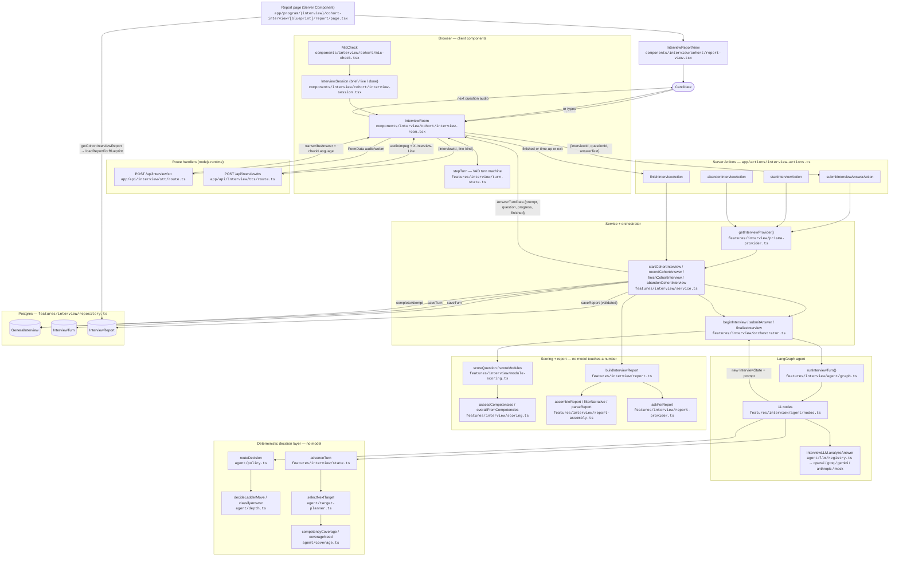

**Notes on the loop.** One graph invocation handles exactly **one** answer and holds no cross-request memory. The "loop" in the diagram is the candidate speaking again, which arrives as a fresh request. This is what keeps the database authoritative and the whole thing safe on serverless (`graph.ts` header comment).

---

## Diagram 2 — LangGraph node-by-node flow

**Graph definition:** `src/features/interview/agent/graph.ts` → `buildInterviewGraph(llm)`
**Node implementations:** `src/features/interview/agent/nodes.ts`
**Channels:** `InterviewAnnotation` (graph.ts) typed by `InterviewAgentState` (`agent/types.ts`)
**Runtime:** `@langchain/langgraph@1.4.10`, compiled once per `InterviewLLM` instance and cached in a `WeakMap`.
**Execution:** `graph.stream(initial, { streamMode: ["updates","values"] })` — `updates` yields the executed node names into `trace[]`, `values` yields the merged final state.

**11 nodes.** No node is optional; all are registered unconditionally.

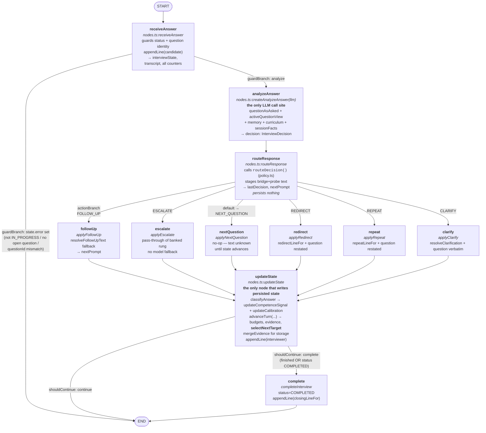

### Conditional edges, exactly as declared

| Edge source | Router function | Mapping |
|---|---|---|
| `START` | *(unconditional)* | → `receiveAnswer` |
| `receiveAnswer` | `guardBranch(state)` — `state.error ? "abort" : "analyze"` | `analyze → analyzeAnswer`, `abort → END` |
| `analyzeAnswer` | *(unconditional)* | → `routeResponse` |
| `routeResponse` | `actionBranch(state)` on `state.lastDecision` | `followUp`, `escalate`, `redirect`, `clarify`, `repeat`, **default** `nextQuestion` |
| `followUp` / `escalate` / `nextQuestion` / `redirect` / `repeat` / `clarify` | *(unconditional)* | → `updateState` |
| `updateState` | `shouldContinue(state)` | `complete → complete`, `continue → END` |
| `complete` | *(unconditional)* | → `END` |

### Important structural facts

- **There is no `planner` node.** The conversation planner (`selectNextTarget`) is invoked *inside* `advanceTurn` (`state.ts`), which is invoked by the `updateState` node. It is a function call, not a graph node.
- **`escalate` never invents text.** `routeResponse` stages `[bridgeText, probeText].join("\n\n")` from the policy's banked rung; `applyEscalate` returns `NEXT_QUESTION` with a null prompt if nothing was staged.
- **`redirect` / `repeat` / `clarify` never reach `advanceTurn`.** In `updateState` they take an early branch that only bumps `redirectsAsked` / `repeatsAsked` / `clarificationsAsked` and appends a transcript line. **No evidence is recorded and no question index moves.**
- **A graph-level throw is caught** in `runInterviewTurn` and returned as `{ ok: false }`, leaving persisted state untouched so the candidate can retry.

---

## Diagram 3 — Adaptive decision flow

This is the real precedence order inside `routeDecision` (`agent/policy.ts`), which is checked top-down. Note that REPEAT and CLARIFY are deliberately checked **before** relevance, because a meta-request shares no vocabulary with the question and would otherwise score as OFF_TOPIC.

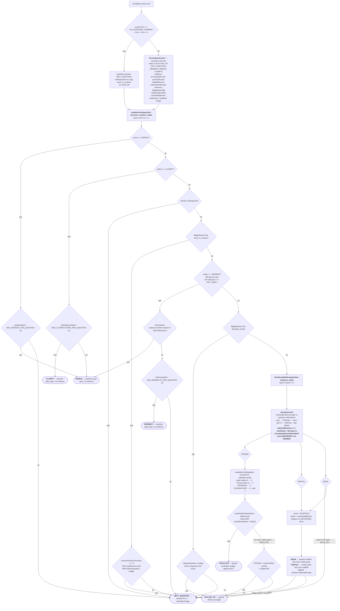

**The withheld actions.** `LLM_ACTIONS` (agent/types.ts) is `["FOLLOW_UP","NEXT_QUESTION","REDIRECT","REPEAT","CLARIFY"]`. `ESCALATE` and `COMPLETE` are **deliberately not proposable by a model** — escalation is the adaptive judgment (`depth.ts` owns it) and completion belongs to the budget machine (`state.ts` owns it).

---

## Diagram 4 — Conversational planner

**Files:** `agent/target-planner.ts`, `agent/coverage.ts`, `cohort/concepts.ts`, `cohort/curriculum-context.ts`, invoked from `state.ts:advanceTurn`.

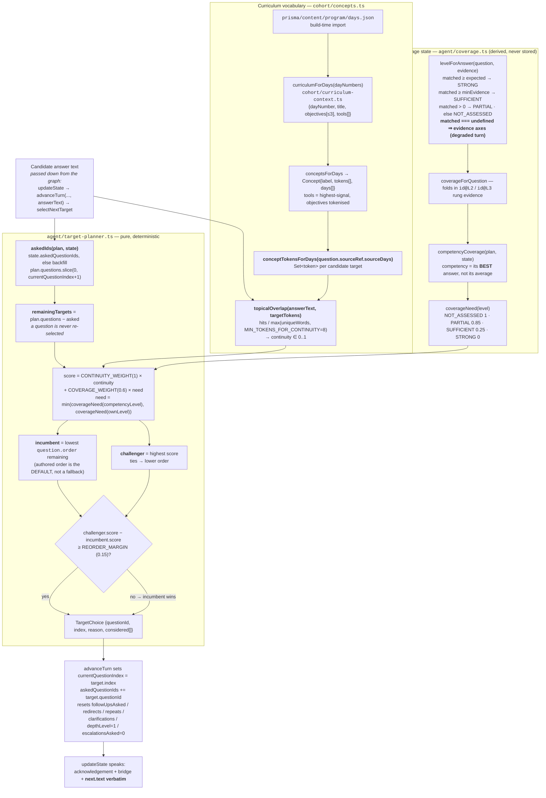

### The rule, stated plainly

> **The curriculum defines the assessment space.** `plan.questions` comes from the fixed bank for the blueprint (`cohort/question-bank.ts`), scope-asserted at module load, again at plan time (`planner.ts:assertWithinScope`) and a third time at scoring (`module-scoring.ts:assertScopeIntegrity`). The planner can only ever choose **from inside that set** — it cannot invent, widen, or reach outside `plan.questions`.
>
> **The candidate's answers influence the path.** Continuity is measured against the curriculum's own vocabulary, so a candidate who volunteers "chunking" is pulled toward the target that assesses chunking.
>
> **The day number is not the conversational target.** In `concepts.ts` the day is explicitly a *lookup key* only; the topic travels forward. `grounding.ts` makes the same choice for spoken text — it says "In your Retrieval Engine work you pushed rag.py —", never "for Day 11".

### What is *not* in the planner

- **Concept-level coverage is NOT IMPLEMENTED.** Coverage is tracked per **competency** and per **question id** (+ rung), never per concept. `mentionedConcepts()` is exported from `cohort/concepts.ts` but has **no call sites anywhere in `src/` or `scripts/`** — it is a dead export awaiting a concept-coverage feature.
- **Question order is reordered, question text is not.** Only `spokenText` may ever vary (grounding clause, model phrasing); `question.text` is the immutable grading target.

---

## Diagram 5 — Curriculum / candidate context

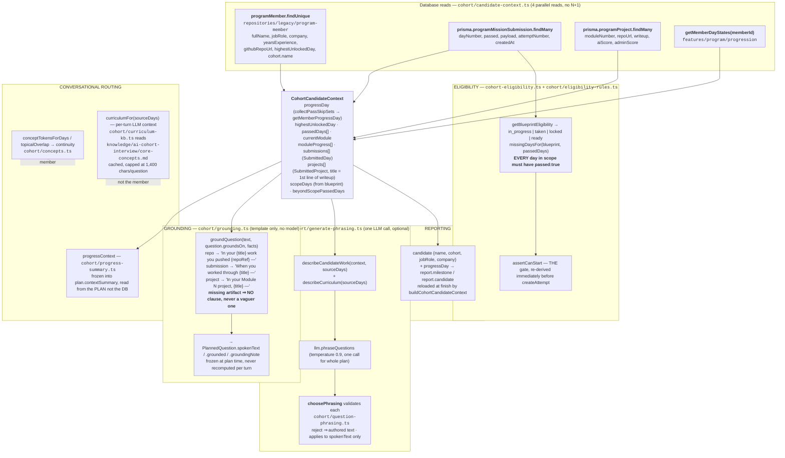

| Information | Used for eligibility | Used for grounding | Used for conversational routing | Used for reporting |
|---|:--:|:--:|:--:|:--:|
| `ProgramMissionSubmission.passed` per day | ✅ (`missingDaysFor`) | ✅ (`findSubmission`) | ⛔ | indirectly via `progressDay` |
| `payload.repoRef` | ⛔ | ✅ (`artifact: "repo"`) | ⛔ (phrasing prompt only) | ⛔ |
| `ProgramProject.writeup` first line | ⛔ | ✅ (`artifact: "project"`) | ⛔ (phrasing prompt only) | ⛔ |
| `progressDay` / `highestUnlockedDay` | ⛔ (never — availability ≠ completion) | ⛔ | ✅ via `progressContext` (tone only) | ✅ `milestone.progressDay` |
| `beyondScopePassedDays` | ⛔ | ⛔ | ⛔ | ✅ `beyondMilestone[]` (unscored) |
| `days.json` objectives/tools | ⛔ | ⛔ | ✅ continuity scoring + phrasing | ⛔ |
| `core-concepts.md` KB | ⛔ | ⛔ | ✅ per-turn LLM context only | ⛔ |
| `fullName`, `jobRole`, `company`, `cohort` | ⛔ | ⛔ | greeting only (`openingLine`) | ✅ `report.candidate` |

**Explicitly excluded from eligibility** (documented in `eligibility-rules.ts`): `cleanPassCount`, `progressDay`, `highestUnlockedDay`, `getMaxContentDay`, `cohort.endsAt`. Only "every scope day has a PASSED submission" unlocks a blueprint.

---

## Diagram 6 — Evidence + scoring

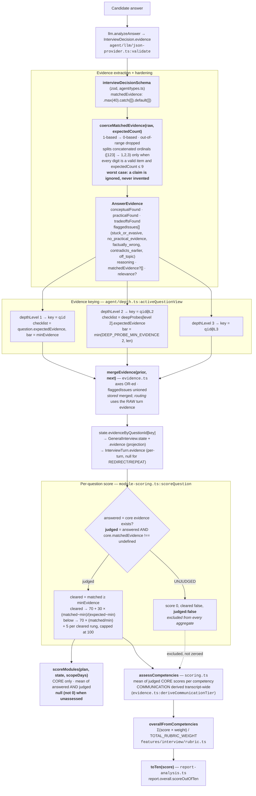

### Why `qid` / `qid@L2` / `qid@L3` are separate keys

An escalation rung carries **its own expected-evidence checklist**. Rung and core checklists are different index spaces, so merging them would make `matchedEvidence: [1]` ambiguous about which checklist item it refers to (`depth.ts:activeQuestionView` comment). It also fixed a real defect: judging a level-2 answer against the level-1 checklist scored a perfect answer as zero, because the candidate was being marked against a question nobody asked them.

`coverageForQuestion` reads rung keys back to upgrade coverage (`SUFFICIENT` + a cleared rung → `STRONG`), and `scoreQuestion` awards `DEPTH_BONUS_PER_RUNG = 5` per cleared rung.

### UNJUDGED ≠ MISSED

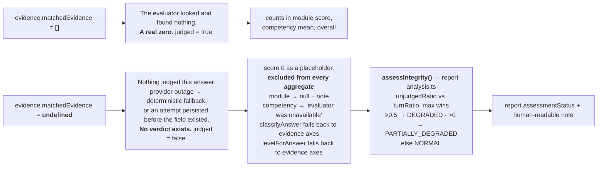

**A low score is not degraded.** `assessIntegrity` exists to keep the two apart: a candidate can answer poorly and receive a clean, valid, low assessment. Degradation means the *system* failed.

---

## Diagram 7 — Report generation

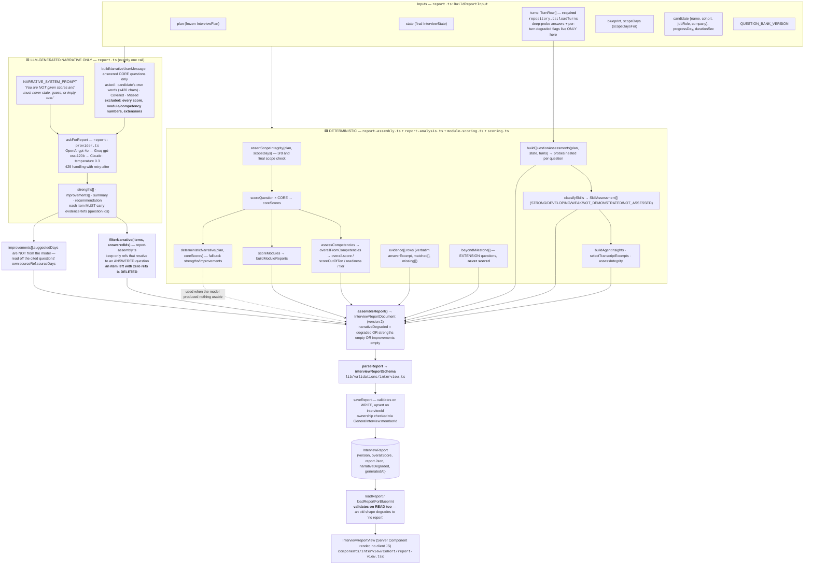

### The anti-hallucination / traceability mechanism

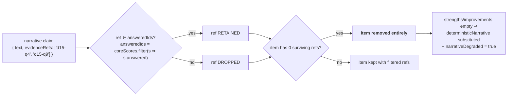

The model is shown the candidate's words and the covered/missed checklist. It is shown **no score at all**. Every number in the document — overall, out-of-ten, readiness, tier, module scores, competency scores, skill levels, agent insights, integrity status — comes from `report-assembly.ts` / `report-analysis.ts` / `module-scoring.ts` / `scoring.ts`, which import no provider and make no network call. **The model does not generate scores at any point in the system.**

---

## Diagram 8 — Voice flow

**The current architecture is TURN-BASED. Barge-in / Realtime is NOT IMPLEMENTED.** `voice.ts`'s header states the reason explicitly: Realtime would hand the conversation to the model, bypassing the question bank, the depth ladder and `policy.ts` — which are the things that make the interview comparable between candidates.

```mermaid
sequenceDiagram
    autonumber
    actor C as Candidate
    participant R as InterviewRoom (client)
    participant TM as stepTurn (turn-state.ts)
    participant TTS as POST /api/interview/tts
    participant V as voice.ts (server-only)
    participant STT as POST /api/interview/stt
    participant LG as language-gate.ts
    participant A as submitInterviewAnswerAction

    Note over R,V: SPEAKING — the interviewer's turn
    R->>TTS: { interviewId, line: "latest"|"waiting"|"retry"|"repeat"|<br/>"time_up"|"language"|"moving_on", variant }<br/><b>NO text field exists in the schema</b>
    TTS->>TTS: isTtsConfigured() → 503 if not
    TTS->>TTS: resolveInterviewMemberId() → 403 if not enrolled
    TTS->>V: resolveSpeakableLine(interviewId, memberId, kind, variant)
    V->>V: composes from DB (last interviewer transcript line /<br/>getCurrentQuestion) or from room-lines.ts constants
    V->>V: synthesizeLine(text, safetyIdentifier)<br/>OpenAI gpt-4o-mini-tts voice "ash" (INTERVIEW_TTS_VOICE)<br/>or Groq canopylabs/orpheus-v1-english if INTERVIEW_TTS_MODEL set
    V-->>TTS: audio/mpeg ArrayBuffer
    TTS-->>R: 200 audio/mpeg<br/>X-Interview-Line: base64(exact words)<br/>Cache-Control: no-store, private
    alt TTS unavailable / non-ok / timeout
        R->>R: window.speechSynthesis fallback (SpeechSynthesisUtterance)
    end
    R->>C: audio + progressive text reveal
    R->>R: phase = "speaking" — microphone closed

    Note over C,TM: LISTENING — the candidate's turn
    R->>R: startRecording() — getUserMedia + MediaRecorder(audio/webm;codecs=opus)
    R->>TM: one AnalyserNode RMS frame per animation frame
    TM->>TM: WAITING_FOR_SPEECH → CANDIDATE_SPEAKING → CANDIDATE_PAUSED<br/>SPEECH_ON_RMS 0.018 / SPEECH_OFF_RMS 0.012 / SPEECH_SUSTAIN_MS 180
    alt no speech for NO_ANSWER_MS (4.5s)
        TM-->>R: effect "nudge" → speak(WAITING_LINES[variant], "waiting")
    else second silence
        TM-->>R: effect "moveOn" → send(NO_RESPONSE_ANSWER)
    else silence for INTERVIEW_SILENCE_MS (10s) after speech
        TM-->>R: effect "finalize"
    end
    R->>R: stopRecording() → Blob

    Note over R,LG: TRANSCRIBING
    R->>STT: FormData { audio: blob }
    STT->>STT: <b>auth BEFORE reading the body</b> → 403
    STT->>STT: rejectAudioUpload(size, type) → 413 / 415 (voice-contract.ts)
    STT->>STT: WebM EBML magic check (1a45dfa3) → 422 on headless container
    STT->>V: transcribeAnswer(blob, filename, safetyIdentifier)
    V->>V: OpenAI whisper-1 (verbose_json) or Groq whisper-large-v3<br/>temperature 0 · TRANSCRIPTION_VOCABULARY_HINT · no language pin<br/>timeout 180s
    V-->>STT: { text, language } — 422 if empty
    STT->>LG: checkLanguage(text, language) — NON_LATIN_RATIO 0.3
    STT-->>R: { ok: true, data: { text, english } }
    alt english === false
        R->>R: speak(LANGUAGE_RETRY_LINE, "language") and re-open the mic<br/>(max MAX_LANGUAGE_RETRIES_PER_QUESTION = 1)
    end

    Note over R,A: SAME PIPELINE AS TYPED TEXT
    R->>A: submitInterviewAnswerAction({ interviewId, questionId, answerText })
    A-->>R: AnswerTurnData { prompt, question, action, finished, progress }
    R->>R: phase = "speaking" → loop back to the TTS step
```

### Voice facts

| Concern | Implementation |
|---|---|
| STT provider | `voice.ts:sttVendor()` — **OpenAI** if `OPENAI_API_KEY`, else **Groq**, else `null` (503). Model: `INTERVIEW_STT_MODEL` ?? `whisper-large-v3` (Groq) / `whisper-1` (OpenAI). |
| Why `whisper-1` not `gpt-4o-transcribe` | Documented in `voice.ts`: gpt-4o transcribe models reject `audio/webm;codecs=opus`, and only Whisper supports `verbose_json`, which carries the detected language the gate prefers. |
| TTS provider | OpenAI `gpt-4o-mini-tts`, voice `ash`. Groq `canopylabs/orpheus-v1-english` **only if `INTERVIEW_TTS_MODEL` is set** (the model terms require org-admin acceptance). |
| TTS fallback | **Client-side** `window.speechSynthesis` — same words, since they come from the server transcript. |
| Second conversational AI | **NONE.** There is exactly one reasoning path. STT and TTS are transport. `voice.ts` header: *"voice must not become a second interview implementation that drifts from the first."* |
| Barge-in / interruption | **NOT IMPLEMENTED.** The microphone is closed while `phase === "speaking"`. Turn ownership is a strict state machine (`turn-state.ts`). |
| Realtime API | **Not used here.** Only the legacy program exit interview (`/api/program/interview/session`) mints Realtime client secrets. |
| Answer cap | `MAX_ANSWER_MS = 180_000`; server `TRANSCRIBE_TIMEOUT_MS = 180_000`, `REQUEST_TIMEOUT_MS = 120_000` for synthesis; client `PROCESSING_WATCHDOG_MS = 90_000`. |

---

## Diagram 9 — Persistence

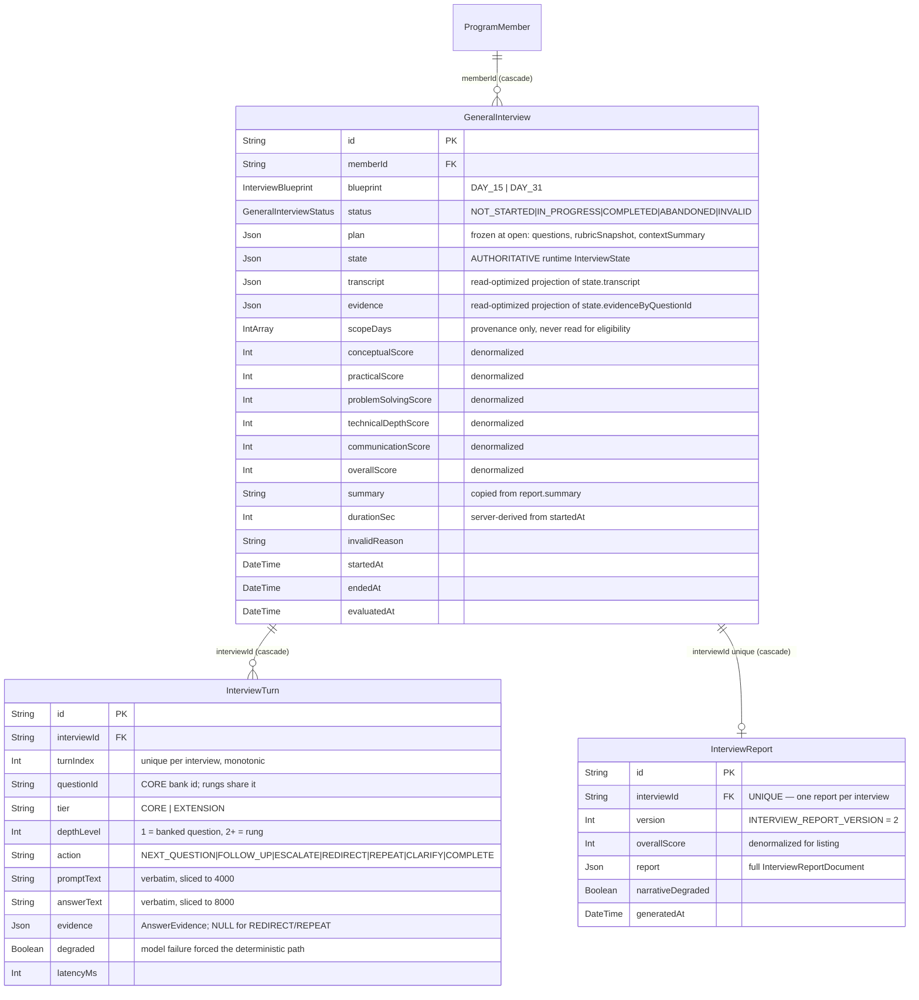

### Lifecycle and write/read validation boundaries

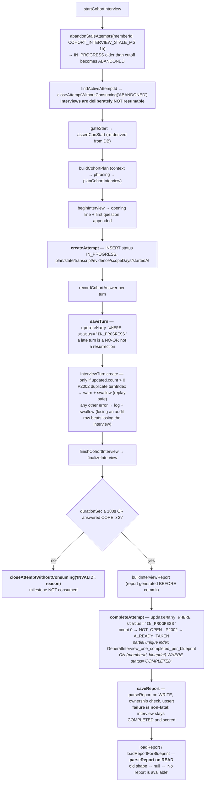

**Every repository function is scoped by `memberId` inside the `WHERE` clause**, so another member's interview id is indistinguishable from a nonexistent one.

---

## Diagram 10 — Complete single-turn trace

One candidate answer, end to end.

```mermaid
sequenceDiagram
    autonumber
    actor C as Candidate
    participant R as InterviewRoom
    participant SA as submitInterviewAnswerAction<br/>(interview-actions.ts)
    participant PR as prisma-provider.answer
    participant SV as recordCohortAnswer<br/>(service.ts)
    participant DB as repository.ts / Postgres
    participant OR as submitAnswer<br/>(orchestrator.ts)
    participant G as runInterviewTurn<br/>(agent/graph.ts)
    participant N as graph nodes<br/>(agent/nodes.ts)
    participant M as InterviewLLM<br/>(agent/llm/*)
    participant P as routeDecision<br/>(agent/policy.ts)
    participant D as depth.ts
    participant ST as advanceTurn (state.ts)<br/>+ selectNextTarget

    C->>R: speaks / types
    R->>SA: { interviewId, questionId, answerText }
    SA->>SA: resolveInterviewMemberId() — session only, no payload input
    SA->>SA: submitInterviewAnswerSchema.safeParse (zod)
    SA->>PR: answer(memberId, interviewId, questionId, answerText)
    PR->>SV: recordCohortAnswer(...)
    SV->>DB: loadActiveAttempt(interviewId, memberId, status IN_PROGRESS)
    DB-->>SV: { id, blueprint, plan, state, startedAt } or null → "no longer in progress"
    SV->>DB: nextTurnIndex(interviewId) [started, NOT awaited yet]
    SV->>OR: submitAnswer(plan, state, questionId, answerText,<br/>{ interviewId, blueprint, minutesLeft from persisted startedAt })
    OR->>OR: resolveInterviewLLM() (registry.ts, config only)
    OR->>G: runInterviewTurn(llm, RunTurnInput)
    G->>G: build InterviewAgentState from plan + persisted state<br/>maxFollowUps = followUpBudgetFor(openQuestion)
    G->>N: stream(initial, ["updates","values"])

    rect rgb(240,246,255)
    N->>N: <b>receiveAnswer</b> — status IN_PROGRESS? question id matches server?<br/>appendLine("candidate", text, question.id)
    alt guard fails
        N-->>G: error set → END → { ok:false }, persisted state untouched
    end
    end

    rect rgb(255,250,235)
    N->>N: <b>analyzeAnswer</b> — questionAsAsked(question, depthLevel)<br/>activeQuestionView → evidenceKey
    alt answerText === NO_RESPONSE_ANSWER
        N->>N: synthetic decision, NO model call
    else
        N->>M: analyzeAnswer({ question, answerText, priorEvidence,<br/>followUpsRemaining, recentTranscript, calibratedLevel,<br/>memory (memory.ts), curriculum (curriculum-kb.ts),<br/>sessionFacts, nextQuestionText, progressContext })
        M->>M: askJson → zod validate → coerceMatchedEvidence<br/>1 retry with STRICT_JSON_REMINDER<br/>on total failure: fallbackDecision (heuristics.ts, degraded:true)
        M-->>N: InterviewDecision (never throws, never rejects)
    end
    end

    rect rgb(245,240,255)
    N->>P: <b>routeResponse</b> → routeDecision(questionAsAsked, decision, counters, state)
    P->>D: classifyAnswer / decideLadderMove / escalationCeiling / nextScaffoldProbe
    D-->>P: LadderMove ESCALATE | SCAFFOLD | MOVE_ON
    P-->>N: PolicyOutcome { action, rationale, probeText?, probeLevel?, bridgeText? }
    N->>N: stage nextPrompt (ESCALATE = bridge + banked rung)<br/>log when applied ≠ proposed
    end

    N->>N: <b>branch node</b> followUp | escalate | nextQuestion | redirect | repeat | clarify

    rect rgb(240,255,244)
    alt REDIRECT / REPEAT / CLARIFY
        N->>N: <b>updateState</b> — bump only that counter, appendLine(interviewer)<br/><b>no evidence, no index move</b>
    else FOLLOW_UP / ESCALATE / NEXT_QUESTION
        N->>N: classifyAnswer(raw evidence) → updateCompetenceSignal + updateCalibration
        N->>ST: advanceTurn(plan, state, questionId, evidence, proposed, evidenceKey, answerText)
        ST->>ST: consecutiveStuckAnswers; ≥3 → END_INTERVIEW
        ST->>ST: budget checks → FOLLOW_UP / ESCALATE (depthLevel+1)
        ST->>ST: else <b>selectNextTarget(plan, next, answerText)</b><br/>continuity × 1 + need × 0.6, REORDER_MARGIN 0.15
        ST-->>N: { state, action }
        N->>N: mergeEvidence(prior, next) for STORAGE; raw evidence drove ROUTING
        N->>N: appendLine(interviewer, acknowledgement + bridge + next.text verbatim)
    end
    end

    N->>N: <b>shouldContinue</b> → "complete" → <b>complete</b> node (closingLineFor) | "continue" → END
    N-->>G: final merged state + trace[] of executed node names
    G-->>OR: { state, action, prompt, questionId, finished, degraded, proposed, trace }
    OR-->>SV: TurnResult { state, action, nextPrompt, nextQuestion, finished, degraded }

    SV->>SV: build TurnRecord (await turnIndexPromise)<br/>evidence null for REDIRECT/REPEAT, else state.evidenceByQuestionId[qid or qid@Ln]
    SV->>DB: saveTurn(interviewId, memberId, state, record)<br/>updateMany guarded on IN_PROGRESS; InterviewTurn.create
    SV->>SV: logger.info "[interview] turn latency" { llmMs, persistMs, serverMs }
    SV-->>R: AnswerTurnData { isFollowUp, action, prompt, question (ClientQuestion),<br/>finished, progress: coreProgressFor(plan, state) }
    R->>R: append prompt to transcript, setQuestion, setProgress
    R->>C: void speak(prompt) → /api/interview/tts → audio
```

**`ClientQuestion` deliberately excludes** `expectedEvidence`, `minEvidence`, `deepProbes`, `scaffoldProbes` and the rubric — revealing the checklist would let candidates recite it back (`service.ts:toClientQuestion`).

---

## Diagram 11 — Interview completion

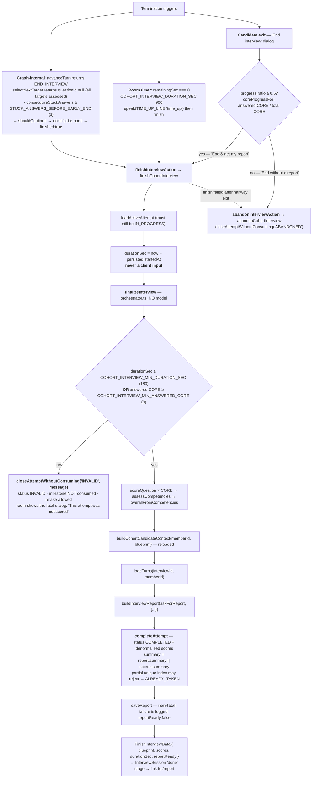

### Exit-behaviour matrix (as implemented)

| Situation | Code path | DB status | Milestone consumed? | Report? |
|---|---|---|---|---|
| Exit **before** 50% of CORE answered | `abandonInterviewAction` (room never calls finish) | `ABANDONED` | **No** | No |
| Exit **at or after** 50% | `finishInterviewAction`; falls back to `abandonInterviewAction` if finish fails | `COMPLETED` (or `ABANDONED` on fallback) | Yes | Yes |
| Graph reached completion | `finished: true` → room calls `finishInterviewAction` | `COMPLETED` | Yes | Yes |
| Session timer hit 900s | room calls `finishInterviewAction` | `COMPLETED` if scorable, else `INVALID` | Yes / No | Yes / No |
| Too thin to score (< 180s **and** < 3 answered CORE) | `finalizeInterview` returns `ok:false` | `INVALID` | **No** | No |
| Tab closed, > 1h stale | `abandonStaleAttempts` on next start | `ABANDONED` | **No** | No |
| Provider degraded throughout | interview completes normally | `COMPLETED` | Yes | Yes, with `assessmentStatus: DEGRADED` and unjudged questions **excluded**, not zeroed |
| Second completion attempt (race) | partial unique index → `P2002` | unchanged | — | `ALREADY_TAKEN` |

---

## Node reference table

All 11 LangGraph nodes. Files are relative to `src/`.

| Node | File | Trigger | Input (read from state) | Output (NodeUpdate) | State changes | Next possible nodes |
|---|---|---|---|---|---|---|
| `receiveAnswer` | `features/interview/agent/nodes.ts` | `START` | `interviewState.status`, `plan`, `currentQuestionId`, `candidateAnswer` | `interviewState`, `transcript`, `currentQuestion`, `currentQuestionIndex`, `followUpCount`, `maxFollowUps`, `redirectCount`, `repeatCount`, `depthLevel`, `escalationsAsked` — **or** `{ error, finished }` | appends candidate transcript line; projects all per-question counters | `analyzeAnswer` (analyze) · `END` (abort) |
| `analyzeAnswer` | `agent/nodes.ts` → `createAnalyzeAnswer(llm)` | after `receiveAnswer` | current question, `depthLevel`, `candidateAnswer`, `evidenceByQuestionId[view.evidenceKey]`, `transcript`, `calibration.level`, `plan.contextSummary` | `{ decision }` — or `{ error, finished }` if no open question | none persisted | `routeResponse` |
| `routeResponse` | `agent/nodes.ts` | after `analyzeAnswer` | `decision`, current question at `depthLevel`, counters from `interviewState` | `{ lastDecision, nextPrompt }` | **none** — names the branch only | `followUp` · `escalate` · `nextQuestion` · `redirect` · `repeat` · `clarify` |
| `followUp` | `agent/nodes.ts` → `applyFollowUp` | `lastDecision === "FOLLOW_UP"` | `nextPrompt`, `decision`, current question | `{ nextPrompt }` or downgrade `{ lastDecision: "NEXT_QUESTION", nextPrompt: null }` | none | `updateState` |
| `escalate` | `agent/nodes.ts` → `applyEscalate` | `lastDecision === "ESCALATE"` | `nextPrompt` (bridge + banked rung, staged by `routeResponse`) | `{ nextPrompt }` or downgrade to `NEXT_QUESTION` | none | `updateState` |
| `nextQuestion` | `agent/nodes.ts` → `applyNextQuestion` | default branch | *(none)* | `{ nextPrompt: null }` | none — the text is unknown until state advances | `updateState` |
| `redirect` | `agent/nodes.ts` → `applyRedirect` | `lastDecision === "REDIRECT"` | `interviewId`, `currentQuestion` | `{ nextPrompt: redirectLineFor(id) + "\n\n" + currentQuestion }` | none | `updateState` |
| `repeat` | `agent/nodes.ts` → `applyRepeat` | `lastDecision === "REPEAT"` | `interviewId`, `currentQuestion` | `{ nextPrompt: repeatLineFor(id) + "\n\n" + currentQuestion }` | none | `updateState` |
| `clarify` | `agent/nodes.ts` → `applyClarify` | `lastDecision === "CLARIFY"` | `decision.clarification`, `currentQuestion` | `{ nextPrompt: resolveClarification(decision) + "\n\n" + currentQuestion }` | none | `updateState` |
| `updateState` | `agent/nodes.ts` | after any branch node | `plan`, `interviewState`, `decision`, `lastDecision`, `nextPrompt`, `candidateAnswer` | `interviewState`, `transcript`, `evidence`, `currentQuestionId`, `currentQuestion`, `currentQuestionIndex`, `followUpCount`, `maxFollowUps`, `redirectCount`, `repeatCount`, `depthLevel`, `escalationsAsked`, `lastDecision`, `nextPrompt`, `status`, `finished` | **the only writer.** REDIRECT/REPEAT/CLARIFY: bumps that one counter + transcript line. Otherwise: `competenceSignal`, `calibration`, `advanceTurn` (evidence, budgets, `consecutiveStuckAnswers`, `currentQuestionIndex`, `askedQuestionIds`, counter resets), `mergeEvidence`, transcript line | `complete` · `END` |
| `complete` | `agent/nodes.ts` → `completeInterview` | `shouldContinue === "complete"` | `interviewState`, `interviewId` | `interviewState`, `transcript`, `nextPrompt`, `lastDecision: "COMPLETE"`, `status: "COMPLETED"`, `finished: true` | sets `status: COMPLETED`, appends `closingLineFor(interviewId)` | `END` |

**Router functions (not nodes):** `guardBranch` and `actionBranch` in `agent/graph.ts`; `shouldContinue` in `agent/nodes.ts`.

---

## Non-graph components

| Component | File | Responsibility | Called by |
|---|---|---|---|
| `runInterviewTurn` / `buildInterviewGraph` | `features/interview/agent/graph.ts` | Compiles + caches the graph per provider; projects persisted state into graph channels; streams and captures the node trace; converts throws into `{ ok:false }` | `orchestrator.ts:submitAnswer` |
| `routeDecision`, `resolveAcknowledgement`, `resolveBridge`, `resolveClarification`, `resolveFollowUpText`, `resolveSimplified`, `speakable`, `openingLine`, `redirect/repeat/closingLineFor`, `pickFor` | `agent/policy.ts` | Deterministic action policy + all spoken-line guards (no `?` in acknowledgements, length caps, hollow-ack rejection, em-dash removal) | `nodes.ts`, `orchestrator.ts` |
| `classifyAnswer`, `decideLadderMove`, `escalationCeiling`, `updateCompetenceSignal`, `updateCalibration`, `activeQuestionView`, `questionAsAsked`, `nextDeepProbe`, `nextScaffoldProbe` | `agent/depth.ts` | The depth ladder — direction of adaptation. Pure, no model, no DB | `policy.ts`, `nodes.ts` |
| `advanceTurn`, `createInitialState`, `startInterview`, `getCurrentQuestion`, `appendLine`, `followUpBudgetFor`, `transcriptToText` | `features/interview/state.ts` | Budget + termination machine; calls the planner | `nodes.ts`, `orchestrator.ts`, `service.ts`, `voice.ts` |
| `selectNextTarget`, `askedIds` | `agent/target-planner.ts` | Chooses the next assessment target (continuity + coverage, authored-order incumbent, reorder margin) | `state.ts:advanceTurn` |
| `competencyCoverage`, `coverageForQuestion`, `coverageNeed` | `agent/coverage.ts` | Derived coverage per competency and per question (incl. rungs). Nothing stored | `target-planner.ts` |
| `conceptTokensForDays`, `topicalOverlap`, `conceptsForDays`, `mentionedConcepts`*(unused)* | `cohort/concepts.ts` | Curriculum vocabulary from `days.json`; continuity scoring | `target-planner.ts` |
| `curriculumForDay(s)`, `describeCurriculum` | `cohort/curriculum-context.ts` | Build-time `days.json` projection | `concepts.ts`, `generate-phrasing.ts` |
| `curriculumFor(sourceDays)` | `cohort/curriculum-kb.ts` | Parses + caches `knowledge/ai-cohort-interview/core-concepts.md` by `# DAY n`; per-question LLM context capped at 1,400 chars | `nodes.ts:analyzeAnswer` |
| `buildInterviewMemory` | `features/interview/memory.ts` | Standing summary (≤10 lines) of what each answered question established, from authored evidence items + verbatim quotes | `nodes.ts:analyzeAnswer` |
| `createJsonInterviewLLM`, `coerceMatchedEvidence` | `agent/llm/json-provider.ts` | Vendor-agnostic JSON provider: schema validation, one retry with `STRICT_JSON_REMINDER`, deterministic fallback, `phraseQuestions` | all vendor adapters |
| `resolveInterviewLLM` | `agent/llm/registry.ts` | Config-only provider resolution (`INTERVIEW_LLM_PROVIDER`); autodetect is **OpenAI or mock** | `orchestrator.ts`, `session.ts` |
| vendor adapters | `agent/llm/{openai,groq,gemini,anthropic,mock}-provider.ts` | HTTP/SDK bindings + `recordUsage` cost tracking (OpenAI) | `registry.ts` |
| `fallbackDecision`, `looksStuck`, `isBlankAnswer` | `agent/llm/heuristics.ts` | Structural-only degraded classification. **Off-topic detection was deliberately deleted** — degraded turns report `ON_TOPIC` | `json-provider.ts`, `mock-provider.ts` |
| `ANALYZE_SYSTEM_PROMPT`, `buildAnalyzeUserMessage`, `PHRASE_SYSTEM_PROMPT`, `buildPhraseUserMessage` | `agent/llm/prompt.ts` | Prompt construction | `json-provider.ts` |
| `beginInterview`, `submitAnswer`, `finalizeInterview` | `features/interview/orchestrator.ts` | Open / one turn / close. `finalizeInterview` consults **no model** | `service.ts` |
| `startCohortInterview`, `resumeCohortInterview`, `recordCohortAnswer`, `finishCohortInterview`, `abandonCohortInterview`, `getCohortInterviewOverview`, `getCohortInterviewReport`, `getInterviewReportById` | `features/interview/service.ts` | Security posture, DB orchestration, turn-record construction, latency logging | `prisma-provider.ts`, Server Components |
| `cohortInterviewProvider` / `getInterviewProvider` | `features/interview/prisma-provider.ts` | Uniform `(memberId, …)` surface over the service | Server Actions |
| `resolveInterviewMemberId`, `toProgramMemberId` | `features/interview/provider.ts` | The single source of member identity (session only); strips the 078 `pe_pm_` prefix | actions, routes, pages |
| repository functions | `features/interview/repository.ts` | All `GeneralInterview` / `InterviewTurn` / `InterviewReport` access; every query member-scoped | `service.ts` |
| `getBlueprintEligibility`, `assertCanStart` | `features/interview/cohort-eligibility.ts` | Eligibility read + **the** start gate | `session.ts` |
| `isBlueprintUnlocked`, `missingDaysFor`, `passedScopeCount` | `cohort/eligibility-rules.ts` | Pure unlock rule (every scope day passed) | `cohort-eligibility.ts` |
| `buildCohortPlan`, `gateStart`, `resolveCohortEligibility` | `features/interview/session.ts` | Assembles context → phrasing → plan | `service.ts` |
| `planCohortInterview`, `scopeDaysFor` | `cohort/planner.ts` | Bank → frozen `InterviewPlan`; grounding + phrasing applied once; extension selection | `session.ts`, `repository.ts`, `service.ts` |
| `getQuestionBank`, `questionCountFor`, `assertBankIntegrity` | `cohort/question-bank.ts` | The fixed banks + load-time integrity (scope, duplicate ids, satisfiable `minEvidence`, ascending rungs, scaffolds targeting real items) | `planner.ts`, `service.ts`, `report.ts` |
| `groundQuestion` | `cohort/grounding.ts` | Template-only factual clause; missing artifact ⇒ no clause | `planner.ts` |
| `generateCohortPhrasing`, `choosePhrasing`, `FRAMING` | `cohort/generate-phrasing.ts`, `cohort/question-phrasing.ts` | One optional LLM call to reword `spokenText`; every output validated | `session.ts`, `planner.ts`, `policy.ts` |
| `buildCohortCandidateContext` | `cohort/candidate-context.ts` | 4 parallel reads → `CohortCandidateContext` | `session.ts`, `service.ts` |
| `buildProgressSummary`, `formatProgressContext` | `cohort/progress-summary.ts` | Deterministic progress text frozen into the plan | `planner.ts` |
| `scoreQuestion`, `scoreModules`, `scoreToTier`, `assertScopeIntegrity` | `features/interview/module-scoring.ts` | Evidence → numbers. No model | `orchestrator.ts`, `report-assembly.ts` |
| `assessCompetencies`, `overallFromCompetencies`, `aggregateScores` | `features/interview/scoring.ts` | Rubric-weighted aggregation | `orchestrator.ts`, `report-assembly.ts` |
| `mergeEvidence`, `deriveCompetencyTier`, `deriveFallbackJudgments` | `features/interview/evidence.ts` | Evidence arithmetic incl. transcript-wide COMMUNICATION | `nodes.ts`, `scoring.ts` |
| `RUBRIC`, `EVIDENCE_TIER_SCORE`, `buildRubricSnapshot` | `features/interview/rubric.ts` | What is measured and what each axis is worth | `scoring.ts`, `planner.ts` |
| `buildInterviewReport` | `features/interview/report.ts` | One narrative call + fallbacks; `suggestedDays` from provenance | `service.ts` |
| `askForReport` | `features/interview/report-provider.ts` | OpenAI → Groq → Claude narrative chain with 429 handling | `service.ts` |
| `assembleReport`, `filterNarrative`, `deterministicNarrative`, `parseReport`, `answerExcerptFor` | `features/interview/report-assembly.ts` | Every number + the citation filter + write/read validation | `report.ts`, `repository.ts` |
| `buildQuestionAssessments`, `classifySkills`, `buildAgentInsights`, `selectTranscriptExcerpts`, `assessIntegrity`, `buildModuleReports`, `buildCompetencyReports`, `readinessFor`, `toTen`, `coreProgressFor` | `features/interview/report-analysis.ts` | The analytical layer; all deterministic | `report-assembly.ts`, `service.ts` |
| `transcribeAnswer`, `synthesizeLine`, `resolveSpeakableLine`, `isSttConfigured`, `isTtsConfigured` | `features/interview/voice.ts` | Speech transport only | STT/TTS routes |
| `rejectAudioUpload`, `audioFilenameFor`, `safetyIdentifierFor`, `MAX_AUDIO_BYTES`, `ALLOWED_AUDIO_TYPES` | `features/interview/voice-contract.ts` | Upload contract, importable without `server-only` | STT route, `voice.ts` |
| `checkLanguage`, `LANGUAGE_RETRY_LINE` | `features/interview/language-gate.ts` | English-only input gate between STT and the agent | STT route |
| `roomLineFor`, `repeatLine`, `NO_RESPONSE_ANSWER`, `TIME_UP_LINE`, `WAITING_LINES`, `RETRY_LINE`, `MOVING_ON_LINE` | `features/interview/room-lines.ts` | Lines the **room** says (never persisted by the graph); shared by client and TTS route so audio matches the screen | `interview-room.tsx`, `voice.ts` |
| `stepTurn`, `openTurn`, `TurnState`, `TurnEffect` | `features/interview/turn-state.ts` | Single-clock turn-ownership machine (VAD). Pure, `now` injected | `interview-room.tsx` |
| `initialSilenceState`, silence stepper | `features/interview/silence.ts` | Dual-threshold silence rule, extracted for testability | `interview-room.tsx` |
| `InterviewRoom` | `components/interview/cohort/interview-room.tsx` | The live room: audio capture, analyser, TTS playback + reveal, watchdogs, exit dialog, timer | `interview-session.tsx` |
| `InterviewSession`, `MicCheck` | `components/interview/cohort/{interview-session,mic-check}.tsx` | brief → live → done; mic must be **verified** (recorded *and* transcribed) before start | interview page |
| `InterviewReportView` | `components/interview/cohort/report-view.tsx` | Renders the stored document | report page |
| `InterviewAgentDemo` | `components/dev/interview-agent-demo.tsx` + `app/dev/interview-agent/page.tsx` + `app/actions/dev-interview-agent-actions.ts` | Dev harness showing the executed `trace[]`. **404s in production**; the actions re-check | dev only |

---

## State flow

`InterviewState` — `src/features/interview/types.ts`. Persisted to `GeneralInterview.state` (authoritative) with `transcript` / `evidence` as read-optimized projections.

| Field | Type | Written by | Read by |
|---|---|---|---|
| `status` | `NOT_STARTED\|IN_PROGRESS\|COMPLETED\|ABANDONED\|INVALID` | `createInitialState`, `startInterview`, `advanceTurn`, `updateState`, `completeInterview`, `finalizeInterview` | `receiveAnswer` (guard), `shouldContinue`, `service.ts`, `repository.ts` |
| `currentQuestionIndex` | `number` | `advanceTurn` (`= target.index`; `= plan.questions.length` when exhausted) | `getCurrentQuestion`, `askedIds` backfill, `analyzeAnswer` (`nextQuestionText`), `resumeCohortInterview` |
| `askedQuestionIds` | `string[]?` | `beginInterview` (first question), `advanceTurn` | `askedIds` → `remainingTargets` in `selectNextTarget` |
| `followUpsAsked` | `number` | `advanceTurn` (+1 on FOLLOW_UP; reset to 0 on NEXT_QUESTION) | `routeDecision` counters, `analyzeAnswer` (`followUpsRemaining`), `report.overall.followUpsAsked` |
| `consecutiveStuckAnswers` | `number` | `advanceTurn` | `routeDecision` (the `alreadyNudged` scaffold rule), `advanceTurn` early-end at 3 |
| `redirectsAsked` | `number?` | `updateState` (REDIRECT branch); reset by `advanceTurn` | `routeDecision` (cap 3, `firstContact`), `report.overall.redirectsIssued` |
| `repeatsAsked` | `number?` | `updateState` (REPEAT branch); reset by `advanceTurn` | `routeDecision` (cap 2, `firstContact`) |
| `clarificationsAsked` | `number?` | `updateState` (CLARIFY branch); reset by `advanceTurn` | `routeDecision` (cap 2) |
| `depthLevel` | `number?` (1 = core) | `advanceTurn` (+1 on ESCALATE; reset to 1) | `analyzeAnswer`, `routeResponse`, `updateState`, `activeQuestionView`, `nextDeepProbe`, `service.ts` turn record |
| `escalationsAsked` | `number?` | `advanceTurn` (+1 on ESCALATE; reset to 0) | `decideLadderMove` vs `escalationCeiling` |
| `competenceSignal` | `Partial<Record<Competency,{strong,weak}>>?` | `updateState` via `updateCompetenceSignal` (from the **raw** answer, before budgets) | `escalationCeiling`, `decideLadderMove` (projected forward to include the current answer) |
| `calibration` | `{answered,strong,weak,level}?` | `updateState` via `updateCalibration` — CORE answers only, frozen after `CALIBRATION_ANSWERS` (3) | `escalationCeiling` (starting posture), `analyzeAnswer` (`calibratedLevel`, tone only) |
| `transcript` | `TranscriptLine[]` | `appendLine` in `receiveAnswer`, `updateState`, `completeInterview`, `beginInterview` | `analyzeAnswer` (`recentTranscript`), `memory.ts`, `report-assembly.ts:answerExcerptFor`, `voice.ts:resolveSpeakableLine("latest")` |
| `evidenceByQuestionId` | `Record<string, AnswerEvidence>` keyed `qid` / `qid@L2` / `qid@L3` | `advanceTurn` (raw) then `updateState` overwrites with `mergeEvidence` when prior exists | `analyzeAnswer` (`priorEvidence`), `coverage.ts`, `module-scoring.ts`, `evidence.ts`, `report.ts`, `coreProgressFor` |
| `startedAtMs` | `number\|null` | `startInterview` | *(duration actually comes from the DB column `startedAt`, not this field)* |

### Coverage and "current assessment target"

Both are **derived, never stored fields**:

- **Assessment coverage** = `competencyCoverage(plan, state)` recomputed from `evidenceByQuestionId` on every planner call. Documented rationale: an attempt resumed from the database yields exactly the same coverage, and there is no new field that can drift out of sync with the evidence it summarises.
- **Current assessment target** = `plan.questions[state.currentQuestionIndex]` via `getCurrentQuestion`. The `TargetChoice` returned by `selectNextTarget` (with `reason` and `considered[]`) is **not persisted** — only its `index` and `questionId` land in state. *(Persisting the planner rationale per turn is **PLANNED / FUTURE**; `TargetChoice.reason` and `considered[]` are computed and discarded today.)*

### Graph-only channels (not persisted)

`InterviewAgentState` adds `interviewId`, `minutesLeft`, `blueprint`, `plan`, `currentQuestionId`, `currentQuestion`, `candidateAnswer`, `maxFollowUps`, `followUpCount`/`redirectCount`/`repeatCount` (flat projections), `decision`, `lastDecision`, `nextPrompt`, `finished`, `error`. These exist for one turn and are rebuilt from the persisted state on the next request.

---

## Provider boundaries

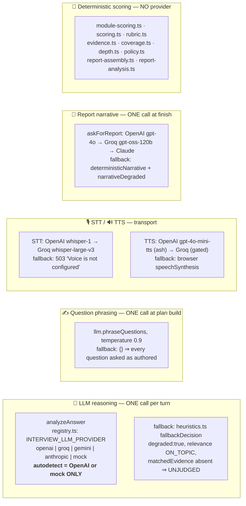

| Boundary | Provider(s) | Purpose | Fallback | Affects scoring? | Can degrade the interview? |
|---|---|---|---|:--:|---|
| **LLM reasoning** | `INTERVIEW_LLM_PROVIDER` → OpenAI (`OPENAI_INTERVIEW_MODEL`) / Groq / Gemini / Anthropic / mock | Reads one answer: relevance, `matchedEvidence`, axes, flags, and drafts follow-up / acknowledgement / clarification / simplified / bridge | 1 retry with `STRICT_JSON_REMINDER`, then `fallbackDecision` (structural heuristics) | **Indirectly.** It supplies `matchedEvidence`, which every score is computed from — but it never emits a score, and its `action` is only a *request* that `routeDecision` may downgrade. A failure yields **UNJUDGED**, which is excluded from aggregates rather than scored as zero | **Yes, gracefully.** Turn is marked `degraded`; the interview continues. Ratio ≥ 0.5 → `assessmentStatus: DEGRADED` |
| **Question phrasing** | Same provider, `phraseQuestions` (optional method), temp 0.9 | Rewords `spokenText` only | `{}` ⇒ authored wording; every candidate string re-validated by `choosePhrasing` | **No.** `question.text` — the grading target — is never touched | No |
| **STT** | OpenAI `whisper-1` → Groq `whisper-large-v3` | Audio → text | None server-side (503). Client keeps the typed-answer path | No — it produces the input, then the same pipeline runs | Yes: an untranscribable answer costs a retry, never a turn (empty transcript is refused with 422 and nothing is submitted) |
| **TTS** | OpenAI `gpt-4o-mini-tts` (voice `ash`) → Groq `orpheus-v1-english` (only with `INTERVIEW_TTS_MODEL`) | Speaks server-composed lines | **`window.speechSynthesis`** in the browser, same words | No | No — worst case the candidate hears a different voice |
| **Report narrative** | OpenAI `gpt-4o` (`OPENAI_INTERVIEW_REPORT_MODEL`) → Groq `openai/gpt-oss-120b` → Claude (`lib/anthropic`) | Prose only: strengths, improvements, summary, recommendation | `deterministicNarrative` + `narrativeDegraded: true` | **No.** The prompt states the model is given no scores; every number is computed in `report-assembly.ts` | No — the interview is complete and scored either way; `saveReport` failure is explicitly non-fatal |
| **Deterministic scoring** | *(none)* | Every number in the product | n/a | It **is** the scoring | n/a |

---

## Security / safety boundaries

| Boundary | Implementation | File |
|---|---|---|
| **Member identity** | `resolveInterviewMemberId()` reads the session and DB and **takes no parameters** — there is no argument through which a caller could act as another member. Requires `ProgramMember.status ∈ {ENROLLED, COMPLETED}` | `features/interview/provider.ts` |
| **What a client may send** | A blueprint enum value, an interview id, a question id, and answer text. Nothing else. Plan, state, eligibility, scores and question index never cross the boundary inbound | `app/actions/interview-actions.ts` |
| **Input validation** | `startInterviewSchema`, `submitInterviewAnswerSchema`, `interviewIdSchema` (zod) at every action entry; `bodySchema` at the TTS route; `interviewReportSchema` on report write **and** read | `lib/validations/interview.ts` |
| **Interview ownership** | `memberId` is inside the `WHERE` clause of every repository query — another member's id resolves to `null`, indistinguishable from nonexistent | `features/interview/repository.ts` |
| **Answer identity** | `receiveAnswer` rejects an answer whose `questionId` ≠ the question the **server** believes is open. A stale or replayed client is a no-op, not a double-scored answer | `agent/nodes.ts` |
| **Start gate** | `assertCanStart` re-derives eligibility from the database immediately before `createAttempt`, in the same request. There is no path to `createAttempt` that skips it | `cohort-eligibility.ts`, `service.ts` |
| **One completion per milestone** | Postgres partial unique index `GeneralInterview_one_completed_per_blueprint ON (memberId, blueprint) WHERE status='COMPLETED'`. `P2002` → `ALREADY_TAKEN`, not a 500. Stronger than an app-level lock | migration + `repository.ts` |
| **Attempt cannot be burned by failure** | Unscorable → `INVALID`; abandoned/stale → `ABANDONED`. Neither is `COMPLETED`, so neither consumes the milestone | `service.ts`, `repository.ts` |
| **Duration** | Computed from the persisted `startedAt` column, never accepted from the client — a client-supplied duration could clear the minimum-length floor | `service.ts` |
| **`minutesLeft`** | Also derived from persisted `startedAt` before being shown to the model | `service.ts` |
| **TTS text sourcing** | The route schema has **no text field**. It takes `{ interviewId, line: enum, variant: int 0..999 }` and composes the line server-side from the interview's own transcript, the server's open question, or a fixed constant. `variant` selects among authored sentences and cannot introduce one. Without this, a paid speech API would be an open TTS service for any signed-in member | `app/api/interview/tts/route.ts`, `features/interview/voice.ts` |
| **TTS caching** | `Cache-Control: no-store, private` — per-attempt, per-member audio must never reach a CDN or shared proxy | TTS route |
| **STT ordering** | Authentication runs **before** `request.formData()`, so an unauthenticated request cannot make the server buffer megabytes | STT route |
| **Upload limits** | `rejectAudioUpload(size, type)` → 413 / 415; WebM EBML magic check (`1a45dfa3`) → 422 | `voice-contract.ts`, STT route |
| **Provider abuse identifier** | `OpenAI-Safety-Identifier: safetyIdentifierFor(memberId)` on both STT and TTS upstream calls | `voice-contract.ts`, `voice.ts` |
| **Checklist secrecy** | `ClientQuestion` omits `expectedEvidence`, `minEvidence`, probes and the rubric | `service.ts:toClientQuestion` |
| **Scope integrity** | Asserted three times: bank module load (`assertBankIntegrity`), plan build (`assertWithinScope`), and at the moment a number is produced (`assertScopeIntegrity`) | `question-bank.ts`, `planner.ts`, `module-scoring.ts` |
| **Grounding non-invention** | Every clause is a template over a database row. A missing artifact yields **no clause**, never a hedge. `groundQuestion` must never receive model-generated text | `cohort/grounding.ts` |
| **Model cannot escalate or complete** | `LLM_ACTIONS` excludes both | `agent/types.ts` |
| **Narrative cannot praise fictional work** | `filterNarrative` deletes any item whose citations do not resolve to an answered question | `report-assembly.ts` |
| **Report immutability** | Reports are never regenerated on view — *"a report is a record of an assessment that happened"* | `service.ts`, report page |
| **Dev harness** | `/dev/interview-agent` `notFound()` in production, and `dev-interview-agent-actions.ts` repeats the check (a route guard does not protect an action endpoint) | `app/dev/interview-agent/page.tsx` |
| **Day-lock bypass** | Read from `isDayLockBypassEnabled()` **and nowhere else**. A previous unconditional `missingDays = []` disabled the progress rule in every environment including production | `cohort-eligibility.ts` |
| **Page-level auth** | `requireProgramMember()` runs **before** the URL params are read on both the interview and report pages | both pages |

### Not a guarantee (stated honestly)

- The **demo reset path** (`resetDemoInterviewAction`, and the `reattemptAction` server actions inlined in both pages) hard-codes `demo-day31@abtalks.dev` and calls `prisma.generalInterview.deleteMany`. It is gated on that exact email, but it is a production code path that deletes completed interviews and uses `blueprint as any`.
- There is **no production/test database boundary represented in the interview code**. `docs/plans/070-interview-dev-database.md` describes one; nothing in `src/features/interview/**` references it. **NOT IMPLEMENTED.**
- There is **no rate limiting** on `/api/interview/stt` or `/api/interview/tts` beyond authentication, the upload size cap, and the `variant` bound.

---

## Not implemented / planned

| Item from the brief or the plans | Status |
|---|---|
| Barge-in / interruptible speech | **NOT IMPLEMENTED.** The mic is closed while the interviewer speaks; `turn-state.ts` enforces strict turn ownership |
| Realtime conversational API for this interview | **NOT IMPLEMENTED, and deliberately rejected** — see the rationale in `voice.ts`. Used only by the separate legacy program exit interview |
| A second conversational AI | **Does not exist.** One `analyzeAnswer` call per turn; STT/TTS are transport |
| A `planner` LangGraph node | **Does not exist as a node.** `selectNextTarget` is called from `advanceTurn` inside `updateState` |
| Concept-level coverage ("already assessed concepts") | **NOT IMPLEMENTED.** Coverage is per competency and per question id (+ rungs). `mentionedConcepts()` is exported but has zero call sites |
| Persisting the planner's `reason` / `considered[]` per turn | **PLANNED / FUTURE.** Computed on every advance and discarded; `InterviewTurn` has no column for it |
| Resuming an interview | **Deliberately disabled.** `resumeCohortInterview` exists in `service.ts` and is exposed on the provider, but `startCohortInterview` abandons any open attempt first, and no UI calls `resume` |
| `evaluation.ts` (`judgeInterview` — model-assigned competency tiers) | **Off the path.** Kept on disk as the reference implementation of that prompt; `finalizeInterview` no longer calls it |
| General 60-day-challenge interview (`/interview`, `question-rules.ts`, `question-generation.ts`, `challenge-context.ts`, `resume-context.ts`, `eligibility.ts`, `mock/`, `read-model.ts`) | **PLANNED / FUTURE.** Route redirects to `/program/dashboard`; modules intact but unreachable |
| Repository/code reading for grounding | **NOT IMPLEMENTED.** `payload.repoRef` is a **filename**, not file contents; `describeCandidateWork` says so explicitly |
| Separate dev/test database boundary | **NOT IMPLEMENTED** in `src/` (see `docs/plans/070`) |
| Question `simplified` rephrasing (`resolveSimplified`) | **Implemented in `policy.ts` but not wired.** `routeDecision` never returns a simplified question, and no node calls `resolveSimplified` — CLARIFY answers the term and restates the question verbatim instead |

---

## Architecture principle

The interviewer is not a chatbot with a system prompt. It is a **constrained adaptive assessment instrument**, and every layer exists to keep one property true: *two candidates whose answers contain the same evidence receive the same score, no matter which model answered the phone that day.*

- **The question bank is the legal assessment space.** `cohort/question-bank.ts` is code, not data, so a malformed bank is a compile error. Its scope is asserted three separate times. `question.text` — the thing evaluation grades against — is byte-identical for every candidate at a milestone, and nothing in the system may rewrite it. Only `spokenText` can vary, and only via a template over a database row (grounding) or a validated rewording (phrasing).
- **LangGraph owns conversation state and routing, as named nodes and declared edges.** The transitions *are* the assessment rules; as a graph they can be read, tested without a network and audited in a diff. Inside a prompt they would be suggestions a model may ignore.
- **The model reports; it does not decide.** It may propose five of seven actions, and `routeDecision` may downgrade any of them. It cannot request an escalation or a completion. It cannot ask a question outside the bank — an "acknowledgement" or "bridge" containing `?` is rejected as an unbudgeted follow-up in disguise. It supplies exactly one thing that reaches a number: which checklist items an answer covered, and even that is range-filtered against the real checklist so an invented item cannot inflate a score.
- **The planner chooses what to explore next, from inside the bank.** Continuity against the curriculum's own vocabulary pulls the interview toward what the candidate raised; coverage need pulls it toward what is still dark. Authored order is the incumbent and only loses by a margin, so an interview never reshuffles itself on noise.
- **Depth is earned deterministically.** `depth.ts` decides direction (escalate / scaffold / move on) from evidence and streaks; `state.ts` decides affordability from budgets; `policy.ts` applies both. All three are pure.
- **Evidence drives every score, and evidence has provenance.** Scores are arithmetic over which authored checklist items were covered, keyed per question and per escalation rung so two checklists' index spaces never mix. A provider outage produces **UNJUDGED**, which is excluded from every aggregate rather than counted as a failure — an outage must not become a scoring event.
- **The LLM supplies semantic interpretation and prose, never authority.** The report's narrative model is shown no scores at all, and any sentence it writes that cannot be traced to a real answered question id is deleted before the document is stored.
- **Nothing trusts the client except the words the candidate said.** Member identity comes from the session, the plan and state are reloaded from Postgres on every turn, the duration comes from a database column, the answer must match the question the server has open, and the speech endpoint accepts a line *kind* rather than a line.

The result is an interview that adapts — it goes deeper on a strong answer, narrows on a weak one, follows what someone actually said, and answers "what do you mean by that?" like a person would — while remaining an instrument two people can be compared on.
