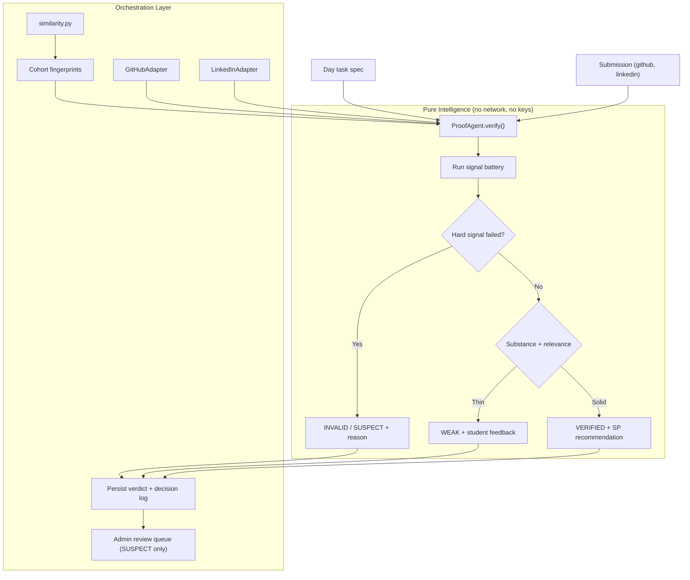

# 077 — Proof-of-Work Verification Agent (new AB Talks open agent)

## 1. Goal
Add a new standalone agent package, **Proof Agent**, that looks at a student's daily
submission (day task + GitHub URL + LinkedIn URL) and autonomously decides whether it is
genuine proof of work — real, original, on-time, and actually about the task — returning a
verdict, an SP recommendation, a signal breakdown, and a plain-English decision log.
It closes ABTalks' biggest integrity hole (today a submission is accepted if the GitHub URL
merely returns HTTP 2xx) and removes the manual admin review that does not scale past a few
hundred students × 60 days.

## 2. Current behavior

### In the app
- `Submission validation` (project-context §5): GitHub URL must match `https://github.com/{owner}/{repo}`,
  be globally unique, and return 2xx on HEAD with a 5s timeout. LinkedIn is **format-only** —
  LinkedIn blocks bots. Both proofs are optional since Synergy.
- SP is awarded purely for the *presence* of a URL: `10 + 5 (GitHub) + 8 (LinkedIn)`
  (`features/synergy/scoring.ts`). An empty repo created ten seconds ago earns the same 5 SP as a
  real project. A README-only repo, a fork, or a repo from a completely different task all pass.
- The only correction path is a human: admin `rejectSubmission`, one submission at a time,
  from `/admin/submissions`.
- The `/program` track does have server-verified missions, but `SHIP_IT` checks **file existence
  only** — content / minLines / notebook checks are gated off.

### In `agent packages/`
Three sibling repos, all following the same shape (this plan copies it exactly):
- **AI-Agents** — 8 Gemini-backed agents (resume, JD, match, interview, judge, planner, report, memory)
  behind a shared `gemini_core.py`, plus a playground HTML.
- **Interview-Agent** — the interview / judge / memory / report subset, extracted.
- **Scheduling-Agent** — the most mature: `pip install .`, `agent_core.py` as *pure intelligence*
  (returns decisions, never side effects), a router that owns Zoom/SMTP/persistence, a CLI, an HTTP
  server, `chat.html`, mermaid architecture in both README and `architecture.mmd`, and a mock-first
  design that runs fully with **no API keys set**.

**Nothing in the existing set verifies work.** `Judge Agent` scores *interview answers*;
`Match Agent` compares a résumé to a role. The daily submission — the single most repeated event
on the platform — has no agent.

## 3. Why this one (and what it beat)
Two runners-up, deliberately not chosen now:
- **Retention / Nudge Agent** — decides who is at risk and what to send. Good fit, but the program
  track already computes at-risk (`behind >2 days`, stuck >2 IST days, 0 commits in 5 days), so the
  agent would mostly be message generation — thin.
- **Curriculum Author Agent** — generates the missing real Day 1–60 SE/DS/AI content. High value,
  but content quality is a taste call; a generator here creates review load rather than removing it.

Proof Agent wins because it is autonomous decision-making under evidence, has real external tool
use (GitHub REST), produces an explainable log, and deletes recurring human work.

## 4. Package layout — `agent packages/Proof-of-Work-Agent/` (its own git repo, like its siblings)

| Path | New/Edit | Note |
|---|---|---|
| `agent_core.py` | [new] | Pure intelligence. Evidence in → verdict + reasoning out. No network, no DB, no keys. |
| `proof_agent.py` | [new] | Public class `ProofAgent` + `verify()`; the import surface. |
| `evidence.py` | [new] | Evidence-gathering adapters: `GitHubAdapter`, `LinkedInAdapter`, `MockAdapter`. The only file that touches the network. |
| `similarity.py` | [new] | Normalized-token shingles + MinHash/Jaccard for cross-cohort near-duplicate detection. Pure, no deps. |
| `llm.py` | [new] | Optional Claude relevance judgment (`ANTHROPIC_API_KEY`); returns `None` when unset so the agent degrades to rules only. |
| `chat_server.py` | [new] | stdlib HTTP server exposing the API in §7. Mirrors `Scheduling-Agent/chat_server.py`. |
| `cli.py` | [new] | `proof-agent --input examples/verify_request.json` |
| `example.py` | [new] | Runnable happy path plus one suspect case. |
| `playground.html` | [new] | Paste a task + repo URL, see verdict, signals, and the decision log render. |
| `examples/verify_request.json` | [new] | Fixture matching the §7 request shape. |
| `examples/fixtures/*.json` | [new] | Canned GitHub responses so the whole suite runs offline. |
| `architecture.mmd`, `README.md`, `CONTRIBUTING.md`, `LICENSE` (MIT), `.env.example`, `.gitignore`, `requirements.txt`, `pyproject.toml` | [new] | Same files, same order, same tone as `Scheduling-Agent`. |

`pyproject.toml`: name `proof-of-work-agent`, `requires-python >=3.10`, dependencies
`requests>=2.31.0` only (Claude via raw HTTP, no SDK). Script entry `proof-agent = "cli:main"`.

## 5. The agent's decision model

**Evidence bundle** (what the router hands the core):
`task_spec` (day number, title, deliverables, domain), `student` (github handle, enrollment start,
day window), `repo` (exists, owner, is_fork, is_template, created_at, pushed_at, default_branch,
commit list with author + timestamp + message, file tree with sizes, languages, README length),
`linkedin` (url shape only), `cohort_corpus` (fingerprints of other submissions for the same day).

**Signals** — each returns `pass | weak | fail | unknown` with a one-line reason and a weight:

| Signal | Fails when |
|---|---|
| `repo_reachable` | 404 / private / deleted |
| `owner_matches_student` | repo owner ≠ the student's GitHub handle and they are not a listed contributor |
| `not_a_fork` | `is_fork` or `is_template` true with no commits authored by the student |
| `has_substance` | tree is README-only, empty, or under a per-domain minimum file/byte floor |
| `authored_by_student` | zero commits whose author matches the student's handle or verified email |
| `within_day_window` | no commit inside the day window supplied for that day number |
| `not_bulk_dump` | one single commit adding a large tree with a generic message (`initial commit`, `add files via upload`) |
| `url_unique` | URL already used by another submission (enforced app-side too; kept here so the package is self-contained) |
| `not_near_duplicate` | Jaccard ≥ threshold against another student's same-day submission |
| `relevant_to_task` | Claude judges the code unrelated to the day's deliverables (→ `unknown` when no key) |

**Verdicts** (deterministic given the same evidence):
- `VERIFIED` — all hard signals pass; recommend full proof SP.
- `WEAK` — real and original but thin (substance floor missed, or late-window commits);
  recommend base SP without the GitHub bonus, plus student-facing feedback on what to add.
- `SUSPECT` — near-duplicate, fork with no own commits, or owner mismatch; **never auto-penalizes** —
  routes to the admin review queue with the evidence attached.
- `INVALID` — unreachable or empty; recommend no proof bonus.
- `UNVERIFIED` — evidence gathering failed (rate limit, timeout). Explicitly *not* a penalty state.

Two rules the core must honor, because they are the difference between a useful agent and an
angry cohort:
1. **The agent never rejects a student by itself.** It recommends. `SUSPECT` opens a review; it
   does not revoke SP.
2. **Absence of evidence is `unknown`, not `fail`.** GitHub rate limits, private-email commits, and
   squashed histories are normal and must not read as cheating.

## 6. Architecture (goes in README + `architecture.mmd`)



Same split as `Scheduling-Agent`: swap GitHub for GitLab tomorrow and `agent_core.py` does not change.

## 7. API surface

`POST /api/proof/verify`
```json
{
  "task": { "day": 12, "domain": "AI", "title": "Build a RAG retriever",
            "deliverables": ["retriever module", "eval script", "README with results"] },
  "student": { "github_handle": "alexj", "day_window": ["2026-07-12T00:00:00+05:30",
                                                        "2026-07-12T23:59:59+05:30"] },
  "submission": { "github_url": "https://github.com/alexj/day12-rag",
                  "linkedin_url": "https://linkedin.com/posts/alexj_example" },
  "cohort_fingerprints": []
}
```
Response: `{ verdict, confidence, sp_recommendation: { base, github_bonus, linkedin_bonus },
signals[], reasoning[], timeline[], student_feedback, fingerprint }` — `reasoning` and `timeline`
in exactly the shape `Scheduling-Agent` already returns, so the playground components are reusable.

Also: `POST /api/proof/verify/batch` (a whole day's submissions in one call, which is what enables
the cross-cohort duplicate check), and `GET /api/proof/verdicts?verdict=SUSPECT` for the queue.

## 8. Mock-first requirement
With no `GITHUB_API_TOKEN` and no `ANTHROPIC_API_KEY`, `python example.py`, the CLI, the server and
`playground.html` must all run end to end off `examples/fixtures/`, exactly like the mock Zoom/SMTP
path in `Scheduling-Agent`. This is a hard acceptance criterion, not a nicety — it is what makes the
package demoable and contributable by challenge students.

## 9. Guardrails for Cursor (DO NOT)
- Do **not** touch the ABTalks app in this plan. Everything lands under
  `agent packages/Proof-of-Work-Agent/`. No `src/`, no `prisma/`, no migrations.
- Do **not** put network calls, file I/O, env reads, or `datetime.now()` in `agent_core.py`. The core
  takes an evidence dict plus a `now` argument and returns a dict. It must be deterministic.
- Do **not** add a web framework. stdlib `http.server` like the sibling package; `requests` is the
  only runtime dependency.
- Do **not** let the agent write SP, reject submissions, or email anyone. It recommends only.
- Do **not** treat a missing or ambiguous signal as failure — that path is `unknown`.
- Do **not** invent a new response envelope. Match `Scheduling-Agent`'s `reasoning` + `timeline`.
- Do **not** hardcode the IST assumption in the core; the day window arrives pre-computed in the
  evidence bundle (the `/program` track runs on America/Chicago and must be able to reuse this).
- No new abstraction files beyond the table in §4.

## 10. Verification
- `pip install .` then `proof-agent --input examples/verify_request.json` prints a `VERIFIED` verdict
  with **no env vars set**.
- `python example.py` prints one `VERIFIED` and one `SUSPECT` (the near-duplicate fixture).
- `playground.html` opened against `python chat_server.py` renders verdict, all ten signals, and the
  decision log.
- Fixture cases that must produce the stated verdict: empty repo → `INVALID`; README-only → `WEAK`;
  fork with zero own commits → `SUSPECT`; two students with the same shingles → both `SUSPECT`;
  GitHub 403 rate limit → `UNVERIFIED` (never `INVALID`).
- Changed files: only the paths listed in §4.

## 11. Phase 2 (separate plan — do not start here)
Wiring into ABTalks: call the agent **asynchronously after** `submitDay` so it never blocks or slows
the submit path; store `proofVerdict`, `proofConfidence`, `proofSignalsJson`, `proofCheckedAt`,
`proofFingerprint` on `Submission`; add a `SUSPECT` filter to `/admin/submissions`; surface
`VERIFIED` on the recruiter report at `/r/[token]` (a verified badge is the thing recruiters actually
want). That plan carries the DB-safety section — commit checkpoint, Neon branch snapshot, commit
hash — since this one changes no schema.

## 12. Commit message
```
feat(agents): add Proof-of-Work Verification Agent package
```
