# 078 — Platform Data Architecture: Audit & Redesign

> **Status:** Architecture proposal. NOTHING is implemented. No code, schema, or
> migration has been changed by this document.
> **Audited against:** `prisma/schema.prisma` (1,197 lines, 54 models, 20 enums),
> 579 TS/TSX files under `src/`, 34 server-action files, 6 API routes, 1 cron,
> 12 seed/migration scripts, 19 applied migrations. Branch
> `feature/student-dashboard`, HEAD `459f71b`.
> **Goal:** evolve ABTalks from four independently-built track subsystems into one
> learning + talent platform, without losing production data.

---

## 0. How to read this document

Sections 1–5 are the **audit** — what exists, what is wrong, ranked. Sections 6–12
are the **proposal** — target schema, migration phases, query design, authorization,
invariants.

The single most important finding is in §2.1: **the platform has two complete,
non-communicating implementations of "a person learning something over time"**
(`Challenge`/`Enrollment`/`DailyTask`/`Submission` and
`ProgramCohort`/`ProgramMember`/`ProgramDay`/`ProgramMissionSubmission`), plus a
third partial one for the hackathon. Every other structural problem in this
document is downstream of that. The redesign is one unified learning spine plus a
canonical candidate identity that the recruiting domain reads.

**Scope note.** I verified every issue in the brief against the code. Three items
on the brief's list turned out to be **not true as stated** — they are corrected in
§2.13, §2.14 and §2.15 rather than repeated as findings.

---

# 1. Current Architecture Assessment

## 1.1 Domain map

The 54 models group into 12 domains. `Source of truth?` = does this table own the
fact, or mirror it.

### Authentication & identity
| Model | Notes |
|---|---|
| `User` | Auth.js user. Also carries `role` (barely used, see §2.8) and `synergyPoints` (a cache, see §2.11). |
| `Account`, `Session`, `VerificationToken` | Auth.js adapter tables. Zero direct app queries — correct. Sessions are JWT, so `Session` is effectively unused. |
| `PhoneVerification` | 1:1 OTP bridge. Duplicates `StudentProfile.phoneVerified`/`phoneVerifiedAt`. |
| `StudentProfile` | The de-facto candidate profile — but only for challenge-track users. Misnamed (holds professionals too). |
| `College` | 54,651-row catalog. `StudentProfile.collegeId` points at it **without a foreign key**, deliberately. |

### Learning — implementation #1: the 60-Day Challenge
| Model | Notes |
|---|---|
| `Challenge` | One row per `Domain`. `domain` is `@unique` → **exactly four challenges can ever exist**. |
| `DailyTask` | 1–60 per challenge. Carries a redundant `domain` column. |
| `Enrollment` | User × Challenge. Holds `daysCompleted`, `currentStreak`, `longestStreak`, `lastSubmittedDay` — all write-time caches. |
| `Submission` | One row per `(enrollmentId, dayNumber)`. **No attempt history** — a day is submitted once, forever. |
| `Quiz`, `QuizQuestion`, `QuizAttempt` | Weekly quizzes. `QuizAttempt` is `@@unique([userId, quizId])` → **one attempt only**, despite the name. |

### Learning — implementation #2: the AI Cohort Program (`/program`)
| Model | Notes |
|---|---|
| `ProgramCohort` | A cohort with **no reusable Program parent**. The curriculum is global, not owned by the cohort. |
| `ProgramMember` | User × Cohort. Also a **full duplicate professional profile** (13 identity columns) and 6 denormalized score counters. |
| `ProgramModule` | `number Int @unique` — **globally** unique. Only one "Module 1" can exist platform-wide. |
| `ProgramDay` | `dayNumber Int @unique` — **globally** unique. Only one "Day 1" can exist platform-wide. |
| `ProgramMissionSubmission` | Multi-attempt (good). Joins to content by `dayNumber Int`, not a FK. |
| `ProgramConceptQuestion`, `ProgramConceptAttempt` | `ConceptAttempt` is **dead code — 0 query sites**. |
| `ProgramVideo`, `ProgramExercise`, `ProgramExerciseCompletion` | `ExerciseCompletion` is **dead — 0 query sites**. `Exercise`/`Video` are seed+admin-read only. |
| `ProgramEntryQuestion`, `ProgramEntryAttempt` | Entry assessment. Bypassed in product (`isProgramEntryBypassEnabled()` returns true unconditionally). |
| `ProgramCommitDay` | GitHub commit-day tracking, fed by the Vercel cron. |
| `ProgramProject` | `@@unique([memberId, moduleNumber])` — **one submission per module, forever**. |
| `ProgramInterview` | `memberId @unique` — one interview per member. |

### Learning — implementation #3: the Hackathon
| Model | Notes |
|---|---|
| `HackathonTeam`, `HackathonParticipant` | Team-scoped participation. `HackathonParticipant.userId` is **globally unique** → one hackathon, ever. |
| `HackathonRemoval` | Append-only removal log; participant rows are hard-deleted. Well designed for its purpose. |
| `HackathonEvent` | Singleton config row (`id = 1`). |
| `HackathonProblem`, `HackathonSubmission` | One submission per team, overwritten in place. |
| `HackathonLink` | Share-link attribution slugs. |

### Learning — implementation #4: Workshops
| Model | Notes |
|---|---|
| `WorkshopRegistration` | All events in one table, keyed by a **code-defined** `eventId` string with no table behind it. Snapshots name/email/phone/org. |

### Assessments & credentials
| Model | Notes |
|---|---|
| `Certificate` | `enrollmentId @unique` is the only first-class source link. Hackathon/workshop/cohort certs carry their provenance in `metadata` JSON. |
| `RecruiterReview` | 30 columns. Admin-curated. Mixes profile data, assessment scores, coding results, logistics and compensation. 8 of them are JSON. |

### Recruiting
| Model | Notes |
|---|---|
| `RecruiterProfile` | 1:1 User. `company` is a **string**. No organization entity. |
| `RecruiterShortlistItem` | Points at `ProgramMember.id` — a cohort-scoped row, not the candidate. |
| `Job`, `JobApplication` | `Job.company` is a string; `createdByAdminId` has no FK. |

### Points, notifications, admin, legal
| Model | Notes |
|---|---|
| `SynergyEvent` | Append-only ledger. **No idempotency key** except `submissionId @unique`. |
| `MarketplaceItem`, `Redemption` | SP spend. |
| `Referral` | Referral graph. |
| `Notification`, `NotificationRead` | Broadcast + read state. Read state keyed by opaque string, deliberately no FK. Well designed. |
| `AdminAction`, `AdminRemark` | Audit log. Written by every admin mutation. |
| `LegalConsent`, `DataRightsRequest`, `NewsletterSubscription` | DPDP compliance. Well designed, leave alone. |

## 1.2 How the pieces actually fit together today

```
User ─┬─ StudentProfile ──── (challenge identity: name, college, skills, resume, SP)
      ├─ Enrollment ─── Challenge ─── DailyTask ─── Submission ─── SynergyEvent
      ├─ ProgramMember ─── ProgramCohort           (SECOND identity: name, company, skills, resume)
      │      └── ProgramMissionSubmission / Project / Interview / CommitDay
      │      └── recruiterVisibilityConsentAt      ← privacy consent lives HERE
      ├─ HackathonParticipant ─── HackathonTeam    (THIRD identity: name, phone, college)
      ├─ WorkshopRegistration                      (FOURTH identity: name, phone, org)
      ├─ RecruiterReview                           (FIFTH identity: education, experience, projects — as JSON)
      ├─ Certificate                               (SIXTH identity: recipientName snapshot)
      └─ RecruiterProfile                          (if this person is a recruiter)

RecruiterShortlistItem ─── ProgramMember   ← recruiter shortlists a COHORT ROW, not a person
```

There is **no path** from a shortlisted candidate to their challenge performance,
their hackathon result, or their certificates. The `/talent` portal
(`src/features/talent-pool/pool.ts`) queries `ProgramMember` exclusively, scoped to
the single most recently published cohort. A candidate who completed the SE
Challenge, won the hackathon and holds three certificates is **invisible** to every
recruiter unless they also joined an AI Cohort.

## 1.3 Authorization as it exists

Three unrelated mechanisms, none of them the `Role` enum:

| Surface | Mechanism | Where |
|---|---|---|
| Admin | `ADMIN_EMAILS` env var, string compare | `lib/admin-auth.ts` |
| Program member | DB membership lookup (`ProgramMember` with status ENROLLED/COMPLETED) | `lib/program-auth.ts` |
| Recruiter | DB flag (`RecruiterProfile.approved`) | `lib/program-auth.ts` |
| Route gating | Path-prefix allowlist | `middleware.ts` |

`User.role` is referenced in **exactly one** place in the entire application
(`src/app/actions/admin-actions.ts:448`). It is effectively dead.

---

# 2. Problems — severity-ranked audit

Severity is about **product blast radius**, not code ugliness. CRITICAL = blocks the
stated product vision or risks irreversible data loss.

---

## 2.1 — CRITICAL — Two independent implementations of "learning"

**Current structure.** `Challenge → DailyTask → Enrollment → Submission` and
`ProgramCohort → ProgramModule → ProgramDay → ProgramMember → ProgramMissionSubmission`
share nothing but `User`. Two enrollment concepts, two progress systems, two
scoring systems, two day-unlock engines (IST vs America/Chicago), two dashboards,
two admin sections, two content pipelines.

**Problem.** Every new learning format needs a third full stack. The vision
explicitly requires "one generalized learning abstraction" and "the UI and backend
should NOT require a separate architecture for every new program."

**Impact.** A "31 Days of Databricks — September 2026" cohort cannot be created
without either (a) reusing the single global `ProgramModule`/`ProgramDay` rows —
which means the August and September cohorts must have identical content, forever —
or (b) writing a third subsystem.

**Example failure.** You launch a Python Bootcamp. It has 6 modules, no days, and
3 attempts per exercise. There is nowhere to put it: `Challenge` hard-codes
day-numbered tasks and a 4-value `Domain`; `ProgramDay` is globally day-unique. You
write `Bootcamp*` tables. The candidate dashboard now needs a third query branch and
`/talent` still cannot see bootcamp results.

**Recommended fix.** One spine:
`LearningProgram → ProgramVersion → Cohort → Module → Activity`, with
`ProgramEnrollment → ActivityAttempt → ActivityEvaluation`. §3, §6.

**Migration risk.** High — this is the whole redesign. Mitigated by the phased plan
in §7: new tables are additive, legacy tables keep serving reads until Phase 6.

---

## 2.2 — CRITICAL — Cascading deletes will destroy recruiting evidence

**Current structure.** 51 of the 55 relations use `onDelete: Cascade`. Exactly 3
use `SetNull`, 1 uses `Restrict`.

Deleting one `User` row silently deletes: every `Submission`, every `Certificate`
(via `User → Certificate` Cascade), every `SynergyEvent`, the `ProgramMember` and
therefore every `ProgramMissionSubmission`, `ProgramProject`, `ProgramInterview`,
`ProgramCommitDay`, `ProgramExerciseCompletion`, **and every
`RecruiterShortlistItem` any recruiter ever created for that person**.

**Problem.** Credentials and assessment results are exactly the records that must
outlive their subject row. A certificate whose whole purpose is third-party
verification is deleted when the account is deleted — the public
`/verify/[certificateId]` page 404s.

**Impact.** Irreversible loss of the platform's most valuable asset (verified
evidence) triggered by an ordinary operation. `npm run db:cleanup:real` does exactly
this, in bulk, and the script comment says "cascades handle related rows".

**Example failure.** A DPDP erasure request arrives (`DataRightsRequest` type
`ERASURE`). You delete the `User`. Every certificate they earned vanishes from
public verification, three recruiters' shortlists silently lose an entry, and the
cohort leaderboard's historical ranks shift. There is no undo.

**Recommended fix.**
- `Credential`: no FK to its source at all (§6, justified there); `userId` becomes
  `onDelete: Restrict` — you must revoke before you can delete.
- `PointsTransaction`, `ActivityEvaluation`, `CandidateAchievement`,
  `AssessmentReport`: `Restrict` on the user.
- `TalentListItem`, `JobApplication`: `SetNull` on candidate (the recruiter's list
  keeps a tombstone row) rather than Cascade.
- Introduce soft-delete (`User.deletedAt`, `User.anonymizedAt`) as the DPDP erasure
  mechanism: scrub PII in place, keep the evidence graph.

**Migration risk.** Low — changing `onDelete` is a constraint-only DDL change, no
data movement. Must be done **before** any bulk cleanup runs again.

---

## 2.3 — CRITICAL — Global uniqueness constraints block multi-program content

**Current structure.**
```prisma
model Challenge      { domain     Domain @unique }   // ← 4 challenges, ever
model ProgramModule  { number     Int    @unique }   // ← one "Module 1" platform-wide
model ProgramDay     { dayNumber  Int    @unique }   // ← one "Day 1" platform-wide
```

**Problem.** These are scoped-uniqueness constraints written as global ones. Every
program needs its own Day 1.

**Impact.** Verified as load-bearing, not theoretical:
`src/features/enrollment/create-core-enrollment.ts:50` does
`prisma.challenge.findUnique({ where: { domain } })` — the entire enrollment path
assumes one challenge per domain. `create-claude-enrollment.ts:39` does the same.
`issue-certificate.ts:20` resolves an enrollment by `domain` alone.

**Example failure.** You want "SE Challenge — Beginner" and "SE Challenge —
Advanced". `Challenge.domain @unique` rejects the second row. You cannot even
create it, let alone enroll anyone.

**Recommended fix.** Scope every content-position uniqueness to its parent:
`@@unique([programVersionId, position])` on `Module`,
`@@unique([moduleId, position])` on `Activity`,
`@@unique([programVersionId, dayNumber])` where days apply. Program identity moves
to a `slug @unique`, not a category enum.

**Migration risk.** Medium. Dropping a unique index is safe; the risk is the ~26
call sites that assume the constraint holds. Handled by the repository layer in §8.

---

## 2.4 — CRITICAL — Recruiter shortlisting points at a cohort row, not a person

**Current structure.**
```prisma
model RecruiterShortlistItem {
  recruiterUserId String
  memberId        String        // → ProgramMember.id
  member          ProgramMember @relation(..., onDelete: Cascade)
  @@unique([recruiterUserId, memberId])
}
```
The recruiter-facing URL is `/talent/members/[id]` where `id` is a `ProgramMember.id`.

**Problem.** A shortlist entry is a statement about a *person* ("I want to hire
Priya"), stored as a statement about a *cohort membership* ("I want to hire
membership row `clx…` in the August cohort").

**Impact.**
1. The same candidate in two cohorts produces two unrelated shortlist entries, and
   `@@unique([recruiterUserId, memberId])` does not prevent the duplicate.
2. If the cohort is archived or the member row deleted, the shortlist entry
   cascades away.
3. Candidates with no `ProgramMember` row — everyone from the challenge, hackathon
   and workshop tracks — **cannot be shortlisted at all**.
4. The brief's own requirement is violated: "a recruiter must never need to
   understand internal things like ProgramMember IDs."

**Example failure.** A recruiter shortlists a candidate from the August cohort. The
candidate re-enrolls in September for a different specialization. The recruiter's
saved list still points at the August row; the `/talent` search surfaces the
September row as a separate, un-shortlisted person. The recruiter shortlists them
twice and sees two "different" candidates with the same name.

**Recommended fix.** `TalentListItem.candidateUserId → User.id`. Evidence is
gathered by joining from the candidate, not stored on the shortlist. Cohort context
becomes a display attribute of the evidence, not the identity of the entry.

**Migration risk.** Medium — a straightforward backfill
(`memberId → ProgramMember.userId`). Deduplication required: two member rows for
one user collapse to one list item; keep the earliest `createdAt` and concatenate
notes. Verification query in §7 Phase 2.

---

## 2.5 — CRITICAL — Recruiter visibility consent is attached to cohort membership

**Current structure.** `ProgramMember.recruiterVisibilityConsentAt DateTime?`.
Checked in exactly three places, all in `src/features/talent-pool/pool.ts`
(lines 184, 354, 410), always as `{ not: null }`.

**Problem.** Consent to be discovered by recruiters is a property of the *person*,
not of one cohort enrollment. Written once per cohort application
(`src/features/program/entry.ts:308`), never revocable by the candidate through
any UI.

**Impact.**
1. **Privacy risk on the redesign path.** The moment the recruiter pool is widened
   beyond `ProgramMember` (which the vision requires), there is no consent flag on
   `StudentProfile`, `HackathonParticipant` or `User` to check. The default would be
   "everyone is searchable" — a DPDP violation and precisely the "do not
   accidentally expose candidate information" failure the brief warns about.
2. Consent is per-cohort: a candidate who opted in for August is *not* opted in for
   September, and vice versa, with no way to reconcile.
3. There is no field-level control. Consent is all-or-nothing, yet
   `/talent/members/[id]` exposes email, LinkedIn, resume URL, GitHub, education and
   interview transcripts together.

**Example failure.** Phase 6 switches `/talent` to the new candidate search. The
new query has no `recruiterVisibilityConsentAt` to filter on because the field lives
on a legacy table the new code doesn't read. Every candidate on the platform,
including workshop attendees who never consented to anything, becomes recruiter-
searchable. This is the single highest-risk step in the whole migration.

**Recommended fix.** `CandidateVisibility` 1:1 with `User`, **default closed**:
`searchableByRecruiters Boolean @default(false)` plus per-field toggles
(`showEmail`, `showPhone`, `showResume`, `showLinkedin`, `showGithub`,
`showAssessmentScores`, `showInterviewResults`). Backfill `true` **only** for users
with a non-null `recruiterVisibilityConsentAt`. Enforced in a single repository
function, never inlined (§11, §12).

**Migration risk.** HIGH if done carelessly — this is the one migration step that
can leak data. Mitigations: default `false`; the Phase 5 verification query asserts
`count(searchable) == count(distinct userId with consent)` **before** Phase 6 flips
reads; the search repository is the only code path allowed to build the where-clause.

---

## 2.6 — HIGH — Candidate identity is duplicated across six models

**Current structure.** Verified by direct schema comparison:

| Concept | StudentProfile | ProgramMember | HackathonParticipant | WorkshopRegistration | RecruiterReview | HackathonRemoval |
|---|---|---|---|---|---|---|
| full name | `fullName` | `fullName` | `fullName` | `name` | — | `fullName` |
| phone | `phone` | `phone` | `phone` | `phone` | — | `phone` |
| college / university | `college`, `collegeId` | `university`, `education` | `college` | `organization` | `education` (JSON) | `college` |
| company | `organization` | `company` | — | `organization` | — | — |
| graduation year | `graduationYear` | `graduationYear` | `graduationYear` | `graduationYear` | — | `graduationYear` |
| skills | `skills String[]` | `skills String[]` | — | — | `skillGroups` (JSON) | — |
| LinkedIn | `linkedinUrl` | `linkedinUrl` | — | — | — | — |
| GitHub | `githubUsername` | `githubUsername`, `githubRepoUrl` | — | — | — | — |
| resume | `resumeUrl` | `resumeUrl` | — | — | — | — |
| experience | `yearsExperience` | `yearsExperience` | — | — | `experience` (JSON) | — |
| job title | `role` | `jobRole` | — | `role` | `targetRole` | — |

`fullName` exists in **six** models. `phone` in six. `graduationYear` in five.

**Problem.** No canonical answer to "what is this candidate's name / college /
skills". Each write path updates one copy. There is no propagation.

**Impact.** A candidate updating their profile at `/profile` writes
`StudentProfile`. Their `ProgramMember` row — the *only* thing `/talent` reads —
keeps the stale value indefinitely. Recruiters see out-of-date names, companies and
skill lists with no way to know.

**Example failure.** A candidate changes employer and updates their profile. Six
months later a recruiter searches `/talent` for people at the old company and gets a
hit. The candidate never sees the profile the recruiter saw and has no way to
correct it.

**Recommended fix.** One `CandidateProfile` (1:1 `User`) as sole source of truth,
plus normalized `CandidateEducation` / `CandidateExperience` / `CandidateProjectEntry`
/ `CandidateSkill`. Participation tables keep **only** program-specific facts
(`githubRepoUrl` is program-specific and stays on the enrollment; `fullName` is not
and moves).

**Legitimate exceptions — snapshots that must stay:**
- `Certificate.recipientName` / `metadata` — a credential must record what was true
  at issue time. Correct as-is.
- `Redemption.itemTitle` / `costSP` — order-line snapshot. Correct as-is.
- `HackathonRemoval.*` — a deliberate tombstone for hard-deleted rows. Correct as-is.

**Migration risk.** Medium. Backfill must define precedence when copies disagree.
Proposed order: `StudentProfile` → `ProgramMember` → `HackathonParticipant` →
`WorkshopRegistration`, most-recently-updated wins within a tier, never overwrite a
non-null with a null. Conflicts are logged, not silently resolved (§7 Phase 2).

---

## 2.7 — HIGH — `StudentProfile` is misnamed and misconceptualized

**Current structure.** `StudentProfile` has `userType UserType @default(STUDENT)`
where `UserType = STUDENT | PROFESSIONAL`, plus student-only columns
(`college`, `graduationYear`) and professional-only columns (`organization`,
`role`, `yearsExperience`) side by side, all nullable.

It also carries `domain Domain` — a **required** "primary track" field, on a
platform that now supports simultaneous multi-track enrollment.
`src/features/enrollment/resolve-dashboard-enrollment.ts:33` already documents it as
a fallback: *"then legacy profile-domain match"*.

**Problem.** The table models a role that no longer exists ("student"), forces a
single-track choice the product has outgrown, and makes half its columns
conditionally meaningless.

**Impact.** Every new audience (bootcamp attendee, recruiter who is also a
candidate, career-switcher) either gets a misleading `userType` or a new table —
which is exactly how `ProgramMember` came to exist.

**Recommended fix.** Rename to `CandidateProfile`. Drop `domain` (multi-enrollment
supersedes it). Move education to `CandidateEducation` and employment to
`CandidateExperience`, so "student" and "professional" become *data*, not a schema
branch. Keep a display hint `primaryPersona` if the UI needs it — as a soft label,
not a structural switch.

**Migration risk.** Low. `@@map` keeps the physical table name through the expand
phase; the rename is a Prisma-model rename only until Phase 8.

---

## 2.8 — HIGH — Single `role` enum is both too weak and unused

**Current structure.** `User.role Role @default(STUDENT)` where
`Role = STUDENT | ADMIN | RECRUITER`. Referenced in application code exactly
**once** (`admin-actions.ts:448`). Real authorization uses three other mechanisms
(§1.3).

**Problem.** Two failures at once. (a) The enum is mutually exclusive, so a person
cannot be both a candidate and a recruiter — which the brief explicitly says must
not be assumed. (b) It is not actually the authorization source, so it is a
misleading column that looks authoritative and is not.

**Impact.** Admin access is granted by an **environment variable**. Adding an admin
requires a redeploy. Revoking access requires a redeploy. There is no audit trail
of who was an admin when — while `AdminAction` diligently logs what admins *did*.
Adding INSTRUCTOR or MENTOR has nowhere to go.

**Example failure.** A cohort instructor needs to grade projects for their cohort
only. There is no role for it and no scoping mechanism, so they are added to
`ADMIN_EMAILS` and can now delete any user on the platform.

**Recommended fix.** `UserRoleAssignment (userId, role, scopeType, scopeId, grantedByUserId, grantedAt, revokedAt)`.
Roles: `CANDIDATE | RECRUITER | ADMIN | INSTRUCTOR | MENTOR | ORG_ADMIN`. Scope is
nullable for global roles, set for `COHORT`/`ORGANIZATION`-scoped ones. Keep
`ADMIN_EMAILS` as a **bootstrap fallback only** so you can never lock yourself out.
Detail in §11.

**Migration risk.** Low — additive. Backfill: one `CANDIDATE` row per user with a
profile, `RECRUITER` per `RecruiterProfile`, `ADMIN` per email in `ADMIN_EMAILS`.
`User.role` stays as a mirror until Phase 8.

---

## 2.9 — HIGH — `Domain` enum hard-codes the platform's category taxonomy

**Current structure.** `enum Domain { SE DS AI CLAUDE }`. Appears in 58 source
files; 150 hard-coded string literals of the four values across 25+ files including
route pages (`/se`, `/ds`, `/ai`, `/claude`), admin filters, certificate constants
and the leaderboard.

Note that `CLAUDE` is not even a domain — it is a *specific cohort program*
(`Challenge.startsAt` is set only for it). The enum conflates "subject area" with
"specific product."

**Problem.** Adding a category is a schema migration plus a Postgres enum
`ALTER TYPE` plus edits across 25 files. The project has already paid this cost once
(`ML` → `DS` rename, recorded in §16 of `project-context.md`).

**Impact.** "Databricks", "Cloud", "Product Management" cannot be added without a
migration + redeploy. The vision requires "multiple programs sharing the same
category/domain", which `Challenge.domain @unique` also forbids (§2.3).

**Recommended fix.** `ProgramCategory` table (`slug`, `name`, `colorToken`,
`sortOrder`, `isActive`). `LearningProgram.categoryId` FK. Categories become
seedable content. Route pages become `/learn/[programSlug]`, with the four legacy
paths kept as redirects.

**Migration risk.** Medium — wide but mechanical. `Domain` stays in the schema
through Phase 7; the four values are seeded as `ProgramCategory` rows in Phase 1 so
old and new code agree.

---

## 2.10 — HIGH — `RecruiterReview` combines six unrelated concerns

**Current structure.** 30 columns in one table: profile data (`headline`, `summary`,
`education` JSON, `experience` JSON, `projects` JSON, `certifications` JSON,
`skillGroups` JSON, `languagesSpoken[]`, `achievements[]`), assessment scores
(`communicationScore`, `programmingScore`, `behaviorScore` + three feedback fields),
coding results (`codingChallenges` JSON), a hiring recommendation
(`recommendation`, `strengths[]`, `areasForGrowth[]`), interview logistics
(`logistics` JSON, `interviewerName`, `challengeRound`), compensation
(`compensation` JSON) and publication state (`isPublished`, `shareToken`).

`userId @unique` — **one review per candidate, forever.**

**Problem.** Six aggregates in one row with different owners, lifecycles and
audiences. The name is also wrong: it is written by *admins*
(`recruiter-review-actions.ts`), not recruiters.

**Impact.**
- A second assessment overwrites the first. No history.
- Nothing here is queryable: `skillGroups`, `education`, `experience` and
  `projects` are JSON, so "find candidates with a Python score above 80" is
  impossible without a table scan and application-side parsing (§2.11).
- `compensation` and `logistics` are admin-only but sit in the same row that
  `/r/[token]` publishes. The safety of the public page depends entirely on the
  `select` clause being right, every time, forever.

**Example failure.** A `select` is widened during a refactor to fix a missing field
on the public report. Candidate salary expectations are published on a public URL.
Nothing in the schema prevents it.

**Recommended fix.** Split by owner and audience:
- profile fields → `CandidateProfile` + `CandidateEducation` / `CandidateExperience`
  / `CandidateProjectEntry` / `CandidateCertification`
- scores → `AssessmentReport` (multi-row, versioned) + `AssessmentScore`
  (one row per dimension, **numeric and indexed**)
- logistics + compensation → `CandidatePreference`, admin/candidate-only, never
  joined by any recruiter-facing query
- publication → `AssessmentReportShare` (token, expiry, revocation)

**Migration risk.** Medium. JSON→relational backfill needs a parser with a
quarantine table for malformed rows. Row count is small (single-digit to low
hundreds), so a one-shot script with manual review is realistic.

---

## 2.11 — HIGH — Recruiter-searchable data is buried in JSON and untyped arrays

**Current structure.** Everything a recruiter would filter on is unqueryable:

| Data | Where it lives | Queryable? |
|---|---|---|
| skills | `String[]` on two tables + `skillGroups` JSON | `hasSome` only, **no GIN index anywhere** |
| education | `RecruiterReview.education` JSON, `ProgramMember.education/university` strings | no |
| experience | `RecruiterReview.experience` JSON, `yearsExperience` Int | partially |
| projects | `RecruiterReview.projects` JSON, `ProgramProject` rows | no |
| assessment scores | 3 Int columns on `RecruiterReview`, `ProgramInterview` scores | no index |
| coding results | `codingChallenges` JSON, `ProgramMissionSubmission.verdict` JSON | no |
| graduation year | `Int?` on 5 tables | **no index on any of them** |
| location | does not exist | no |
| availability | does not exist | no |

I confirmed there are **zero** GIN or pg_trgm indexes in any of the 19 migrations.
Free-text search today is `contains: { mode: "insensitive" }` — a sequential scan.

**Problem.** The core recruiter use case ("filter using verified evidence") has no
index support and, for JSON fields, no query support at all.

**Impact.** `getTalentPool` (`pool.ts:203`) fetches **all** matching members with
`findMany`, then paginates **in JavaScript** (`allMembers.slice(offset, …)`). At
100 members this is fine. At 10,000 candidates it transfers the entire pool on every
page view.

**Recommended fix.** Model what recruiters filter on:
`Skill` / `CandidateSkill` (with a numeric `evidenceScore`), `CandidateEducation`
(with `graduationYear`, `institutionId`), `CandidateExperience` (with
`totalMonths`), `AssessmentScore` (numeric, indexed), `CandidateProfile.locationCity`
/ `countryCode`, `CandidatePreference.availableFrom`. Indexes in §10.
JSON is retained only where the payload is genuinely variable: `Activity.configJson`
(server-only mission verification specs), `ActivityAttempt.payload`,
`ActivityEvaluation.rubricJson`, `Credential.metadata`.

**Migration risk.** Medium. Skills backfill needs normalization ("Python", "python",
"Python 3" → one `Skill` row) with an alias table and a human-reviewed mapping pass.

---

## 2.12 — HIGH — Points exist in three places with no idempotency key

**Current structure.** Verified across the write paths:
```
SynergyEvent            ← append-only ledger (intended source of truth)
User.synergyPoints      ← cached balance
StudentProfile.synergyPoints ← second cached balance ("temporary rollback mirror")
```
`award-submission-synergy.ts` writes all three. `award-referral-synergy.ts` writes
all three. `redeem-item.ts` decrements `User` (conditionally, `gte` guard) and
`StudentProfile` (**unconditionally**, no guard) and then writes the ledger row.
`admin-redemption-actions.ts` increments both on refund.

`SynergyEvent` has **no idempotency key**. The only uniqueness guard is
`submissionId @unique`, which covers `type: "SUBMISSION"` and nothing else. The
other five types (`REFERRAL`, `REDEEM`, `REDEEM_REFUND`, `COMMUNITY_GRANT`,
`BALANCE_RECONCILIATION`) encode their source ID inside a free-text `reason` string
such as `"Redeemed X (redemptionId=clx…)"`.

**Problem.** Three copies of one number, and no mechanism to detect or prevent a
double award for five of six event types.

**Impact.** The changelog already records production drift being repaired: *"Admin
reset/reject clamps User and StudentProfile synergy at 0 and writes
BALANCE_RECONCILIATION … so the ledger cannot go negative"* (2026-08-18). That is a
symptom, not a fix.

**Example failure.** A referral award action is retried after a network timeout. Two
`SynergyEvent` rows are written, both balances increment twice. Nothing detects it.
Reconstructing the true balance requires parsing `reason` strings.

**Recommended fix.** `PointsTransaction` with
`idempotencyKey String @unique` (deterministic: `"submission:<id>"`,
`"referral:<referralId>"`, `"redeem:<redemptionId>"`) plus typed
`sourceType`/`sourceId` columns. One cached balance in `PointsAccount` (with an
optimistic-lock `version`), never two. A nightly reconciliation job asserting
`SUM(amount) == balance` per user. Consistency strategy stated explicitly in §4.

**Migration risk.** Medium. Backfill must synthesize idempotency keys from existing
rows; where `reason`-parsing is ambiguous, fall back to `"legacy:<synergyEventId>"`,
which is unique by construction and preserves the ledger exactly.

---

## 2.13 — MEDIUM — Attempt models are inconsistent (corrects a brief item)

**Current structure.** Six "attempt-shaped" tables, three of which allow only one
attempt:

| Table | Constraint | Attempts allowed |
|---|---|---|
| `ProgramMissionSubmission` | `@@unique([memberId, dayNumber, attemptNumber])` | many ✅ |
| `ProgramEntryAttempt` | `@@unique([userId, cohortId, attemptNumber])` | many ✅ |
| `QuizAttempt` | `@@unique([userId, quizId])` | **one** ❌ |
| `ProgramConceptAttempt` | `@@unique([memberId, dayNumber])` | **one** ❌ (documented as deliberate) |
| `ProgramProject` | `@@unique([memberId, moduleNumber])` | **one** ❌ |
| `Submission` | `@@unique([enrollmentId, dayNumber])` | **one** ❌ |
| `ProgramInterview` | `memberId @unique` | one (deliberate, with `resetCount`) |

**Problem.** "Attempt" means two different things depending on the table.
`QuizAttempt` in particular is named for repetition and enforces the opposite; the
UI compensates with a "Quiz History" section that can only ever hold one row per
quiz.

**Impact.** A candidate who mis-clicks on a quiz is locked out permanently, and the
recruiter-facing "assessment performance" signal has no notion of improvement over
time.

**Recommended fix.** One `ActivityAttempt` model, always multi-attempt
(`@@unique([enrollmentId, activityId, attemptNumber])`). Single-attempt behavior
becomes a **policy** (`Activity.maxAttempts = 1`) enforced in the service layer, not
a structural constraint. `ProgramInterview`-style resets become `attemptNumber = 2`.

**Migration risk.** Low — relaxing a constraint is safe. The service-layer check
must land in the *same* phase, or single-attempt gating silently disappears.

---

## 2.14 — MEDIUM — Content is joined by integer, not by ID

**Current structure.**
```prisma
ProgramMissionSubmission.dayNumber  Int  // → ProgramDay.dayNumber, no FK
ProgramConceptAttempt.dayNumber     Int  // → ProgramDay.dayNumber, no FK
ProgramProject.moduleNumber         Int  // → ProgramModule.number, no FK
ProgramExercise.moduleNumber        Int  // → ProgramModule.number, no FK
SynergyEvent.enrollmentId           String // → Enrollment.id, NO RELATION AT ALL
```

**Problem.** These are foreign keys written as loose integers. Postgres cannot
enforce them; nothing stops a submission for day 99.

**Impact.** This is *why* `ProgramDay.dayNumber` had to be globally unique (§2.3) —
the integer join has no other way to resolve. The two problems are the same problem.
`SynergyEvent.enrollmentId` is a genuine dangling reference: no relation, no
constraint, orphaned the moment an enrollment is deleted.

**Correction to the brief.** The brief lists `StudentProfile.collegeId` as a missing
FK. It is not an oversight — the schema comment says *"Deliberately a plain column,
not a relation — `college` stays the display value everywhere, so no read path has
to join."* Against a 54,651-row reference catalog that is a defensible choice, and I
recommend **keeping** it (with a nightly orphan check). The real dangling FKs are
the five above plus `Job.createdByAdminId`, `RecruiterProfile.approvedByAdminId`,
`Notification.createdByAdminId` and `HackathonRemoval.removedByUserId`.

**Recommended fix.** Real FKs everywhere (`activityId`, `moduleId`,
`enrollmentId`). Keep `dayNumber` as a *display* attribute on `Activity`, not as a
join key. Add FKs for the four admin-actor columns with `onDelete: SetNull`.

**Migration risk.** Medium — adding a FK fails if orphans exist. Every FK addition
in §7 is preceded by an orphan-detection query and a cleanup step.

---

## 2.15 — MEDIUM — Duplicated `domain` columns (corrects a brief item)

**Current structure.** `domain` appears as a stored column on `DailyTask`,
`Enrollment`, `Quiz`, `StudentProfile` and `Certificate`.

**Problem / correction.** Only **three** of these five are true duplication. Because
`Challenge.domain` is unique, `DailyTask.domain`, `Enrollment.domain` and
`Quiz.domain` are all derivable via `challengeId` — they exist purely to avoid a
join, and they are used that way in 26 query sites.

The other two are **not** duplication and should be preserved:
- `Certificate.domain` is an explicit **snapshot at issue time** (schema comment:
  *"never re-read from the profile"*). Correct.
- `StudentProfile.domain` is a user *choice* (primary track), not a copy of
  anything. It is however obsolete for a different reason — see §2.7.

**Impact.** The three derivable copies can silently disagree with their parent. They
are also the reason the leaderboard index is `@@index([domain, daysCompleted, currentStreak])`
rather than a program-scoped index.

**Recommended fix.** Drop the three derivable columns; index on the FK
(`programId`, `cohortId`) instead. Keep `Certificate`-style snapshots.

**Migration risk.** Low, but touches the leaderboard query — needs a matching index
in the same migration or the leaderboard degrades to a scan.

---

## 2.16 — MEDIUM — Indexes will not support the target query patterns

**Confirmed gaps:**

| Query the product needs | Index today | Result |
|---|---|---|
| Candidate dashboard: all enrollments for a user | `Enrollment @@index([userId, status])` ✅ / `ProgramMember @@index([cohortId, …])` ❌ | program lookup has **no `userId` index** |
| Recruiter: filter by skill | `String[]`, no GIN | seq scan |
| Recruiter: filter by graduation year | none on any of 5 tables | seq scan |
| Recruiter: name/company search | `contains` insensitive | seq scan |
| Recruiter: approved-recruiter check | `RecruiterProfile` has **no index on `approved`** | fine at 100 rows, not at scale |
| Cohort listing by status | `ProgramCohort` has **no index at all** beyond `joinCode` | seq scan |
| Activity retrieval for a day | `ProgramDay.dayNumber @unique` ✅ | fine, but see §2.3 |
| Certificates by user | `@@index([userId, status])` ✅ | fine |

`ProgramMember` is queried by `userId` in `resolveProgramMemberForUser` — which runs
on **every** program page load and on the main dashboard — with no supporting index.

**Recommended fix.** Full index set in §10. Notably: `pg_trgm` GIN on candidate
name/headline, GIN on the `CandidateSkill` join, B-tree on
`(graduationYear)`, `(evidenceScore DESC)`, `(searchableByRecruiters, updatedAt DESC)`,
and covering indexes for the dashboard's enrollment fetch.

**Migration risk.** Low — all `CREATE INDEX CONCURRENTLY`. Note that Prisma cannot
express `CONCURRENTLY` or GIN/trgm; these go in hand-written migration SQL, which
must be flagged for the executor (§7).

---

## 2.17 — MEDIUM — Certificates are structurally tied to challenge enrollments

**Current structure.** `Certificate.enrollmentId String? @unique` is the only
relational link to a source. Non-challenge certificates
(`HACKATHON`, `COHORT`, `WORKSHOP`) carry provenance in `metadata` JSON
(`teamName`, `problemTitle`, `hackathonVariant`).

**Problem.** The `@unique` is also global across all types: an enrollment can
produce at most one credential of any kind, ever.

**Impact.** "Completion" and "Distinction" cannot both be issued for one program.
Reissuing after a name correction requires deleting the original. Cohort
certificates have no `cohortId` to link to and no way to answer "list everyone
credentialed from the August cohort" without JSON scanning.

**Recommended fix.** `Credential` with `sourceType` (enum) + `sourceKey` (string) +
`@@unique([type, sourceType, sourceKey])`.

**Deliberate design choice — no FK on the source.** A credential's purpose is to
outlive its source. A `Cascade` FK would delete credentials with their cohort;
`Restrict` would block legitimate archival. Six nullable FK columns for six source
types is worse to read and worse to extend. The `sourceType`/`sourceKey` pair with a
compound unique gives double-issue protection and referential *stability*, which is
the property that actually matters here. A nightly job reports credentials whose
source no longer resolves — reporting, not enforcement, is the correct posture.

**Migration risk.** Low — additive, then backfill from `enrollmentId` and `metadata`.

---

## 2.18 — MEDIUM — `ProgramCohort` has no reusable program parent

**Current structure.** `ProgramCohort` has `name`, `joinCode`, dates, capacity and
status. Curriculum (`ProgramModule`, `ProgramDay`) is **global**, not owned by the
cohort. `PROGRAM_TOTAL_DAYS`, `PROGRAM_TZ` and `PROGRAM_MEMBER_START_DAY` are
compile-time constants in `src/features/program/constants.ts`.

**Problem.** "31 Days of Databricks" as a reusable definition does not exist as
data. It exists as `ProgramModule`/`ProgramDay` rows plus TypeScript constants.

**Impact.** Running a September cohort with revised Day 12 content **changes Day 12
for the August cohort too**, retroactively invalidating their submissions'
provenance. Changing the duration or timezone is a code change and a redeploy.

**Recommended fix.** `LearningProgram` (reusable definition) → `ProgramVersion`
(immutable-once-published content snapshot) → `Cohort` (a scheduled run pinned to
one version). Duration, timezone, unlock rules become columns.

**On `ProgramVersion` — is it premature?** The brief says "only if useful." It is
useful *here* specifically because you already have live cohorts whose submissions
reference content that will be edited for the next cohort. Without versioning, that
edit is a silent retroactive rewrite of assessment history — the exact problem the
recruiting side depends on not having. It is one extra FK hop on content reads,
cached the same way `getDailyTasksCached` already caches daily tasks. I recommend
including it.

**Migration risk.** Medium. Backfill creates one program + one version + one cohort
per existing track; existing `ProgramCohort` maps to a `Cohort` under the
"AI Cohort Program" program.

---

## 2.19 — LOW — Dead and bypassed tables

Verified by exhaustive grep across `src/`, `scripts/`, `prisma/`:

| Model | Query sites | Status |
|---|---|---|
| `ProgramConceptAttempt` | **0** | dead — no reference of any kind |
| `ProgramExerciseCompletion` | **0** | dead — no reference of any kind |
| `ProgramVideo` | 1 (seed only) | seeded, never read by the app |
| `ProgramExercise` | 2 (seed + one admin read) | near-dead |
| `ProgramEntryQuestion` / `ProgramEntryAttempt` | 6 / 8 | live code, **bypassed in product** |
| `Session` | 0 | expected — JWT strategy |
| `src/lib/hackathon-supabase.ts` | **0 importers** | dead file |

**Recommended fix.** Drop `ProgramConceptAttempt` and `ProgramExerciseCompletion` in
Phase 8 (after a row-count check — if they hold production rows, export first).
Delete `hackathon-supabase.ts` now; it is a dead file, not a schema change. Keep the
entry-assessment tables — they hold real attempt data and the feature is paused, not
removed.

**Migration risk.** Low, provided the row-count check runs first.

---

## 2.20 — LOW — Read paths that write

`getAchievements()` (`src/features/certificate/get-achievements.ts:22`) calls
`ensureClaudeCertificate()` — a **write** — on every render of `/achievements`.
This contradicts the project's own stated rule (*"dashboard read paths must never
write"*, `project-context.md` §5).

**Impact.** Certificate issuance is a side effect of page views. Under concurrent
loads it relies on a `P2002` catch to be correct. It cannot be cached.

**Recommended fix.** Move issuance to a submission-time hook plus a backfill job
(`db:backfill:certificates` already exists). Reads become pure and cacheable.

**Migration risk.** None — application-level change, no schema impact.

---

## 2.21 — LOW — `HackathonParticipant.userId` is globally unique

One hackathon per person, ever. Fine for a single event; blocks a second hackathon
entirely. Fix at the same time as §3's hackathon decision:
`@@unique([hackathonEventId, userId])`. Requires promoting `HackathonEvent` from a
singleton (`id Int @default(1)`) to a real event table.

---

## 2.22 — Severity summary

| # | Issue | Severity |
|---|---|---|
| 2.1 | Two independent learning implementations | **CRITICAL** |
| 2.2 | Cascade deletes destroy recruiting evidence | **CRITICAL** |
| 2.3 | Global uniqueness blocks multi-program content | **CRITICAL** |
| 2.4 | Shortlisting points at cohort row, not person | **CRITICAL** |
| 2.5 | Recruiter-visibility consent on cohort membership | **CRITICAL** |
| 2.6 | Candidate identity duplicated across six models | HIGH |
| 2.7 | `StudentProfile` misnamed / forces single track | HIGH |
| 2.8 | Single role enum, unused, unscoped | HIGH |
| 2.9 | `Domain` enum hard-codes taxonomy | HIGH |
| 2.10 | `RecruiterReview` combines six concerns | HIGH |
| 2.11 | Searchable data in JSON, no GIN/trgm indexes | HIGH |
| 2.12 | Points in three places, no idempotency key | HIGH |
| 2.13 | Inconsistent attempt models | MEDIUM |
| 2.14 | Content joined by integer, dangling FKs | MEDIUM |
| 2.15 | Derivable `domain` columns | MEDIUM |
| 2.16 | Indexes insufficient for target queries | MEDIUM |
| 2.17 | Certificates tied to challenge enrollment | MEDIUM |
| 2.18 | `ProgramCohort` has no program parent | MEDIUM |
| 2.19 | Dead / bypassed tables | LOW |
| 2.20 | Read paths that write | LOW |
| 2.21 | One hackathon per person, ever | LOW |

---

# 3. Proposed Architecture

## 3.1 Three bounded contexts, one identity

```
┌───────────────────────────────────────────────────────────────────────┐
│  IDENTITY & ACCESS        (owns: who you are, what you may do)        │
│  User · UserRoleAssignment · CandidateProfile · CandidateVisibility   │
│  CandidateEducation · CandidateExperience · CandidateProjectEntry     │
│  Skill · CandidateSkill · CandidateCertification · CandidatePreference│
└──────────────┬────────────────────────────────────┬───────────────────┘
               │  User.id                           │  User.id
               ▼                                    ▼
┌──────────────────────────────────┐  ┌─────────────────────────────────┐
│  LEARNING                        │  │  TALENT / RECRUITING            │
│  ProgramCategory                 │  │  Organization                   │
│  LearningProgram                 │  │  OrganizationMember             │
│    └ ProgramVersion              │  │  RecruiterProfile               │
│        ├ Module                  │  │  TalentList · TalentListItem    │
│        │   └ Activity            │  │  CandidateNote                  │
│        │       ├ CodingConfig    │  │  Job · JobApplication           │
│        │       ├ QuizConfig      │  │  AssessmentReport               │
│        │       │   └ Question    │  │    └ AssessmentScore            │
│        │       ├ ProjectConfig   │  │  AssessmentReportShare          │
│        │       └ ActivitySkill   │  └─────────────────────────────────┘
│        └ Cohort                  │                    ▲
│            └ ProgramEnrollment   │                    │ reads (never writes)
│                ├ EnrollmentProgress                   │
│                └ ActivityAttempt │                    │
│                    └ ActivityEvaluation ──────────────┘
└──────────────┬───────────────────┘
               │ emits
               ▼
┌───────────────────────────────────────────────────────────────────────┐
│  CROSS-CUTTING (written by many, read by the profile)                 │
│  CandidateAchievement · SkillEvidence · Credential                    │
│  PointsAccount · PointsTransaction                                    │
└───────────────────────────────────────────────────────────────────────┘

┌───────────────────────────────────────────────────────────────────────┐
│  HACKATHON  (stays a bounded subsystem — see §3.4)                    │
│  HackathonEvent · HackathonTeam · HackathonParticipant                │
│  HackathonProblem · HackathonSubmission · HackathonRemoval · Link     │
│  → emits CandidateAchievement + Credential + SkillEvidence            │
└───────────────────────────────────────────────────────────────────────┘
```

**The invariant that makes this work:** Learning writes evidence. Recruiting reads
evidence. Neither reads the other's internal tables. The only shared key is
`User.id`.

## 3.2 The five key modelling decisions

**1. `Cohort.startMode` unifies rolling and scheduled programs.**
The 60-Day Challenge is rolling (each candidate starts on their own join date); the
Databricks cohort is fixed-date; the Claude track is a hybrid
(`max(challenge.startsAt, enrollment.startedAt)`). Rather than three systems, one
`Cohort` with `startMode: ROLLING | FIXED` and an optional `startsAt` floor.
Day math becomes: `anchor = startMode == FIXED ? cohort.startsAt : max(cohort.startsAt ?? -inf, enrollment.startedAt)`.
That single expression reproduces all three of today's behaviors exactly, and
`Cohort.timezone` replaces the hard-coded IST/Chicago split.

**2. Attempt and Evaluation, not Attempt and Submission and Evaluation.**
The brief suggested three tables. Two is enough and clearer: `ActivityAttempt` is
*what the candidate did* (payload, timestamps, attempt number);
`ActivityEvaluation` is *what was decided about it* (by AUTO / AI / HUMAN /
EXTERNAL, with score and feedback). Multiple evaluations per attempt supports
re-grading and admin override with full history — which `ProgramProject.adminScore`
currently overwrites destructively.

**3. Hybrid activity config — typed tables, JSON only for genuinely variable specs.**
`CodingActivityConfig`, `QuizActivityConfig`, `ProjectActivityConfig`,
`ContentActivityConfig`, `ExternalSubmissionConfig` are real tables with real
columns. `Activity.verificationSpec Json?` exists for **one** thing: the program's
server-only mission verification spec, whose shape genuinely differs per mission
type and is never queried. That is JSON used correctly.

**4. `EnrollmentProgress` is a cache with a named consistency strategy.**
Source of truth is always `ActivityAttempt` + `ActivityEvaluation`. `EnrollmentProgress`
is written **in the same transaction** as any attempt/evaluation write (read-your-
writes consistent), plus a nightly recompute job that logs any drift. It is never
the input to an authorization or unlock decision — those recompute from attempts.

**5. Credentials and points are append-only with idempotency.**
`PointsTransaction.idempotencyKey @unique` makes double-award structurally
impossible. `Credential`'s `@@unique([type, sourceType, sourceKey])` does the same
for double-issue.

## 3.3 What is source of truth vs cached

| Fact | Source of truth | Cache (and how it stays honest) |
|---|---|---|
| Points balance | `PointsTransaction` (SUM) | `PointsAccount.balance` — same-txn write + `version` optimistic lock + nightly reconcile |
| Activity completion | `ActivityEvaluation.passed` | `ActivityAttempt.passed` (same txn), `EnrollmentProgress.completedActivities` (same txn) |
| Progress % | count of passed required activities / total required | `EnrollmentProgress.percentComplete` |
| Streak | `ActivityAttempt.submittedAt` history | `EnrollmentProgress.currentStreak` — write-time only, as today |
| Program score | `SUM(ActivityEvaluation.score)` for winning evals | `EnrollmentProgress.pointsEarned` |
| Skill strength | `SkillEvidence` rows | `CandidateSkill.evidenceScore`, `.verified` — recomputed on evidence insert |
| Candidate name/college/skills | `CandidateProfile` + normalized tables | **nothing** — no copies anywhere |
| Credential contents | `Credential.recipientName`/`metadata` | **N/A — deliberate immutable snapshot** |

## 3.4 Hackathon: separate subsystem (option B), explicitly connected

**Decision: keep the hackathon as its own bounded subsystem. Do not force it into
Activity/Attempt.**

Reasoning — the aggregate root is genuinely different. In the learning spine the
unit of participation is `(enrollment, activity)` and every attempt belongs to
exactly one enrolled user (an invariant §12 enforces). In the hackathon the unit is
a **team**: `HackathonSubmission.teamId @unique` means one submission answers for
several people, slot mechanics govern membership, and removal is a first-class
audited event. Modelling that as `ActivityAttempt` would require attempts owned by
a group, which breaks the invariant that makes the learning side safe to reason
about. Forcing the abstraction here buys consistency and costs correctness. The
brief says not to do that, and it is right.

**How hackathon achievement reaches the canonical candidate profile** — three
explicit bridges, all written by the hackathon subsystem, all read by the recruiting
side:

| Bridge | Written when | What the recruiter sees |
|---|---|---|
| `CandidateAchievement` | team submission accepted / results published | "ViCoDathon 2026 — 2nd place, team Nova" on the unified profile |
| `Credential` (`sourceType: HACKATHON_TEAM`) | certificate issued | verifiable credential in the candidate's credential list |
| `SkillEvidence` (`sourceType: HACKATHON`) | results published, per `HackathonProblem.skills` | contributes to `CandidateSkill.evidenceScore` for e.g. "React" |

`CandidateAchievement` is the general-purpose bridge: **any** subsystem — hackathon,
workshop, external assessment, a future partner integration — writes one row and
appears on the unified profile without the recruiting side learning anything about
that subsystem's internals. This is the extension point that keeps §3.1's "neither
reads the other's tables" true as the platform grows.

## 3.5 ER diagram

```mermaid
erDiagram
    User ||--o| CandidateProfile : "has"
    User ||--o{ UserRoleAssignment : "granted"
    User ||--o| CandidateVisibility : "controls"
    User ||--o| PointsAccount : "holds"
    User ||--o{ PointsTransaction : "ledger"
    User ||--o{ Credential : "earned"
    User ||--o{ CandidateAchievement : "achieved"
    User ||--o| RecruiterProfile : "may be"

    CandidateProfile ||--o{ CandidateEducation : "has"
    CandidateProfile ||--o{ CandidateExperience : "has"
    CandidateProfile ||--o{ CandidateProjectEntry : "has"
    CandidateProfile ||--o{ CandidateCertification : "has"
    CandidateProfile ||--o| CandidatePreference : "has"
    CandidateProfile ||--o{ CandidateSkill : "claims"

    Skill ||--o{ CandidateSkill : "claimed_as"
    Skill ||--o{ ActivitySkill : "taught_by"
    CandidateSkill ||--o{ SkillEvidence : "backed_by"

    ProgramCategory ||--o{ LearningProgram : "groups"
    LearningProgram ||--o{ ProgramVersion : "versioned_as"
    ProgramVersion ||--o{ Module : "contains"
    ProgramVersion ||--o{ Cohort : "run_as"
    Module ||--o{ Activity : "contains"

    Activity ||--o| CodingActivityConfig : "configured_by"
    Activity ||--o| QuizActivityConfig : "configured_by"
    Activity ||--o| ProjectActivityConfig : "configured_by"
    Activity ||--o| ContentActivityConfig : "configured_by"
    Activity ||--o| ExternalSubmissionConfig : "configured_by"
    Activity ||--o{ ActivitySkill : "develops"
    Activity ||--o{ ActivityPrerequisite : "requires"
    QuizActivityConfig ||--o{ Question : "asks"
    Question ||--o{ QuestionOption : "offers"
    CodingActivityConfig ||--o{ TestCase : "verified_by"

    Cohort ||--o{ ProgramEnrollment : "enrolls"
    User ||--o{ ProgramEnrollment : "enrolled_in"
    ProgramEnrollment ||--o| EnrollmentProgress : "cached_as"
    ProgramEnrollment ||--o{ ActivityAttempt : "produces"
    Activity ||--o{ ActivityAttempt : "attempted_as"
    ActivityAttempt ||--o{ ActivityEvaluation : "graded_by"
    ActivityEvaluation ||--o{ SkillEvidence : "evidences"

    Organization ||--o{ OrganizationMember : "employs"
    Organization ||--o{ TalentList : "owns"
    Organization ||--o{ Job : "posts"
    Organization ||--o{ CandidateNote : "scopes"
    User ||--o{ OrganizationMember : "member_of"
    RecruiterProfile ||--o{ TalentList : "curates"

    TalentList ||--o{ TalentListItem : "contains"
    User ||--o{ TalentListItem : "listed_as"
    Job ||--o{ JobApplication : "receives"
    User ||--o{ JobApplication : "applies_with"
    User ||--o{ CandidateNote : "noted_about"

    User ||--o{ AssessmentReport : "assessed_in"
    AssessmentReport ||--o{ AssessmentScore : "scores"
    AssessmentReport ||--o{ AssessmentReportShare : "shared_via"

    HackathonEvent ||--o{ HackathonTeam : "hosts"
    HackathonEvent ||--o{ HackathonProblem : "poses"
    HackathonTeam ||--o{ HackathonParticipant : "has"
    HackathonTeam ||--o| HackathonSubmission : "submits"
    User ||--o{ HackathonParticipant : "participates_as"
```



---

# 4. Table Responsibility Matrix

`SoT?` — **Y** = this table owns the fact. **N** = cache/derived. **SNAP** =
immutable snapshot, correct by design.

## 4.1 Identity & access

| Table | Purpose | SoT? | Key relationships | Important indexes |
|---|---|---|---|---|
| `User` | Auth identity + account lifecycle. Adds `deletedAt`/`anonymizedAt` for DPDP erasure without evidence loss. | Y | 1:1 profile, visibility, points; 1:N roles | `email` unique; `(deletedAt, createdAt DESC)` |
| `UserRoleAssignment` | What a user may do, optionally scoped to a cohort/org. Replaces `User.role` + `ADMIN_EMAILS`. | Y | → User, granter | `(userId, role) WHERE revokedAt IS NULL`; `(role, scopeType, scopeId)` |
| `CandidateProfile` | **The** canonical candidate identity. Replaces `StudentProfile` and the identity half of `ProgramMember`. | Y | 1:1 User; 1:N education/experience/projects/skills | `userId` unique; `referralCode` unique; trgm GIN on `fullName`, `headline`; `(locationCity, countryCode)` |
| `CandidateVisibility` | Recruiter-discovery consent + per-field disclosure. **Default closed.** Replaces `ProgramMember.recruiterVisibilityConsentAt`. | Y | 1:1 User | `(searchableByRecruiters, updatedAt DESC)` |
| `CandidateEducation` | Normalized education. Recruiter-filterable graduation year + institution. | Y | → User, `College` (soft ref) | `(userId)`; `(graduationYear)`; `(institutionName)` trgm |
| `CandidateExperience` | Normalized employment. Powers years-of-experience filters. | Y | → User, `Organization?` | `(userId, startedOn DESC)`; `(isCurrent)` |
| `CandidateProjectEntry` | Self-declared portfolio projects. Distinct from graded `ProjectConfig` submissions. | Y | → User | `(userId, sortOrder)` |
| `CandidateCertification` | External certifications (AWS, Databricks). Distinct from platform-issued `Credential`. | Y | → User | `(userId)`; `(issuer)` |
| `CandidatePreference` | Job preferences, availability, **compensation** (private). Absorbs `RecruiterReview.logistics`/`compensation`. | Y | 1:1 User | `(availableFrom)`; `(openToWork)` |
| `Skill` | Canonical skill vocabulary with aliases. Replaces free-text `String[]`. | Y | 1:N candidateSkill, activitySkill | `slug` unique; `(categoryId, name)`; GIN on `aliases` |
| `CandidateSkill` | A candidate's claim on a skill + cached evidence strength. | Y (claim) / N (`evidenceScore`) | → User, Skill; 1:N evidence | `(userId, skillId)` unique; `(skillId, evidenceScore DESC)`; `(skillId, verified)` |
| `SkillEvidence` | Append-only proof that a skill was demonstrated. The heart of "verified skills". | Y | → CandidateSkill; polymorphic source | `(candidateSkillId, occurredAt DESC)`; `(sourceType, sourceId)` |
| `College` | Institution reference catalog (54,651 rows). **Unchanged.** | Y | soft-referenced by education | `nameKey` unique; `searchText` trgm GIN *(new)* |

## 4.2 Learning

| Table | Purpose | SoT? | Key relationships | Important indexes |
|---|---|---|---|---|
| `ProgramCategory` | Replaces the `Domain` enum with rows. | Y | 1:N programs | `slug` unique; `(isActive, sortOrder)` |
| `LearningProgram` | The reusable learning definition ("31 Days of Databricks"). | Y | → category; 1:N versions | `slug` unique; `(categoryId, isPublished)` |
| `ProgramVersion` | Immutable-once-published content snapshot. Lets cohort N+1 change content without rewriting cohort N's history. | Y | → program; 1:N modules, cohorts | `(programId, versionNumber)` unique; `(programId, status)` |
| `Cohort` | A scheduled run. `startMode` unifies rolling + fixed. Replaces `ProgramCohort` and `Challenge.startsAt`. | Y | → version; 1:N enrollments | `slug` unique; `joinCode` unique; `(programVersionId, status)`; `(status, startsAt)`; `(resultsPublishedAt DESC)` |
| `Module` | Ordered grouping inside a version. Position scoped to parent — fixes `ProgramModule.number @unique`. | Y | → version; 1:N activities | `(programVersionId, position)` unique |
| `Activity` | **The** unit of work. One type enum + hybrid typed configs. Replaces `DailyTask`, `ProgramDay`, `Quiz`, `ProgramExercise`, `ProgramProject` definition. | Y | → module; 1:1 configs; 1:N attempts | `(moduleId, position)` unique; `(moduleId, dayNumber)`; `(type)` |
| `ActivityPrerequisite` | Explicit DAG edges. Replaces implicit "previous day must pass". | Y | Activity → Activity | `(activityId, requiresActivityId)` unique |
| `CodingActivityConfig` | Language, starter code, setup SQL, time limits. | Y | 1:1 Activity; 1:N testCase | `activityId` unique |
| `TestCase` | Visible/hidden test cases for coding activities. | Y | → config | `(configId, sortOrder)` |
| `QuizActivityConfig` | Pass mark, shuffle, sample size, time limit. | Y | 1:1 Activity; 1:N question | `activityId` unique |
| `Question` / `QuestionOption` | Normalized quiz content. Replaces `QuizQuestion`'s A/B/C/D columns and `ProgramConceptQuestion.options String[]`. | Y | config → question → option | `(configId, position)` unique; `(questionId, position)` unique |
| `ProjectActivityConfig` | Rubric, repo requirement, AI-grading toggle. | Y | 1:1 Activity | `activityId` unique |
| `ContentActivityConfig` | Reading/video content: markdown body, video ref, duration. Replaces `ProgramVideo` + `DailyTask.dayContent`. | Y | 1:1 Activity | `activityId` unique |
| `ExternalSubmissionConfig` | GitHub / LinkedIn / URL proof requirements. Replaces `Submission`'s hard-coded URL columns. | Y | 1:1 Activity | `activityId` unique |
| `ActivitySkill` | Which skills an activity develops, and how strongly. Feeds `SkillEvidence`. | Y | Activity ↔ Skill | `(activityId, skillId)` unique; `(skillId)` |
| `ProgramEnrollment` | User × Cohort. Program-specific facts **only** — no identity columns. Replaces `Enrollment` **and** the membership half of `ProgramMember`. | Y | → User, Cohort; 1:1 progress; 1:N attempts | `(userId, cohortId)` unique; `(userId, status)`; `(cohortId, status)`; `(cohortId, enrolledAt)` |
| `EnrollmentProgress` | Dashboard cache: %, counts, streak, current/next activity, points. | **N** | 1:1 enrollment | `enrollmentId` unique; `(cohortId, pointsEarned DESC)` for leaderboard |
| `ActivityAttempt` | One try at one activity. **Always multi-attempt.** Replaces `Submission`, `QuizAttempt`, `ProgramMissionSubmission`, `ProgramConceptAttempt`, `ProgramExerciseCompletion`, `ProgramProject` submission. | Y | → enrollment, activity; 1:N evaluations | `(enrollmentId, activityId, attemptNumber)` unique; `(enrollmentId, submittedAt DESC)`; `(activityId, passed)` |
| `ActivityEvaluation` | A grading decision. AUTO / AI / HUMAN / EXTERNAL, with history. Replaces `verdict`, `aiScore`, `adminScore`, quiz scoring. | Y | → attempt; → evaluator User? | `(attemptId, createdAt DESC)`; `(evaluatorType)` |
| `EnrollmentDayActivity` | Optional daily-streak grain for day-based programs (one row per enrollment per active day). Replaces `ProgramCommitDay` and the heatmap query. | Y | → enrollment | `(enrollmentId, activityDate)` unique |

## 4.3 Credentials, points, achievements

| Table | Purpose | SoT? | Key relationships | Important indexes |
|---|---|---|---|---|
| `Credential` | Verifiable credential from **any** source. Replaces `Certificate`. No FK to source — deliberate (§2.17). | SNAP | → User (`Restrict`) | `credentialId` unique; `(type, sourceType, sourceKey)` unique; `(userId, status)`; `(issuedAt DESC)` |
| `PointsAccount` | Cached SP balance, one per user. Replaces `User.synergyPoints` + `StudentProfile.synergyPoints`. | **N** | 1:1 User | `userId` unique; `(balance DESC)` |
| `PointsTransaction` | Append-only SP ledger with idempotency. Replaces `SynergyEvent`. | Y | → User (`Restrict`) | `idempotencyKey` unique; `(userId, createdAt DESC)`; `(sourceType, sourceId)` |
| `CandidateAchievement` | Cross-subsystem achievement feed for the unified profile. The bridge from hackathon/workshop/external into recruiting. | Y | → User | `(userId, occurredAt DESC)`; `(sourceType, sourceId)` unique; `(isPublic)` |

## 4.4 Talent & recruiting

| Table | Purpose | SoT? | Key relationships | Important indexes |
|---|---|---|---|---|
| `Organization` | Employer entity. Replaces `RecruiterProfile.company` and `Job.company` strings. | Y | 1:N members, lists, jobs | `slug` unique; `(isVerified)`; trgm on `name` |
| `OrganizationMember` | Person ↔ org with an org-level role. Enables multiple recruiters per company. | Y | → Organization, User | `(organizationId, userId)` unique; `(userId, status)` |
| `RecruiterProfile` | Recruiter-side identity + platform approval. | Y | 1:1 User; → Organization | `userId` unique; `(organizationId, approved)`; `(approved, createdAt DESC)` |
| `TalentList` | A named shortlist owned by an org (visible to teammates) or private to a recruiter. | Y | → Organization, RecruiterProfile; 1:N items | `(organizationId, name)` unique; `(ownerRecruiterId)` |
| `TalentListItem` | **A candidate on a list — keyed by `User.id`, not a membership row.** Carries pipeline stage. | Y | → TalentList, User (`SetNull`) | `(talentListId, candidateUserId)` unique; `(talentListId, stage, addedAt DESC)`; `(candidateUserId)` |
| `CandidateNote` | Private recruiter note, **scoped to an organization**. Never visible cross-org. | Y | → Organization, User, author | `(organizationId, candidateUserId, createdAt DESC)` |
| `Job` | Posting owned by an org. | Y | → Organization; 1:N applications | `(organizationId, isOpen)`; `(isOpen, createdAt DESC)` |
| `JobApplication` | Candidate application + pipeline stage. | Y | → Job, User (`SetNull`) | `(jobId, candidateUserId)` unique; `(jobId, stage)`; `(candidateUserId, createdAt DESC)` |
| `AssessmentReport` | An admin/instructor-curated assessment. **Multi-row** — history preserved. Replaces the scoring half of `RecruiterReview`. | Y | → User (`Restrict`); 1:N scores, shares | `(candidateUserId, assessedAt DESC)`; `(status)` |
| `AssessmentScore` | One numeric dimension of a report. **Indexed and filterable** — replaces JSON. | Y | → report; → Skill? | `(reportId, dimension)` unique; `(dimension, score DESC)`; `(skillId, score DESC)` |
| `AssessmentReportShare` | Public share token with expiry + revocation. Replaces `RecruiterReview.shareToken`. | Y | → report | `token` unique; `(reportId, revokedAt)` |

## 4.5 Unchanged / lightly touched

| Table | Change |
|---|---|
| `Account`, `Session`, `VerificationToken` | none |
| `LegalConsent`, `DataRightsRequest`, `NewsletterSubscription` | none — well designed |
| `Notification`, `NotificationRead` | none — well designed |
| `AdminAction`, `AdminRemark` | add real FKs for actor columns; keep otherwise |
| `MarketplaceItem`, `Redemption` | repoint SP writes at `PointsTransaction`; schema unchanged |
| `Referral` | unchanged; SP award moves to `PointsTransaction` |
| `PhoneVerification` | fold `verified`/`verifiedAt` into `CandidateProfile`; keep the table as the OTP bridge |
| `HackathonEvent` | promote from singleton to real event table (`id String @id @default(cuid())`, `slug`, dates) |
| `HackathonParticipant` | `userId @unique` → `@@unique([hackathonEventId, userId])` |
| `HackathonTeam`, `HackathonProblem`, `HackathonSubmission`, `HackathonRemoval`, `HackathonLink` | scope to `hackathonEventId`; otherwise unchanged |
| `WorkshopRegistration` | drop identity snapshot columns once `CandidateProfile` exists; add a real `WorkshopEvent` table |
| `College` | add trgm index |

---

# 5. Old → New Mapping

`Strategy` legend — **COPY**: straight row-for-row backfill. **DERIVE**: computed
from several sources. **SPLIT**: one old table becomes several. **MERGE**: several
old tables become one. **KEEP**: unchanged. **RETIRE**: dropped in Phase 8 after
verification.

## 5.1 Learning

| Old model | New model | Strategy | Notes / gotchas |
|---|---|---|---|
| `Challenge` (SE) | `LearningProgram` "Software Engineering Challenge" + `ProgramVersion v1` + `Cohort` (`startMode: ROLLING`) | DERIVE | One program per row. `totalDays` → `ProgramVersion.plannedDurationDays`. |
| `Challenge` (DS) | same shape | DERIVE | |
| `Challenge` (AI) | same shape | DERIVE | |
| `Challenge` (CLAUDE) | `LearningProgram` + `Cohort` (`startMode: ROLLING`, `startsAt = challenge.startsAt`) | DERIVE | The rolling-with-floor semantic is exactly `startMode: ROLLING` + non-null `startsAt`. |
| `Domain` enum values | 4 × `ProgramCategory` rows | COPY | Seed in Phase 1 so old and new code agree. |
| `DailyTask` | `Module` (one per 10 days, or one per challenge) + `Activity` (`type: EXTERNAL_SUBMISSION`) + `ContentActivityConfig` + `ExternalSubmissionConfig` | SPLIT | `dayNumber` → `Activity.dayNumber` **and** `position`. `problemStatement`/`learningObjectives`/`resources` → `ContentActivityConfig`. `linkedinTemplate`/`solutionApproach` → `ExternalSubmissionConfig`. `dayContent` Json → `ContentActivityConfig.bodyMarkdown` where parseable, else kept as `contentJson`. `domain` **dropped** (derivable). |
| `Enrollment` | `ProgramEnrollment` | COPY | `daysCompleted`/`currentStreak`/`longestStreak`/`lastSubmittedDay` → `EnrollmentProgress`, **not** onto the enrollment. `domain` dropped. |
| `Submission` | `ActivityAttempt` (`attemptNumber = 1`) + `ActivityEvaluation` (`evaluatorType: AUTO`, `passed: true`) | SPLIT | `githubUrl`/`linkedinUrl` → `payload` JSON. `status ON_TIME|LATE` → `ActivityAttempt.lateness`. The global `githubUrl @unique` becomes a **partial unique index on `(payload->>'githubUrl')`** — preserves plagiarism blocking without a dedicated column. |
| `Quiz` | `Activity` (`type: QUIZ`) + `QuizActivityConfig` | SPLIT | `weekNumber` → `Activity.position` inside a "Quizzes" module. |
| `QuizQuestion` | `Question` + 4 × `QuestionOption` | SPLIT | `optionA..D` → four option rows; `correctAnswer` → `QuestionOption.isCorrect`. |
| `QuizAttempt` | `ActivityAttempt` + `ActivityEvaluation` | COPY | `attemptNumber = 1`; the one-attempt constraint is **not** carried over (becomes `Activity.maxAttempts`). |
| `ProgramCohort` | `LearningProgram` "AI Cohort Program" + `ProgramVersion v1` + `Cohort` (`startMode: FIXED`, `timezone: America/Chicago`) | DERIVE | `joinCode`, `capacity`, `requiresJoinCode`, `resultsPublishedAt` all COPY onto `Cohort`. |
| `ProgramMember` (membership half) | `ProgramEnrollment` | SPLIT | `status`, `enrolledAt`, `completedAt`, `githubRepoUrl`, `skipTokensUsed`, `highestUnlockedDay` stay. |
| `ProgramMember` (identity half) | `CandidateProfile` + `CandidateEducation` + `CandidateExperience` | SPLIT | `fullName`, `phone`, `linkedinUrl`, `resumeUrl`, `githubUsername`, `skills` → profile. `education`/`university`/`graduationYear` → education row. `company`/`jobRole`/`yearsExperience` → experience row. **Precedence rules in §7 Phase 2.** |
| `ProgramMember` (score half) | `EnrollmentProgress` | COPY | `missionPoints`+`conceptPoints`+`commitPoints`+`projectPoints` → `pointsEarned` components; `totalScore` → `pointsEarned`. |
| `ProgramMember.recruiterVisibilityConsentAt` | `CandidateVisibility.searchableByRecruiters` | DERIVE | **Only non-null values become `true`.** Everything else stays `false`. Highest-risk step — see §7 Phase 2 + Phase 5. |
| `ProgramModule` | `Module` | COPY | `number` → `position`, now scoped to `programVersionId`. |
| `ProgramDay` | `Activity` (type per `missionType`) + configs | SPLIT | `briefMd` → `ContentActivityConfig`. `missionSpec` → `Activity.verificationSpec` (**stays JSON, server-only**). `assetsJson` → `ContentActivityConfig.assetsJson`. `starterCode`/`language` → `CodingActivityConfig`. `isProjectDay` → `type: PROJECT`. |
| `ProgramConceptQuestion` | `Activity` (`type: QUIZ`) + `Question` + `QuestionOption` | SPLIT | `options String[]` + `correctIndex` → option rows. |
| `ProgramMissionSubmission` | `ActivityAttempt` + `ActivityEvaluation` | SPLIT | `payload` → attempt. `verdict`/`passed`/`pointsAwarded` → evaluation (`evaluatorType: AUTO`). `aiFeedback` → a **second** evaluation (`evaluatorType: AI`) — this is where multi-evaluation earns its keep. `dayNumber` int join → real `activityId`. |
| `ProgramProject` | `Activity` (`type: PROJECT`) + `ActivityAttempt` + 2 × `ActivityEvaluation` | SPLIT | `aiScore`/`aiFeedback`/`aiRubricJson` → AI evaluation. `adminScore` → HUMAN evaluation. **No longer destructive** — both survive. |
| `ProgramInterview` | `Activity` (`type: INTERVIEW`) + `ActivityAttempt` + `ActivityEvaluation` + `AssessmentScore` rows | SPLIT | `transcript` → attempt payload. `commScore`/`techScore`/`problemScore`/`overallScore` → `AssessmentScore` rows (numeric, indexed, recruiter-filterable). `resetCount` → attempt count. |
| `ProgramCommitDay` | `EnrollmentDayActivity` | COPY | `commitCount` → `activityCount`, `source: GITHUB_COMMIT`. |
| `ProgramExercise` | `Activity` (`type: CODING`) + `CodingActivityConfig` | SPLIT | `moduleNumber` int → real `moduleId`. |
| `ProgramExerciseCompletion` | — | RETIRE | **0 query sites.** Export row count first; if non-zero, backfill as `ActivityAttempt`. |
| `ProgramConceptAttempt` | — | RETIRE | **0 query sites.** Same check. |
| `ProgramEntryQuestion` / `ProgramEntryAttempt` | `Activity` (`type: QUIZ`, `gate: ENTRY`) + attempts | COPY | Feature is paused, not removed. Low priority — migrate last. |
| `ProgramVideo` | `ContentActivityConfig` (`videoProvider: YOUTUBE`, `videoRef`) | COPY | |

## 5.2 Identity

| Old model | New model | Strategy | Notes |
|---|---|---|---|
| `StudentProfile` | `CandidateProfile` | COPY + SPLIT | `college`/`collegeId`/`graduationYear` → `CandidateEducation`. `organization`/`role`/`yearsExperience` → `CandidateExperience`. `skills String[]` → `CandidateSkill` via `Skill` normalization. `domain` **dropped**. `synergyPoints` **dropped** (→ `PointsAccount`). `phoneVerified`/`phoneVerifiedAt` → profile columns. `referralCode`, `isReadyForInterview`, ambassador fields COPY. |
| `UserType` enum | `CandidateProfile.primaryPersona` (soft label) | COPY | No longer a structural branch. |
| `User.role` | `UserRoleAssignment` | DERIVE | + `ADMIN_EMAILS` → ADMIN assignments; `RecruiterProfile` → RECRUITER; profile-holders → CANDIDATE. |
| `PhoneVerification` | KEEP | KEEP | Still the pre-profile OTP bridge. |
| `College` | KEEP | KEEP | Add trgm index. |

## 5.3 Recruiting

| Old model | New model | Strategy | Notes |
|---|---|---|---|
| `RecruiterProfile.company` (string) | `Organization` + `OrganizationMember` | DERIVE | Distinct company strings → `Organization` rows; **manual review required** for near-duplicates ("Acme", "Acme Inc.", "ACME"). Do not auto-merge. |
| `RecruiterProfile` | `RecruiterProfile` (+ `organizationId`) | COPY | `approved`/`approvedAt` KEEP. |
| `RecruiterShortlistItem` | `TalentList` ("My shortlist", one per recruiter) + `TalentListItem` | DERIVE | **`memberId` → `ProgramMember.userId`.** Dedupe per `(recruiter, candidateUser)`; keep earliest `createdAt`, concatenate notes with a provenance marker. |
| `RecruiterReview` (profile fields) | `CandidateProfile` / `CandidateEducation` / `CandidateExperience` / `CandidateProjectEntry` / `CandidateCertification` | SPLIT | JSON parse with a `MigrationQuarantine` table for malformed rows. Never overwrite a non-null `CandidateProfile` value. |
| `RecruiterReview` (scores) | `AssessmentReport` + `AssessmentScore` | SPLIT | 3 score columns → 3 rows; `codingChallenges` JSON → additional rows where parseable. |
| `RecruiterReview` (`logistics`, `compensation`) | `CandidatePreference` | SPLIT | **Never joined by any recruiter-facing query.** |
| `RecruiterReview` (`shareToken`, `isPublished`) | `AssessmentReportShare` | SPLIT | Token COPY so existing `/r/[token]` links keep working. |
| `Job.company` (string) | `Job.organizationId` | DERIVE | Same manual-review caveat. |
| `JobApplication` | `JobApplication` (+ `stage`) | COPY | |

## 5.4 Points, credentials, hackathon, workshop

| Old model | New model | Strategy | Notes |
|---|---|---|---|
| `SynergyEvent` | `PointsTransaction` | COPY | `idempotencyKey` synthesized: parse `reason` for `submissionId`/`referralId`/`redemptionId`; fall back to `"legacy:<id>"` (unique by construction). `type` string → `sourceType` enum + `sourceId`. |
| `User.synergyPoints` | `PointsAccount.balance` | COPY | Then verify `SUM(PointsTransaction.amount) == balance` **per user** before Phase 6. |
| `StudentProfile.synergyPoints` | — | RETIRE | Explicitly a "temporary rollback mirror" in the schema comment. |
| `Certificate` | `Credential` | COPY | `enrollmentId` → `sourceType: PROGRAM_ENROLLMENT` + `sourceKey`. `metadata.teamName` etc. → `sourceType: HACKATHON_TEAM`. `recipientName`/`domain`/`metadata` stay **as snapshots**. |
| `HackathonEvent` (singleton) | `HackathonEvent` (real table) | DERIVE | Existing row becomes "ViCoDathon 2026". |
| `HackathonParticipant` | KEEP (+ `hackathonEventId`) | COPY | `userId @unique` → `@@unique([hackathonEventId, userId])`. Identity columns dropped once `CandidateProfile` is populated. |
| `HackathonTeam` / `Problem` / `Submission` / `Removal` / `Link` | KEEP (+ `hackathonEventId`) | COPY | Bounded subsystem retained (§3.4). |
| hackathon results | + `CandidateAchievement` + `SkillEvidence` | DERIVE | The bridge into the unified profile. |
| `WorkshopRegistration` | KEEP + new `WorkshopEvent` table | SPLIT | Code-defined `eventId` strings become rows. Identity snapshot columns dropped after `CandidateProfile` backfill. |
| `AdminAction` / `AdminRemark` | KEEP | KEEP | Add FKs for actor columns. |

---

# 6. Proposed Prisma Schema

> **This is the target state**, not a drop-in replacement. During Phases 1–7 these
> models coexist with the legacy ones — model names were chosen to avoid collision
> (`ProgramEnrollment` vs legacy `Enrollment`, `Cohort` vs `ProgramCohort`,
> `Credential` vs `Certificate`, `Module` vs `ProgramModule`, `Activity` vs
> `ProgramDay`, `CandidateProfile` vs `StudentProfile`), so no rename is needed
> before Phase 8.
>
> **Prisma cannot express** GIN, pg_trgm, partial or `CONCURRENTLY` indexes. Those
> are listed in §10.3 as hand-written migration SQL and are marked `// SQL:` below.

## 6.1 Enums

```prisma
// ── identity & access ────────────────────────────────────────────────────────
enum PlatformRole {
  CANDIDATE
  RECRUITER
  ADMIN
  INSTRUCTOR
  MENTOR
  ORG_ADMIN
}

enum RoleScopeType {
  GLOBAL
  COHORT
  ORGANIZATION
  PROGRAM
}

enum CandidatePersona {
  STUDENT
  PROFESSIONAL
  OTHER
}

enum SkillProficiency {
  BEGINNER
  INTERMEDIATE
  ADVANCED
  EXPERT
}

// ── learning ─────────────────────────────────────────────────────────────────
enum ProgramFormat {
  CHALLENGE
  COHORT
  COURSE
  BOOTCAMP
  WORKSHOP
  ASSESSMENT
}

enum ProgramVersionStatus {
  DRAFT
  PUBLISHED
  ARCHIVED
}

enum CohortStartMode {
  /// Every enrollment starts on its own join date. `startsAt`, when set, is a floor.
  ROLLING
  /// Every enrollment shares the cohort's `startsAt`.
  FIXED
}

enum CohortStatus {
  DRAFT
  ENROLLING
  ACTIVE
  COMPLETED
  ARCHIVED
}

enum ActivityType {
  CODING
  QUIZ
  PROJECT
  ASSIGNMENT
  CONTENT
  VIDEO
  INTERVIEW
  EXTERNAL_SUBMISSION
  DAILY_CHALLENGE
}

enum ActivityUnlockRule {
  /// Available as soon as the enrollment is active.
  ALWAYS
  /// Requires the previous activity in the module to be passed.
  SEQUENTIAL
  /// Requires the cohort calendar to have reached `dayNumber`.
  SCHEDULED
  /// Requires every row in ActivityPrerequisite to be passed.
  PREREQUISITE
}

enum EnrollmentStatusV2 {
  APPLIED
  WAITLISTED
  ACTIVE
  COMPLETED
  DROPPED
  REMOVED
}

enum AttemptStatus {
  IN_PROGRESS
  SUBMITTED
  EVALUATED
  ABANDONED
}

enum AttemptLateness {
  ON_TIME
  LATE
  NOT_APPLICABLE
}

enum EvaluatorType {
  AUTO
  AI
  HUMAN
  EXTERNAL
  SELF
}

enum DayActivitySource {
  SUBMISSION
  GITHUB_COMMIT
  MANUAL
}

// ── credentials, points, achievements ────────────────────────────────────────
enum CredentialType {
  COMPLETION
  DISTINCTION
  PARTICIPATION
  PLACEMENT
  ASSESSMENT
}

enum CredentialSourceType {
  PROGRAM_ENROLLMENT
  COHORT
  HACKATHON_TEAM
  WORKSHOP_REGISTRATION
  ASSESSMENT_REPORT
  MANUAL
}

enum CredentialStatus {
  ISSUED
  REVOKED
}

enum PointsSourceType {
  ACTIVITY_ATTEMPT
  REFERRAL
  REDEMPTION
  REDEMPTION_REFUND
  ADMIN_GRANT
  RECONCILIATION
  LEGACY
}

enum AchievementSourceType {
  PROGRAM_ENROLLMENT
  HACKATHON_TEAM
  WORKSHOP_REGISTRATION
  ASSESSMENT_REPORT
  CREDENTIAL
  EXTERNAL
}

enum EvidenceSourceType {
  ACTIVITY_EVALUATION
  ASSESSMENT_SCORE
  HACKATHON
  CREDENTIAL
  EXTERNAL
}

// ── recruiting ───────────────────────────────────────────────────────────────
enum OrgMemberRole {
  OWNER
  ADMIN
  RECRUITER
  VIEWER
}

enum OrgMemberStatus {
  INVITED
  ACTIVE
  SUSPENDED
}

enum PipelineStage {
  SOURCED
  SHORTLISTED
  CONTACTED
  SCREENING
  INTERVIEWING
  OFFER
  HIRED
  REJECTED
  WITHDRAWN
}

enum AssessmentReportStatus {
  DRAFT
  PUBLISHED
  ARCHIVED
}

enum RecommendationLevelV2 {
  STRONGLY_RECOMMEND
  RECOMMEND
  NEUTRAL
  DO_NOT_RECOMMEND
}
```

## 6.2 Identity & access

```prisma
/// Auth identity. `deletedAt` / `anonymizedAt` replace hard deletion so that
/// credentials, evaluations and points survive a DPDP erasure request (§2.2).
model User {
  id             String    @id @default(cuid())
  email          String    @unique
  emailVerified  DateTime?
  name           String?
  image          String?
  password       String?
  /// Soft delete. Set instead of DELETE; PII is scrubbed by the anonymizer.
  deletedAt      DateTime?
  anonymizedAt   DateTime?
  createdAt      DateTime  @default(now())
  updatedAt      DateTime  @updatedAt

  accounts          Account[]
  sessions          Session[]
  roleAssignments   UserRoleAssignment[] @relation("RoleSubject")
  rolesGranted      UserRoleAssignment[] @relation("RoleGranter")
  candidateProfile  CandidateProfile?
  visibility        CandidateVisibility?
  pointsAccount     PointsAccount?
  pointsLedger      PointsTransaction[]
  credentials       Credential[]
  achievements      CandidateAchievement[]
  enrollments       ProgramEnrollment[]
  evaluationsGiven  ActivityEvaluation[] @relation("Evaluator")
  recruiterProfile  RecruiterProfile?
  orgMemberships    OrganizationMember[]
  talentListItems   TalentListItem[]
  candidateNotes    CandidateNote[]      @relation("NoteSubject")
  notesAuthored     CandidateNote[]      @relation("NoteAuthor")
  jobApplications   JobApplication[]
  assessmentReports AssessmentReport[]   @relation("AssessedCandidate")

  @@index([deletedAt, createdAt(sort: Desc)])
  @@index([createdAt(sort: Desc)])
}

/// Replaces `User.role` + the ADMIN_EMAILS env var. Scoped roles let an
/// INSTRUCTOR be an instructor for one cohort only (§2.8, §11).
model UserRoleAssignment {
  id             String        @id @default(cuid())
  userId         String
  role           PlatformRole
  scopeType      RoleScopeType @default(GLOBAL)
  /// Cohort.id / Organization.id / LearningProgram.id. Null when scopeType=GLOBAL.
  /// Deliberately not an FK: the target table varies by scopeType.
  scopeId        String?
  grantedByUserId String?
  grantedAt      DateTime      @default(now())
  revokedAt      DateTime?
  revokedReason  String?

  user      User  @relation("RoleSubject", fields: [userId], references: [id], onDelete: Cascade)
  grantedBy User? @relation("RoleGranter", fields: [grantedByUserId], references: [id], onDelete: SetNull)

  // SQL: CREATE UNIQUE INDEX ... ON "UserRoleAssignment"(userId, role, scopeType, COALESCE(scopeId,'')) WHERE "revokedAt" IS NULL;
  @@index([userId, revokedAt])
  @@index([role, scopeType, scopeId])
  @@index([grantedByUserId])
}

/// THE canonical candidate identity. Nothing else stores a candidate's name,
/// phone, links or resume (§2.6, §2.7).
model CandidateProfile {
  id              String            @id @default(cuid())
  userId          String            @unique
  fullName        String
  headline        String?
  summary         String?
  /// Soft display label only — never a schema branch (§2.7).
  primaryPersona  CandidatePersona  @default(STUDENT)
  phone           String?
  phoneVerified   Boolean           @default(false)
  phoneVerifiedAt DateTime?
  locationCity    String?
  locationRegion  String?
  countryCode     String?           @db.Char(2)
  linkedinUrl     String?
  githubUsername  String?
  portfolioUrl    String?
  resumeUrl       String?
  referralCode    String            @unique
  isReadyForInterview         Boolean   @default(false)
  isCampusAmbassadorCandidate Boolean   @default(false)
  ambassadorAppliedAt         DateTime?
  ambassadorDismissedAt       DateTime?
  createdAt       DateTime          @default(now())
  updatedAt       DateTime          @updatedAt

  user            User                     @relation(fields: [userId], references: [id], onDelete: Cascade)
  education       CandidateEducation[]
  experience      CandidateExperience[]
  projects        CandidateProjectEntry[]
  certifications  CandidateCertification[]
  skills          CandidateSkill[]
  preference      CandidatePreference?

  // SQL: CREATE INDEX ... USING gin ("fullName" gin_trgm_ops);
  // SQL: CREATE INDEX ... USING gin ("headline" gin_trgm_ops);
  @@index([locationCity, countryCode])
  @@index([isReadyForInterview])
  @@index([updatedAt(sort: Desc)])
}

/// Recruiter-discovery consent. DEFAULT CLOSED — every column defaults to the
/// most private value (§2.5). Only the search repository may read this (§11).
model CandidateVisibility {
  id                      String   @id @default(cuid())
  userId                  String   @unique
  /// Master switch. False = invisible to every recruiter surface, no exceptions.
  searchableByRecruiters  Boolean  @default(false)
  showEmail               Boolean  @default(false)
  showPhone               Boolean  @default(false)
  showResume              Boolean  @default(false)
  showLinkedin            Boolean  @default(true)
  showGithub              Boolean  @default(true)
  showAssessmentScores    Boolean  @default(false)
  showInterviewResults    Boolean  @default(false)
  showCurrentEmployer     Boolean  @default(true)
  /// Audit trail for consent, required under DPDP.
  consentSource           String?
  consentedAt             DateTime?
  withdrawnAt             DateTime?
  createdAt               DateTime @default(now())
  updatedAt               DateTime @updatedAt

  user User @relation(fields: [userId], references: [id], onDelete: Cascade)

  @@index([searchableByRecruiters, updatedAt(sort: Desc)])
}

model CandidateEducation {
  id               String    @id @default(cuid())
  userId           String
  institutionName  String
  /// Soft reference to College.id — see §2.14 for why this stays FK-free.
  collegeId        String?
  degree           String?
  fieldOfStudy     String?
  startYear        Int?
  graduationYear   Int?
  grade            String?
  isCurrent        Boolean   @default(false)
  sortOrder        Int       @default(0)
  createdAt        DateTime  @default(now())
  updatedAt        DateTime  @updatedAt

  profile CandidateProfile @relation(fields: [userId], references: [userId], onDelete: Cascade)

  // SQL: CREATE INDEX ... USING gin ("institutionName" gin_trgm_ops);
  @@index([userId, sortOrder])
  @@index([graduationYear])
  @@index([collegeId])
}

model CandidateExperience {
  id             String    @id @default(cuid())
  userId         String
  companyName    String
  /// Set when the employer exists as a platform Organization.
  organizationId String?
  title          String
  employmentType String?
  locationCity   String?
  startedOn      DateTime  @db.Date
  endedOn        DateTime? @db.Date
  isCurrent      Boolean   @default(false)
  /// Cached from startedOn/endedOn so "min years experience" is one indexed compare.
  totalMonths    Int       @default(0)
  description    String?
  createdAt      DateTime  @default(now())
  updatedAt      DateTime  @updatedAt

  profile      CandidateProfile @relation(fields: [userId], references: [userId], onDelete: Cascade)
  organization Organization?    @relation(fields: [organizationId], references: [id], onDelete: SetNull)

  @@index([userId, startedOn(sort: Desc)])
  @@index([isCurrent, totalMonths(sort: Desc)])
  @@index([organizationId])
}

model CandidateProjectEntry {
  id          String   @id @default(cuid())
  userId      String
  title       String
  description String?
  repoUrl     String?
  liveUrl     String?
  sortOrder   Int      @default(0)
  createdAt   DateTime @default(now())
  updatedAt   DateTime @updatedAt

  profile CandidateProfile @relation(fields: [userId], references: [userId], onDelete: Cascade)

  @@index([userId, sortOrder])
}

/// EXTERNAL certifications (AWS, Databricks). Platform-issued proof is `Credential`.
model CandidateCertification {
  id            String    @id @default(cuid())
  userId        String
  name          String
  issuer        String
  issuedOn      DateTime? @db.Date
  expiresOn     DateTime? @db.Date
  credentialUrl String?
  createdAt     DateTime  @default(now())

  profile CandidateProfile @relation(fields: [userId], references: [userId], onDelete: Cascade)

  @@index([userId])
  @@index([issuer])
}

/// Job preferences + compensation. Absorbs RecruiterReview.logistics/compensation.
/// NEVER joined by a recruiter-facing query unless the candidate opted in (§2.10).
model CandidatePreference {
  id                   String    @id @default(cuid())
  userId               String    @unique
  openToWork           Boolean   @default(false)
  availableFrom        DateTime? @db.Date
  noticePeriodDays     Int?
  preferredRoles       String[]  @default([])
  preferredLocations   String[]  @default([])
  willingToRelocate    Boolean   @default(false)
  remotePreference     String?
  /// Private. Exposed only to admins, never on any recruiter or public surface.
  expectedSalaryMin    Int?
  expectedSalaryMax    Int?
  salaryCurrency       String?   @db.Char(3)
  currentSalary        Int?
  createdAt            DateTime  @default(now())
  updatedAt            DateTime  @updatedAt

  profile CandidateProfile @relation(fields: [userId], references: [userId], onDelete: Cascade)

  @@index([openToWork, availableFrom])
}

model SkillCategory {
  id        String   @id @default(cuid())
  slug      String   @unique
  name      String
  sortOrder Int      @default(0)
  skills    Skill[]
}

/// Canonical skill vocabulary. Replaces free-text `String[]` on two tables (§2.11).
model Skill {
  id         String   @id @default(cuid())
  slug       String   @unique
  name       String
  categoryId String?
  /// Alternate spellings folded into this skill during normalization.
  aliases    String[] @default([])
  isActive   Boolean  @default(true)
  createdAt  DateTime @default(now())

  category        SkillCategory?   @relation(fields: [categoryId], references: [id], onDelete: SetNull)
  candidateSkills CandidateSkill[]
  activitySkills  ActivitySkill[]
  programSkills   ProgramSkill[]
  jobSkills       JobSkill[]
  assessmentScores AssessmentScore[]

  // SQL: CREATE INDEX ... USING gin (aliases);
  @@index([categoryId, name])
  @@index([isActive])
}

/// A candidate's claim on a skill. `evidenceScore` and `verified` are CACHES,
/// recomputed whenever a SkillEvidence row is inserted (§3.3).
model CandidateSkill {
  id            String            @id @default(cuid())
  userId        String
  skillId       String
  selfRated     SkillProficiency?
  /// Cached 0–100 strength derived from SkillEvidence. Source of truth is the evidence rows.
  evidenceScore Int               @default(0)
  /// Cached: true when at least one non-SELF evidence row exists.
  verified      Boolean           @default(false)
  evidenceCount Int               @default(0)
  lastEvidenceAt DateTime?
  createdAt     DateTime          @default(now())
  updatedAt     DateTime          @updatedAt

  profile  CandidateProfile @relation(fields: [userId], references: [userId], onDelete: Cascade)
  skill    Skill            @relation(fields: [skillId], references: [id], onDelete: Restrict)
  evidence SkillEvidence[]

  @@unique([userId, skillId])
  @@index([skillId, evidenceScore(sort: Desc)])
  @@index([skillId, verified])
  @@index([userId, evidenceScore(sort: Desc)])
}

/// Append-only proof that a skill was demonstrated. This is what makes the talent
/// profile "evidence-backed" rather than self-declared (§3.4).
model SkillEvidence {
  id               String             @id @default(cuid())
  candidateSkillId String
  sourceType       EvidenceSourceType
  /// Polymorphic by design — evidence comes from four bounded contexts.
  sourceId         String
  /// Human-readable provenance shown to recruiters ("Databricks Assessment").
  sourceLabel      String
  score            Int?
  maxScore         Int?
  weight           Int                @default(1)
  occurredAt       DateTime
  createdAt        DateTime           @default(now())

  candidateSkill CandidateSkill @relation(fields: [candidateSkillId], references: [id], onDelete: Cascade)

  @@unique([candidateSkillId, sourceType, sourceId])
  @@index([candidateSkillId, occurredAt(sort: Desc)])
  @@index([sourceType, sourceId])
}
```

## 6.3 Learning

```prisma
/// Replaces the `Domain` enum with rows (§2.9).
model ProgramCategory {
  id         String            @id @default(cuid())
  slug       String            @unique
  name       String
  description String?
  colorToken String?
  sortOrder  Int               @default(0)
  isActive   Boolean           @default(true)
  createdAt  DateTime          @default(now())
  programs   LearningProgram[]

  @@index([isActive, sortOrder])
}

/// The reusable learning definition. "31 Days of Databricks" is ONE row,
/// independent of how many times it runs (§2.18).
model LearningProgram {
  id                String        @id @default(cuid())
  slug              String        @unique
  title             String
  subtitle          String?
  description       String
  categoryId        String
  format            ProgramFormat @default(COHORT)
  heroImageUrl      String?
  cardImageUrl      String?
  isPublished       Boolean       @default(false)
  sortOrder         Int           @default(0)
  createdAt         DateTime      @default(now())
  updatedAt         DateTime      @updatedAt

  category ProgramCategory  @relation(fields: [categoryId], references: [id], onDelete: Restrict)
  versions ProgramVersion[]
  skills   ProgramSkill[]

  @@index([categoryId, isPublished])
  @@index([isPublished, sortOrder])
}

/// An immutable-once-PUBLISHED content snapshot. Lets the September cohort revise
/// Day 12 without retroactively rewriting the August cohort's history (§2.18).
model ProgramVersion {
  id                    String               @id @default(cuid())
  programId             String
  versionNumber         Int
  status                ProgramVersionStatus @default(DRAFT)
  /// Null for programs with no fixed length (self-paced courses).
  plannedDurationDays   Int?
  /// Total points available. Cached from SUM(Activity.points); recomputed on publish.
  totalPoints           Int                  @default(0)
  /// Cached count of required activities — the denominator for progress %.
  requiredActivityCount Int                  @default(0)
  changelog             String?
  publishedAt           DateTime?
  createdAt             DateTime             @default(now())
  updatedAt             DateTime             @updatedAt

  program LearningProgram @relation(fields: [programId], references: [id], onDelete: Restrict)
  modules Module[]
  cohorts Cohort[]

  @@unique([programId, versionNumber])
  @@index([programId, status])
}

/// A scheduled run of one ProgramVersion. `startMode` unifies the rolling
/// 60-Day Challenge and the fixed-date AI Cohort in one model (§3.2).
model Cohort {
  id                 String          @id @default(cuid())
  programVersionId   String
  slug               String          @unique
  name               String
  startMode          CohortStartMode @default(FIXED)
  /// FIXED: the shared Day-1 anchor. ROLLING: a floor (null = pure rolling).
  startsAt           DateTime?
  endsAt             DateTime?
  /// IANA zone. Replaces the hard-coded IST vs America/Chicago split.
  timezone           String          @default("Asia/Kolkata")
  status             CohortStatus    @default(DRAFT)
  capacity           Int?
  joinCode           String?         @unique
  requiresJoinCode   Boolean         @default(false)
  enrollmentOpensAt  DateTime?
  enrollmentClosesAt DateTime?
  /// Gates recruiter visibility of this cohort's results.
  resultsPublishedAt DateTime?
  createdAt          DateTime        @default(now())
  updatedAt          DateTime        @updatedAt

  programVersion ProgramVersion      @relation(fields: [programVersionId], references: [id], onDelete: Restrict)
  enrollments    ProgramEnrollment[]

  @@index([programVersionId, status])
  @@index([status, startsAt])
  @@index([resultsPublishedAt(sort: Desc)])
}

/// Ordered grouping inside a version. Position is scoped to the parent — this is
/// the fix for `ProgramModule.number @unique` (§2.3).
model Module {
  id               String   @id @default(cuid())
  programVersionId String
  position         Int
  title            String
  subtitle         String?
  description      String?
  colorToken       String?
  /// Day-based programs only; null for module-only programs.
  startDay         Int?
  endDay           Int?
  createdAt        DateTime @default(now())
  updatedAt        DateTime @updatedAt

  programVersion ProgramVersion @relation(fields: [programVersionId], references: [id], onDelete: Cascade)
  activities     Activity[]

  @@unique([programVersionId, position])
  @@index([programVersionId])
}

/// THE unit of work. One row replaces DailyTask, ProgramDay, Quiz, ProgramExercise
/// and the definition half of ProgramProject (§2.1).
model Activity {
  id           String             @id @default(cuid())
  moduleId     String
  position     Int
  type         ActivityType
  title        String
  summary      String?
  /// Display day for day-based programs. NULL for programs with no days —
  /// this is what lets one model serve both (§2.3). Never used as a join key.
  dayNumber    Int?
  points       Int                @default(0)
  isRequired   Boolean            @default(true)
  unlockRule   ActivityUnlockRule @default(SEQUENTIAL)
  /// Null = unlimited. `1` reproduces today's single-attempt behavior as POLICY (§2.13).
  maxAttempts  Int?
  /// Days after the activity unlocks that it is due. Null = no deadline.
  dueOffsetDays Int?
  estimatedMinutes Int?
  difficulty   String?
  tags         String[]           @default([])
  /// SERVER-ONLY verification spec. Shape genuinely varies per mission type and is
  /// never queried — the one place JSON is the right tool (§3.2).
  verificationSpec Json?
  createdAt    DateTime           @default(now())
  updatedAt    DateTime           @updatedAt

  module                Module                     @relation(fields: [moduleId], references: [id], onDelete: Cascade)
  codingConfig          CodingActivityConfig?
  quizConfig            QuizActivityConfig?
  projectConfig         ProjectActivityConfig?
  contentConfig         ContentActivityConfig?
  externalConfig        ExternalSubmissionConfig?
  skills                ActivitySkill[]
  prerequisites         ActivityPrerequisite[]     @relation("PrerequisiteHolder")
  requiredBy            ActivityPrerequisite[]     @relation("PrerequisiteTarget")
  attempts              ActivityAttempt[]

  @@unique([moduleId, position])
  @@index([moduleId, dayNumber])
  @@index([type])
}

model ActivityPrerequisite {
  id                 String @id @default(cuid())
  activityId         String
  requiresActivityId String

  activity Activity @relation("PrerequisiteHolder", fields: [activityId], references: [id], onDelete: Cascade)
  requires Activity @relation("PrerequisiteTarget", fields: [requiresActivityId], references: [id], onDelete: Cascade)

  @@unique([activityId, requiresActivityId])
  @@index([requiresActivityId])
}

model CodingActivityConfig {
  id             String   @id @default(cuid())
  activityId     String   @unique
  language       String
  starterCode    String?
  setupSql       String?
  solutionCode   String?
  timeLimitSec   Int?
  memoryLimitMb  Int?

  activity  Activity   @relation(fields: [activityId], references: [id], onDelete: Cascade)
  testCases TestCase[]
}

model TestCase {
  id             String  @id @default(cuid())
  configId       String
  sortOrder      Int
  input          String
  expectedOutput String
  /// Hidden cases are never serialized to the client.
  isHidden       Boolean @default(true)
  weight         Int     @default(1)

  config CodingActivityConfig @relation(fields: [configId], references: [id], onDelete: Cascade)

  @@unique([configId, sortOrder])
}

model QuizActivityConfig {
  id            String     @id @default(cuid())
  activityId    String     @unique
  passMark      Int        @default(60)
  /// Null = ask every question. Set to sample N of them.
  sampleSize    Int?
  shuffle       Boolean    @default(true)
  timeLimitSec  Int?
  showExplanations Boolean @default(true)

  activity  Activity   @relation(fields: [activityId], references: [id], onDelete: Cascade)
  questions Question[]
}

/// Normalized quiz content. Replaces QuizQuestion's optionA..D columns and
/// ProgramConceptQuestion's `options String[]` + `correctIndex`.
model Question {
  id          String   @id @default(cuid())
  configId    String
  position    Int
  body        String
  explanation String?
  points      Int      @default(1)

  config  QuizActivityConfig @relation(fields: [configId], references: [id], onDelete: Cascade)
  options QuestionOption[]

  @@unique([configId, position])
}

model QuestionOption {
  id         String  @id @default(cuid())
  questionId String
  position   Int
  body       String
  isCorrect  Boolean @default(false)

  question Question @relation(fields: [questionId], references: [id], onDelete: Cascade)

  @@unique([questionId, position])
  @@index([questionId, isCorrect])
}

model ProjectActivityConfig {
  id             String   @id @default(cuid())
  activityId     String   @unique
  briefMarkdown  String
  requiresRepo   Boolean  @default(true)
  requiresWriteup Boolean @default(true)
  rubricJson     Json?
  aiGradingEnabled Boolean @default(false)
  maxScore       Int      @default(100)

  activity Activity @relation(fields: [activityId], references: [id], onDelete: Cascade)
}

/// Reading / video content. Replaces ProgramVideo and DailyTask.dayContent.
model ContentActivityConfig {
  id             String   @id @default(cuid())
  activityId     String   @unique
  bodyMarkdown   String?
  /// Kept for rich structured day pages that do not reduce to markdown.
  contentJson    Json?
  /// Client-safe assets only (datasets, API specs). Never verification data.
  assetsJson     Json?
  videoProvider  String?
  videoRef       String?
  videoDurationMin Int?
  resources      String[] @default([])
  objectives     String[] @default([])

  activity Activity @relation(fields: [activityId], references: [id], onDelete: Cascade)
}

/// GitHub / LinkedIn / URL proof requirements. Replaces Submission's hard-coded
/// githubUrl / linkedinUrl columns (§5.1).
model ExternalSubmissionConfig {
  id                   String  @id @default(cuid())
  activityId           String  @unique
  requiresGithubUrl    Boolean @default(false)
  requiresLinkedinUrl  Boolean @default(false)
  requiresLiveUrl      Boolean @default(false)
  /// Enforce global URL uniqueness for this activity (plagiarism guard).
  enforceGlobalUrlUniqueness Boolean @default(true)
  linkedinTemplate     String?
  solutionApproach     String?

  activity Activity @relation(fields: [activityId], references: [id], onDelete: Cascade)
}

model ActivitySkill {
  id         String @id @default(cuid())
  activityId String
  skillId    String
  /// How strongly passing this activity evidences the skill (1–10).
  weight     Int    @default(1)

  activity Activity @relation(fields: [activityId], references: [id], onDelete: Cascade)
  skill    Skill    @relation(fields: [skillId], references: [id], onDelete: Cascade)

  @@unique([activityId, skillId])
  @@index([skillId])
}

model ProgramSkill {
  id        String @id @default(cuid())
  programId String
  skillId   String

  program LearningProgram @relation(fields: [programId], references: [id], onDelete: Cascade)
  skill   Skill           @relation(fields: [skillId], references: [id], onDelete: Cascade)

  @@unique([programId, skillId])
  @@index([skillId])
}

/// User × Cohort. Program-specific facts ONLY — no name, phone, college or skills.
/// Replaces legacy `Enrollment` and the membership half of `ProgramMember` (§2.6).
model ProgramEnrollment {
  id             String             @id @default(cuid())
  userId         String
  cohortId       String
  status         EnrollmentStatusV2 @default(ACTIVE)
  /// The rolling anchor. For FIXED cohorts, day math ignores this.
  startedAt      DateTime           @default(now())
  enrolledAt     DateTime?
  completedAt    DateTime?
  droppedAt      DateTime?
  /// Program-specific: the dedicated repo for this run. Legitimately per-enrollment.
  githubRepoUrl  String?
  /// Admin floor override on the unlock ceiling.
  unlockFloorDay Int?
  skipTokensUsed Int                @default(0)
  createdAt      DateTime           @default(now())
  updatedAt      DateTime           @updatedAt

  user     User                    @relation(fields: [userId], references: [id], onDelete: Cascade)
  cohort   Cohort                  @relation(fields: [cohortId], references: [id], onDelete: Restrict)
  progress EnrollmentProgress?
  attempts ActivityAttempt[]
  dayActivity EnrollmentDayActivity[]

  @@unique([userId, cohortId])
  @@index([userId, status])
  @@index([cohortId, status])
  @@index([cohortId, enrolledAt])
}

/// CACHE. Source of truth is ActivityAttempt + ActivityEvaluation. Written in the
/// same transaction as any attempt write; repaired nightly (§3.3, §9).
model EnrollmentProgress {
  id                  String    @id @default(cuid())
  enrollmentId        String    @unique
  /// Denormalized for leaderboard indexes without a join.
  cohortId            String
  completedActivities Int       @default(0)
  totalActivities     Int       @default(0)
  /// 0–10000 (basis points) — integer avoids float drift in ORDER BY.
  percentCompleteBp   Int       @default(0)
  pointsEarned        Int       @default(0)
  pointsPossible      Int       @default(0)
  currentStreak       Int       @default(0)
  longestStreak       Int       @default(0)
  lastActivityAt      DateTime?
  currentActivityId   String?
  nextActivityId      String?
  /// Highest module position with a passed activity — drives the unlock ceiling.
  unlockedThroughPosition Int   @default(0)
  recomputedAt        DateTime  @default(now())
  updatedAt           DateTime  @updatedAt

  enrollment ProgramEnrollment @relation(fields: [enrollmentId], references: [id], onDelete: Cascade)

  @@index([cohortId, pointsEarned(sort: Desc)])
  @@index([cohortId, percentCompleteBp(sort: Desc)])
  @@index([lastActivityAt(sort: Desc)])
}

/// One try at one activity. ALWAYS multi-attempt — single-attempt is a policy on
/// Activity.maxAttempts, not a schema constraint (§2.13).
model ActivityAttempt {
  id            String          @id @default(cuid())
  enrollmentId  String
  activityId    String
  attemptNumber Int
  status        AttemptStatus   @default(IN_PROGRESS)
  lateness      AttemptLateness @default(NOT_APPLICABLE)
  /// Type-specific payload: {code} | {answers} | {repoUrl, writeup} | {githubUrl, linkedinUrl} | {transcript}
  payload       Json?
  /// CACHE of the winning evaluation, written in the same transaction.
  passed        Boolean         @default(false)
  score         Int?
  pointsAwarded Int             @default(0)
  startedAt     DateTime        @default(now())
  submittedAt   DateTime?
  createdAt     DateTime        @default(now())
  updatedAt     DateTime        @updatedAt

  enrollment  ProgramEnrollment    @relation(fields: [enrollmentId], references: [id], onDelete: Cascade)
  activity    Activity             @relation(fields: [activityId], references: [id], onDelete: Restrict)
  evaluations ActivityEvaluation[]

  // SQL: partial unique on (payload->>'githubUrl') WHERE payload ? 'githubUrl' — plagiarism guard (§5.1)
  @@unique([enrollmentId, activityId, attemptNumber])
  @@index([enrollmentId, submittedAt(sort: Desc)])
  @@index([activityId, passed])
  @@index([enrollmentId, activityId, passed])
  @@index([submittedAt(sort: Desc)])
}

/// A grading decision. Multiple per attempt supports AI grade + human override
/// WITHOUT destroying the original, which ProgramProject.adminScore does today (§5.1).
model ActivityEvaluation {
  id              String        @id @default(cuid())
  attemptId       String
  evaluatorType   EvaluatorType
  evaluatorUserId String?
  passed          Boolean       @default(false)
  score           Int?
  maxScore        Int?
  /// Per-check verdicts, rubric breakdowns, test results.
  detailJson      Json?
  feedback        String?
  /// True for the evaluation that currently determines the attempt's outcome.
  isAuthoritative Boolean       @default(true)
  createdAt       DateTime      @default(now())

  attempt   ActivityAttempt @relation(fields: [attemptId], references: [id], onDelete: Cascade)
  evaluator User?           @relation("Evaluator", fields: [evaluatorUserId], references: [id], onDelete: SetNull)

  // SQL: CREATE UNIQUE INDEX ... ON "ActivityEvaluation"(attemptId) WHERE "isAuthoritative";
  @@index([attemptId, createdAt(sort: Desc)])
  @@index([evaluatorType, createdAt(sort: Desc)])
  @@index([evaluatorUserId])
}

/// Daily activity grain for streaks and heatmaps. Replaces ProgramCommitDay and
/// backs the dashboard heatmap without scanning every attempt.
model EnrollmentDayActivity {
  id            String            @id @default(cuid())
  enrollmentId  String
  activityDate  DateTime          @db.Date
  source        DayActivitySource @default(SUBMISSION)
  activityCount Int               @default(0)
  pointsEarned  Int               @default(0)

  enrollment ProgramEnrollment @relation(fields: [enrollmentId], references: [id], onDelete: Cascade)

  @@unique([enrollmentId, activityDate, source])
  @@index([enrollmentId, activityDate(sort: Desc)])
}
```

## 6.4 Credentials, points, achievements

```prisma
/// Verifiable credential from ANY source. Deliberately has NO foreign key to its
/// source: a credential must outlive the thing that produced it (§2.17).
model Credential {
  id             String               @id @default(cuid())
  /// Public, human-readable. Format ABT-XX-XXXXX.
  credentialId   String               @unique
  userId         String
  type           CredentialType
  sourceType     CredentialSourceType
  /// The source row's id. Not an FK — see the model doc above.
  sourceKey      String
  status         CredentialStatus     @default(ISSUED)
  title          String
  /// SNAPSHOT at issue time — never re-read from the profile.
  recipientName  String
  /// SNAPSHOT: program title, cohort name, scores, placement, college.
  metadata       Json?
  issuedAt       DateTime             @default(now())
  expiresAt      DateTime?
  revokedAt      DateTime?
  revokedReason  String?
  createdAt      DateTime             @default(now())
  updatedAt      DateTime             @updatedAt

  /// Restrict, not Cascade — deleting a user must not destroy public credentials (§2.2).
  user User @relation(fields: [userId], references: [id], onDelete: Restrict)

  @@unique([type, sourceType, sourceKey])
  @@index([userId, status])
  @@index([sourceType, sourceKey])
  @@index([issuedAt(sort: Desc)])
}

/// CACHED balance. One per user, replacing the two copies on User and
/// StudentProfile. `version` gives optimistic locking (§2.12).
model PointsAccount {
  id           String   @id @default(cuid())
  userId       String   @unique
  balance      Int      @default(0)
  lifetimeEarned Int    @default(0)
  lifetimeSpent  Int    @default(0)
  version      Int      @default(0)
  reconciledAt DateTime?
  updatedAt    DateTime @updatedAt

  user User @relation(fields: [userId], references: [id], onDelete: Cascade)

  @@index([balance(sort: Desc)])
}

/// Append-only ledger. `idempotencyKey` makes double-award structurally
/// impossible — the guarantee SynergyEvent never had (§2.12).
model PointsTransaction {
  id             String           @id @default(cuid())
  userId         String
  /// Positive = earn, negative = spend. SUM per user is the true balance.
  amount         Int
  sourceType     PointsSourceType
  sourceId       String?
  /// Deterministic, e.g. "attempt:<id>", "referral:<id>", "redeem:<id>".
  idempotencyKey String           @unique
  reason         String?
  metadata       Json?
  createdByUserId String?
  createdAt      DateTime         @default(now())

  /// Restrict — the ledger is financial-grade history (§2.2).
  user User @relation(fields: [userId], references: [id], onDelete: Restrict)

  @@index([userId, createdAt(sort: Desc)])
  @@index([sourceType, sourceId])
  @@index([createdAt(sort: Desc)])
}

/// The cross-subsystem bridge onto the unified candidate profile. The hackathon,
/// workshops and future integrations write here; recruiting reads here (§3.4).
model CandidateAchievement {
  id          String                @id @default(cuid())
  userId      String
  sourceType  AchievementSourceType
  sourceId    String
  title       String
  description String?
  /// e.g. "2nd place", "Completed", "Top 5%".
  outcomeLabel String?
  /// Optional numeric outcome for sorting/filtering (rank, score, percentile).
  outcomeValue Int?
  occurredAt  DateTime
  /// False hides it from every recruiter surface regardless of visibility settings.
  isPublic    Boolean               @default(true)
  metadata    Json?
  createdAt   DateTime              @default(now())

  user User @relation(fields: [userId], references: [id], onDelete: Restrict)

  @@unique([sourceType, sourceId])
  @@index([userId, occurredAt(sort: Desc)])
  @@index([userId, isPublic])
}
```

## 6.5 Talent & recruiting

```prisma
model Organization {
  id          String    @id @default(cuid())
  slug        String    @unique
  name        String
  websiteUrl  String?
  logoUrl     String?
  industry    String?
  sizeBucket  String?
  isVerified  Boolean   @default(false)
  createdAt   DateTime  @default(now())
  updatedAt   DateTime  @updatedAt

  members     OrganizationMember[]
  recruiters  RecruiterProfile[]
  talentLists TalentList[]
  jobs        Job[]
  notes       CandidateNote[]
  experience  CandidateExperience[]

  // SQL: CREATE INDEX ... USING gin (name gin_trgm_ops);
  @@index([isVerified])
}

/// Person ↔ organization. This is what lets several recruiters share one
/// company's talent lists and jobs (§2.10 recruiting half).
model OrganizationMember {
  id             String          @id @default(cuid())
  organizationId String
  userId         String
  role           OrgMemberRole   @default(RECRUITER)
  status         OrgMemberStatus @default(INVITED)
  invitedByUserId String?
  joinedAt       DateTime?
  createdAt      DateTime        @default(now())
  updatedAt      DateTime        @updatedAt

  organization Organization @relation(fields: [organizationId], references: [id], onDelete: Cascade)
  user         User         @relation(fields: [userId], references: [id], onDelete: Cascade)

  @@unique([organizationId, userId])
  @@index([userId, status])
  @@index([organizationId, role])
}

model RecruiterProfile {
  id                String    @id @default(cuid())
  userId            String    @unique
  organizationId    String?
  fullName          String
  title             String?
  phone             String?
  /// Platform-level approval, distinct from org membership.
  approved          Boolean   @default(false)
  approvedAt        DateTime?
  approvedByUserId  String?
  createdAt         DateTime  @default(now())
  updatedAt         DateTime  @updatedAt

  user         User          @relation(fields: [userId], references: [id], onDelete: Cascade)
  organization Organization? @relation(fields: [organizationId], references: [id], onDelete: SetNull)
  talentLists  TalentList[]

  @@index([organizationId, approved])
  @@index([approved, createdAt(sort: Desc)])
}

/// A named shortlist. Owned by an organization (shared with teammates) or by one
/// recruiter (private). Replaces the implicit single shortlist per recruiter.
model TalentList {
  id               String   @id @default(cuid())
  organizationId   String
  ownerRecruiterId String?
  name             String
  description      String?
  /// False = visible only to ownerRecruiterId.
  isSharedWithOrg  Boolean  @default(true)
  createdAt        DateTime @default(now())
  updatedAt        DateTime @updatedAt

  organization Organization      @relation(fields: [organizationId], references: [id], onDelete: Cascade)
  owner        RecruiterProfile? @relation(fields: [ownerRecruiterId], references: [id], onDelete: SetNull)
  items        TalentListItem[]

  @@unique([organizationId, name])
  @@index([ownerRecruiterId])
}

/// A candidate on a list, keyed by User.id. A recruiter never sees an enrollment
/// or membership id (§2.4).
model TalentListItem {
  id               String        @id @default(cuid())
  talentListId     String
  candidateUserId  String?
  /// Tombstone: survives candidate deletion so the list does not silently shrink.
  candidateLabel   String
  stage            PipelineStage @default(SHORTLISTED)
  addedByUserId    String?
  addedAt          DateTime      @default(now())
  stageChangedAt   DateTime      @default(now())
  updatedAt        DateTime      @updatedAt

  talentList TalentList @relation(fields: [talentListId], references: [id], onDelete: Cascade)
  candidate  User?      @relation(fields: [candidateUserId], references: [id], onDelete: SetNull)

  @@unique([talentListId, candidateUserId])
  @@index([talentListId, stage, addedAt(sort: Desc)])
  @@index([candidateUserId])
}

/// Private note about a candidate, scoped to ONE organization. Cross-org reads are
/// impossible by construction, not by a forgotten where-clause (§12).
model CandidateNote {
  id              String   @id @default(cuid())
  organizationId  String
  candidateUserId String
  authorUserId    String
  body            String
  createdAt       DateTime @default(now())
  updatedAt       DateTime @updatedAt

  organization Organization @relation(fields: [organizationId], references: [id], onDelete: Cascade)
  candidate    User         @relation("NoteSubject", fields: [candidateUserId], references: [id], onDelete: Cascade)
  author       User         @relation("NoteAuthor", fields: [authorUserId], references: [id], onDelete: Cascade)

  @@index([organizationId, candidateUserId, createdAt(sort: Desc)])
  @@index([authorUserId])
}

model Job {
  id               String    @id @default(cuid())
  organizationId   String
  title            String
  location         String?
  employmentType   String    @default("FULL_TIME")
  description      String
  minExperienceMonths Int?
  applyExternalUrl String?
  isOpen           Boolean   @default(true)
  createdByUserId  String?
  createdAt        DateTime  @default(now())
  updatedAt        DateTime  @updatedAt

  organization Organization     @relation(fields: [organizationId], references: [id], onDelete: Cascade)
  applications JobApplication[]
  skills       JobSkill[]

  @@index([organizationId, isOpen])
  @@index([isOpen, createdAt(sort: Desc)])
}

model JobSkill {
  id       String  @id @default(cuid())
  jobId    String
  skillId  String
  required Boolean @default(true)

  job   Job   @relation(fields: [jobId], references: [id], onDelete: Cascade)
  skill Skill @relation(fields: [skillId], references: [id], onDelete: Cascade)

  @@unique([jobId, skillId])
  @@index([skillId])
}

model JobApplication {
  id              String        @id @default(cuid())
  jobId           String
  candidateUserId String?
  candidateLabel  String
  stage           PipelineStage @default(SOURCED)
  note            String?
  createdAt       DateTime      @default(now())
  updatedAt       DateTime      @updatedAt

  job       Job   @relation(fields: [jobId], references: [id], onDelete: Cascade)
  candidate User? @relation(fields: [candidateUserId], references: [id], onDelete: SetNull)

  @@unique([jobId, candidateUserId])
  @@index([jobId, stage])
  @@index([candidateUserId, createdAt(sort: Desc)])
}

/// An admin/instructor-curated assessment. MULTI-ROW — a second assessment no
/// longer overwrites the first (§2.10).
model AssessmentReport {
  id              String                 @id @default(cuid())
  candidateUserId String
  title           String
  status          AssessmentReportStatus @default(DRAFT)
  recommendation  RecommendationLevelV2?
  summary         String?
  strengths       String[]               @default([])
  areasForGrowth  String[]               @default([])
  assessorName    String?
  assessedByUserId String?
  assessedAt      DateTime?
  createdAt       DateTime               @default(now())
  updatedAt       DateTime               @updatedAt

  /// Restrict — assessment history is evidence (§2.2).
  candidate User                    @relation("AssessedCandidate", fields: [candidateUserId], references: [id], onDelete: Restrict)
  scores    AssessmentScore[]
  shares    AssessmentReportShare[]

  @@index([candidateUserId, assessedAt(sort: Desc)])
  @@index([status, assessedAt(sort: Desc)])
}

/// One numeric dimension. Indexed and filterable — this is what makes
/// "Python score above 80" a real query instead of a JSON scan (§2.11).
model AssessmentScore {
  id        String   @id @default(cuid())
  reportId  String
  /// "communication" | "programming" | "behavior" | "problem_solving" | a skill slug
  dimension String
  skillId   String?
  score     Int
  maxScore  Int      @default(100)
  feedback  String?
  createdAt DateTime @default(now())

  report AssessmentReport @relation(fields: [reportId], references: [id], onDelete: Cascade)
  skill  Skill?           @relation(fields: [skillId], references: [id], onDelete: SetNull)

  @@unique([reportId, dimension])
  @@index([dimension, score(sort: Desc)])
  @@index([skillId, score(sort: Desc)])
}

/// Public share token with expiry and revocation. Replaces the permanent,
/// unrevocable RecruiterReview.shareToken.
model AssessmentReportShare {
  id            String    @id @default(cuid())
  reportId      String
  token         String    @unique
  createdByUserId String?
  expiresAt     DateTime?
  revokedAt     DateTime?
  lastViewedAt  DateTime?
  viewCount     Int       @default(0)
  createdAt     DateTime  @default(now())

  report AssessmentReport @relation(fields: [reportId], references: [id], onDelete: Cascade)

  @@index([reportId, revokedAt])
}
```

## 6.6 A note on actor columns

`TalentListItem.addedByUserId`, `AssessmentReportShare.createdByUserId` and
`PointsTransaction.createdByUserId` are FK-free on purpose, and this is the
*narrow* exception to §2.14: they record **who performed an action**, not what a row
belongs to. Adding real FKs would require four more back-relations on `User` for
columns that are never joined and never filtered — and the actor may legitimately be
`NULL` (system-generated) or a since-deleted account. The dangling FKs §2.14
complains about are different: they are *ownership* references
(`ProgramMissionSubmission.dayNumber`, `SynergyEvent.enrollmentId`) that the database
should enforce and currently cannot. Those all become real FKs.

## 6.7 What stays unchanged

`Account`, `Session`, `VerificationToken`, `College`, `LegalConsent`,
`DataRightsRequest`, `NewsletterSubscription`, `Notification`, `NotificationRead`,
`AdminAction`, `AdminRemark`, `MarketplaceItem`, `Redemption`, `Referral`,
`PhoneVerification`, and the whole `Hackathon*` family (with the `hackathonEventId`
scoping change from §5.4) carry over as-is. They are not part of this redesign.

---

# 7. Migration Plan

## 7.0 Ground rules (non-negotiable)

1. **No `DROP` of any legacy table before Phase 8**, and Phase 8 only starts after
   Phase 5's verification queries pass and Phase 7 has been running clean for at
   least 14 days.
2. **Every phase runs against a Neon branch first.** The project already mandates
   this (`CHANGELOG` 2026-08-18: *"all Neon mutations must target a production child
   branch unless that exact production write is explicitly authorized"*). Take the
   branch, run the phase, run the verification queries, then promote.
3. **Commit checkpoint before every phase** with the hash recorded in the phase's
   runbook entry.
4. `SEED_ALLOW_PRODUCTION` and the cleanup scripts stay **off** for the whole
   migration. §2.2's cascade fix (Phase 1) lands before any cleanup script may run
   again — otherwise a routine cleanup destroys evidence mid-migration.
5. **Phase 1 is additive-only.** Not one existing column is altered or dropped.

## Phase 1 — Expand: create new tables (additive only)

**Tables added.** Everything in §6.2–§6.5. Nothing dropped, nothing altered except
the cascade changes below.

**Columns added to existing tables.**
- `User.deletedAt`, `User.anonymizedAt` (both nullable)

**Cascade changes (constraint-only DDL — this is the §2.2 fix and it goes first).**
- `Certificate.userId`: `Cascade` → `Restrict`
- `SynergyEvent.userId`: `Cascade` → `Restrict`
- `RecruiterShortlistItem.memberId`: `Cascade` → `Restrict` (temporarily, until
  Phase 6 repoints it)
- Add real FKs with `onDelete: SetNull` for `Job.createdByAdminId`,
  `RecruiterProfile.approvedByAdminId`, `Notification.createdByAdminId`,
  `HackathonRemoval.removedByUserId` — **each preceded by an orphan check**
  (§7 verification below); orphans are nulled, not deleted.

**Seed data.** 4 × `ProgramCategory` (`software-engineering`, `data-science`,
`ai-engineering`, `claude`), 1 × `SkillCategory` set, initial `Skill` vocabulary
from the distinct values in `StudentProfile.skills` + `ProgramMember.skills`
(normalized, human-reviewed).

**Application changes.** None. No code reads the new tables yet.

**Validation.**
```sql
-- every new table exists and is empty except the seeds
SELECT table_name, (xpath('/row/c/text()',
  query_to_xml(format('SELECT count(*) AS c FROM %I', table_name), false, true, '')))[1]::text::int AS rows
FROM information_schema.tables
WHERE table_schema = 'public' AND table_name IN ('LearningProgram','Cohort','Activity','ProgramEnrollment','CandidateProfile','Organization');

-- orphan check BEFORE each FK is added (must return 0)
SELECT count(*) FROM "Job" j
  LEFT JOIN "User" u ON u.id = j."createdByAdminId"
 WHERE j."createdByAdminId" IS NOT NULL AND u.id IS NULL;
```

**Rollback.** `DROP TABLE` the new tables; revert the cascade DDL. Zero data loss —
nothing outside the new tables was written.

---

## Phase 2 — Backfill (read legacy, write new; legacy untouched)

Run as **idempotent** scripts (`prisma/scripts/migrate-*.ts`), each re-runnable,
each writing to a `MigrationRun` audit table with counts and a conflict log.

**Order matters** — later steps depend on earlier ids.

**2a. Identity.**
`StudentProfile` → `CandidateProfile`. Then merge in `ProgramMember`,
`HackathonParticipant`, `WorkshopRegistration` for users with no `StudentProfile`.

> **Precedence when copies disagree** (§2.6): `StudentProfile` > `ProgramMember` >
> `HackathonParticipant` > `WorkshopRegistration`; within a tier, most recent
> `updatedAt` wins; **never overwrite a non-null with a null**. Every disagreement
> is written to `MigrationConflict(userId, field, chosenValue, rejectedValue, source)`
> for human review — not silently resolved.

Then: education rows from `StudentProfile.college/collegeId/graduationYear` and
`ProgramMember.university/education/graduationYear`; experience rows from
`StudentProfile.organization/role/yearsExperience` and
`ProgramMember.company/jobRole/yearsExperience`; `CandidateSkill` from both
`skills String[]` columns via the `Skill` alias map.

**2b. Visibility — the highest-risk step in the entire migration (§2.5).**
```sql
INSERT INTO "CandidateVisibility" (id, "userId", "searchableByRecruiters", "consentedAt", "consentSource")
SELECT gen_random_uuid()::text, u.id, false, NULL, NULL FROM "User" u
ON CONFLICT ("userId") DO NOTHING;   -- everyone starts CLOSED

UPDATE "CandidateVisibility" v
   SET "searchableByRecruiters" = true,
       "consentedAt"   = m."recruiterVisibilityConsentAt",
       "consentSource" = 'program_apply_migrated'
  FROM "ProgramMember" m
 WHERE m."userId" = v."userId"
   AND m."recruiterVisibilityConsentAt" IS NOT NULL;   -- opt-in ONLY from explicit consent
```

**2c. Roles.** `UserRoleAssignment`: CANDIDATE per `CandidateProfile`; RECRUITER per
`RecruiterProfile`; ADMIN per `ADMIN_EMAILS`. `grantedByUserId = NULL`,
`grantedAt = User.createdAt`.

**2d. Learning content.** `LearningProgram` + `ProgramVersion` + `Cohort` per §5.1,
then `Module`, `Activity` and the config tables from `DailyTask`, `ProgramDay`,
`ProgramModule`, `Quiz`, `QuizQuestion`, `ProgramConceptQuestion`,
`ProgramExercise`, `ProgramVideo`.

**2e. Enrollments and attempts.** `Enrollment` → `ProgramEnrollment`;
`ProgramMember` (membership half) → `ProgramEnrollment`; `Submission`,
`QuizAttempt`, `ProgramMissionSubmission`, `ProgramProject`, `ProgramInterview` →
`ActivityAttempt` + `ActivityEvaluation`; `ProgramCommitDay` →
`EnrollmentDayActivity`. Then compute `EnrollmentProgress` for every enrollment.

**2f. Points.** `SynergyEvent` → `PointsTransaction` with synthesized
`idempotencyKey`; `User.synergyPoints` → `PointsAccount.balance`.

**2g. Credentials.** `Certificate` → `Credential`.

**2h. Recruiting.** Distinct `RecruiterProfile.company` + `Job.company` strings →
`Organization` (**with a human-reviewed near-duplicate merge pass — do not
auto-merge**). `RecruiterShortlistItem` → `TalentList` + `TalentListItem` keyed by
`ProgramMember.userId`, deduplicated. `RecruiterReview` → `AssessmentReport` +
`AssessmentScore` + `AssessmentReportShare` + profile rows, with a
`MigrationQuarantine` table for unparseable JSON.

**2i. Achievements + evidence.** `CandidateAchievement` from hackathon results,
completed enrollments and issued credentials. `SkillEvidence` from
`ActivityEvaluation` (via `ActivitySkill`) and `AssessmentScore`. Then recompute
`CandidateSkill.evidenceScore`.

**Application changes.** None yet.

**Validation.** See §7 "Verification query pack" below. Every count must match
before Phase 3 begins.

**Rollback.** `TRUNCATE` the new tables and re-run. Legacy data is untouched and
still authoritative, so rollback is free at this phase.

---

## Phase 3 — Repository layer (new code, legacy reads)

Introduce `src/repositories/` (see §8). Every function has the **final** signature
but reads from **legacy** tables. No UI change, no behavior change.

- `candidateRepository` — profile, education, experience, skills, visibility
- `learningRepository` — programs, cohorts, activities, enrollments, attempts
- `progressRepository` — dashboard reads
- `talentRepository` — recruiter search, lists, notes (the ONLY place a visibility
  filter is constructed)
- `pointsRepository`, `credentialRepository`

**Application changes.** Move existing call sites in
`src/features/*` behind these repositories. Server Actions and components keep their
current shapes.

**Validation.** Full typecheck + build; manual pass over dashboard, `/challenge`,
`/program`, `/talent`, `/achievements`, `/marketplace`, admin. Output must be
byte-identical to before.

**Rollback.** Revert the commit — no schema or data change in this phase.

---

## Phase 4 — Dual-write (only where genuinely needed)

**Do NOT dual-write everything.** Only these four paths, because they are the ones
where a Phase-2 backfill would go stale during the switch window:

| Path | Why |
|---|---|
| `submitDay` (challenge submissions) | ~high daily volume; a stale attempt table means lost days |
| `verifyMission` (program missions) | same |
| points award/spend | balance drift is the hardest thing to reconcile after the fact |
| enrollment creation | a user enrolling during the window would exist in only one system |

Everything else (profile edits, content, recruiter actions) is low-volume: re-run
the Phase-2 backfill delta instead.

**Implementation.** Legacy write first, new write second, both inside the existing
transaction. A failure of the **new** write logs loudly and does **not** fail the
request — legacy is still authoritative at this phase.

**Validation.** A drift monitor comparing legacy vs new counts for the four paths,
run hourly, alerting on any non-zero delta.

**Rollback.** Feature-flag the new write off (`ENABLE_DUAL_WRITE=false`). Instant.

---

## Phase 5 — Verify

**Status (2026-08-26).** Production Phase 5 is **complete**. Pass #1
`2026-08-24T15:57:57Z`; pass #2 clean (V1–V10, full drift, extras, 200-user
shadow, points/credentials/visibility/new-user interval). Recruiter-visible
population is every `ProgramMember` plus searchable `platform_default` (plan
095), not consent-only. Operational gate: `docs/plans/095-phase6-read-switches.md`.

No code changes. Run the full verification pack (below), plus:

- Re-run the Phase-2 delta backfill to absorb anything written before dual-write
  landed.
- **Reconcile points per user**: `SUM(PointsTransaction.amount) == PointsAccount.balance`
  for every user, zero exceptions.
- **Reconcile visibility**: `count(searchableByRecruiters = true)` must equal
  `count(DISTINCT userId)` from `ProgramMember WHERE recruiterVisibilityConsentAt IS NOT NULL`.
  **A mismatch blocks Phase 6.** This is the gate that prevents the §2.5 leak.
- Shadow-read comparison: for 200 sampled users, run the old and new dashboard
  queries and diff the results field by field.

**Exit criterion.** Every query in the pack returns 0 discrepancies, twice, 24 hours
apart.

---

## Phase 6 — Switch reads

**Status (2026-08-26).** Phase 6 CREDENTIAL and POINTS are **complete**.
`ENABLE_NEW_CREDENTIAL=true` and `ENABLE_NEW_POINTS=true` on production; live
`/verify` / `/achievements` / download read `Credential`, and live SP display
(`getBalance`) reads `PointsAccount`. Keep `ENABLE_DUAL_WRITE=true`. Do
**not** change legacy writes. `ENABLE_NEW_CANDIDATE` was rolled back (6
referral-code mismatches vs `StudentProfile`). Remaining order in
`docs/plans/095-phase6-read-switches.md` (CANDIDATE → LEARNING → PROGRESS →
TALENT last).

Flip the repository layer from legacy to new tables, **one repository at a time**,
behind per-repository flags, in this order (least → most risky):

1. `credentialRepository` (`/achievements`, `/verify`) — smallest blast radius
2. `pointsRepository` (`/marketplace`, SP display)
3. `progressRepository` + `learningRepository` (dashboard, `/challenge`, `/program`)
4. `candidateRepository` (`/profile`, `/register`)
5. **`talentRepository` last** — the recruiter surface. Before flipping, assert in
   code that the search where-clause contains `searchableByRecruiters: true`
   (§12 test I8 runs in CI and must be green).

**Validation.** After each flip: smoke the affected routes, watch the drift monitor
for 24h, keep dual-write running.

**Rollback.** Flip the flag back. Legacy tables are still current because
dual-write is still on. **This is why Phase 4 exists** — it is what makes Phase 6
reversible.

---

## Phase 7 — Stop writing legacy

Remove the legacy half of each dual-write. Legacy tables become read-only history.

**Validation.** Assert zero writes for 14 days:
```sql
SELECT max("submittedAt") FROM "Submission";          -- must stop advancing
SELECT max("createdAt")   FROM "SynergyEvent";
SELECT max("createdAt")   FROM "ProgramMissionSubmission";
```

**Rollback.** Re-enable the legacy write path. Requires a delta backfill in the
reverse direction — this is the first phase whose rollback is not free, which is why
it waits for two clean weeks.

---

## Phase 8 — Contract (destructive — one table at a time)

**Every drop in this phase needs all three of: a risk note, a rollback, and a
verification query. No exceptions.**

Order, with a full `pg_dump` of each table to cold storage immediately before:

| Step | Drop | Risk | Rollback | Verification before dropping |
|---|---|---|---|---|
| 8a | `ProgramConceptAttempt`, `ProgramExerciseCompletion` | **Low** — 0 query sites (verified) | restore from dump | `SELECT count(*)` — if > 0, backfill as `ActivityAttempt` first |
| 8b | `StudentProfile.synergyPoints`, `User.synergyPoints` | **Medium** — the SP display reads these until Phase 6.2 | re-add column + recompute from ledger | `SUM(PointsTransaction.amount) = PointsAccount.balance` for all users |
| 8c | `ProgramMember` identity columns (`fullName`, `phone`, `company`, `skills`, …) | **Medium** — `/talent` legacy path | re-add + backfill from `CandidateProfile` | every `ProgramMember.userId` has a `CandidateProfile` row |
| 8d | `RecruiterShortlistItem` | **High** — recruiter-visible data | restore from dump | `TalentListItem` count ≥ deduplicated `RecruiterShortlistItem` count, and every recruiter has ≥ their old candidates |
| 8e | `RecruiterReview` | **High** — public `/r/[token]` links | restore from dump | every non-null `shareToken` resolves via `AssessmentReportShare` |
| 8f | `Submission`, `QuizAttempt`, `ProgramMissionSubmission`, `ProgramProject`, `ProgramInterview` | **High** — assessment history | restore from dump | per-user attempt counts match exactly |
| 8g | `Enrollment`, `ProgramMember`, `ProgramCohort` | **High** | restore from dump | per-user enrollment counts match |
| 8h | `DailyTask`, `Quiz`, `QuizQuestion`, `ProgramDay`, `ProgramModule`, `ProgramConceptQuestion`, `ProgramVideo`, `ProgramExercise` | **Medium** — content, re-seedable | re-seed from `prisma/content/*.json` | activity counts match per program |
| 8i | `Certificate` | **High** — public verification URLs | restore from dump | every `certificateId` resolves as a `Credential.credentialId` |
| 8j | `Challenge`, `Domain` enum, `Role` enum, `UserType` enum | **Medium** | re-add enum values | zero code references (grep must return 0) |

**Explicitly NOT dropped:** `ProgramEntryQuestion` / `ProgramEntryAttempt` (paused
feature, real data), `AdminAction` / `AdminRemark`, `LegalConsent`,
`DataRightsRequest`, `College`, `Referral`, `PhoneVerification`.

## 7.x Verification query pack

Run at Phase 2 (after backfill) and again at Phase 5 (gate to Phase 6). **Every one
must return zero rows.**

```sql
-- V1 every legacy enrollment has exactly one new enrollment
SELECT e.id FROM "Enrollment" e
  LEFT JOIN "ProgramEnrollment" pe
    ON pe."userId" = e."userId" AND pe."cohortId" = (SELECT id FROM "Cohort" WHERE slug = 'legacy-' || lower(e.domain::text))
 WHERE pe.id IS NULL;

-- V2 every legacy submission became an attempt
SELECT s.id FROM "Submission" s
  LEFT JOIN "ActivityAttempt" a ON a.payload->>'legacySubmissionId' = s.id
 WHERE a.id IS NULL;

-- V3 points ledger equals cached balance, per user
SELECT pa."userId", pa.balance, COALESCE(SUM(pt.amount), 0) AS ledger
  FROM "PointsAccount" pa
  LEFT JOIN "PointsTransaction" pt ON pt."userId" = pa."userId"
 GROUP BY pa."userId", pa.balance
HAVING pa.balance <> COALESCE(SUM(pt.amount), 0);

-- V4 THE PRIVACY GATE: nobody is searchable without explicit legacy consent
SELECT v."userId" FROM "CandidateVisibility" v
 WHERE v."searchableByRecruiters" = true
   AND NOT EXISTS (
     SELECT 1 FROM "ProgramMember" m
      WHERE m."userId" = v."userId" AND m."recruiterVisibilityConsentAt" IS NOT NULL);

-- V5 every shortlisted member became a list item for the same recruiter
SELECT si.id FROM "RecruiterShortlistItem" si
  JOIN "ProgramMember" m ON m.id = si."memberId"
  LEFT JOIN "TalentListItem" tli
    ON tli."candidateUserId" = m."userId"
   JOIN "TalentList" tl ON tl.id = tli."talentListId"
   JOIN "RecruiterProfile" rp ON rp.id = tl."ownerRecruiterId"
 WHERE rp."userId" = si."recruiterUserId" AND tli.id IS NULL;

-- V6 every certificate became a credential with the same public id
SELECT c.id FROM "Certificate" c
  LEFT JOIN "Credential" cr ON cr."credentialId" = c."certificateId"
 WHERE cr.id IS NULL;

-- V7 no candidate identity was lost
SELECT sp."userId" FROM "StudentProfile" sp
  LEFT JOIN "CandidateProfile" cp ON cp."userId" = sp."userId"
 WHERE cp.id IS NULL;

-- V8 no orphan attempts (attempt's enrollment owns it)
SELECT a.id FROM "ActivityAttempt" a
  LEFT JOIN "ProgramEnrollment" pe ON pe.id = a."enrollmentId"
 WHERE pe.id IS NULL;

-- V9 every activity's module belongs to the enrollment's program version
SELECT a.id FROM "ActivityAttempt" a
  JOIN "Activity" act ON act.id = a."activityId"
  JOIN "Module" m     ON m.id  = act."moduleId"
  JOIN "ProgramEnrollment" pe ON pe.id = a."enrollmentId"
  JOIN "Cohort" c     ON c.id  = pe."cohortId"
 WHERE m."programVersionId" <> c."programVersionId";

-- V10 progress never exceeds the activity count
SELECT ep.id FROM "EnrollmentProgress" ep
 WHERE ep."completedActivities" > ep."totalActivities" OR ep."percentCompleteBp" > 10000;
```

---

# 8. Compatibility Strategy

## 8.1 The repository boundary

The whole migration hinges on one rule: **no React component, page or Server Action
ever touches `prisma` directly again.** They call a repository. The repository
decides which tables to read.

```
Server Component / Server Action
        │  (stable types, never change during migration)
        ▼
src/repositories/*.ts      ← the ONLY layer that knows about legacy vs new
        │
        ├─ legacy path (Phases 3–5)
        └─ new path    (Phase 6+)
```

Repository functions are introduced in Phase 3 with their **final** signatures.
Phase 6 changes only their bodies. No component is edited during the switch — which
is what makes a per-repository rollback a one-line flag flip.

## 8.2 Return types are the contract

```ts
// src/repositories/types.ts — stable across the whole migration
export type EnrolledProgramCard = {
  enrollmentId: string;
  programSlug: string;
  programTitle: string;
  cardImageUrl: string | null;
  cohortName: string;
  status: "ACTIVE" | "COMPLETED" | "DROPPED";
  percentComplete: number;          // 0–100
  pointsEarned: number;
  currentStreak: number;
  nextActivity: { id: string; title: string; dayNumber: number | null } | null;
  dueAt: Date | null;
};
```
In Phase 3 this is assembled from `Enrollment` + `Challenge` + `ProgramMember` +
`ProgramCohort` with branching. In Phase 6 it is one query against
`ProgramEnrollment` + `EnrollmentProgress`. **The component never knows.**

## 8.3 Rules that keep the two worlds from diverging

1. **One visibility gate.** `talentRepository.searchCandidates()` is the only
   function in the codebase permitted to build a candidate-search where-clause. A
   CI lint rule fails the build on `prisma.candidateProfile.findMany` outside
   `src/repositories/talent.ts`.
2. **`ENABLE_NEW_*` flags are per-repository, not global.** One repository can be
   on new tables while another is on legacy.
3. **Legacy model names never appear in new code.** After Phase 3, a grep for
   `prisma.studentProfile` / `prisma.programMember` outside `src/repositories/legacy/`
   must return zero.
4. **Public URLs are contracts.** `/verify/[certificateId]` and `/r/[token]` must
   resolve at every point in the migration. `Credential.credentialId` reuses the
   old `Certificate.certificateId` value verbatim; `AssessmentReportShare.token`
   reuses `RecruiterReview.shareToken`. No user-visible link ever breaks.
5. **Edge-safety is unchanged.** `middleware.ts` and `auth.config.ts` import nothing
   from `@/lib/*` or `@/repositories/*` — the role check moves into the Node-side
   `auth()` callback, not the middleware (§11.4).

---

# 9. Candidate Dashboard Query Design

## 9.1 The requirement

One query set answering: for this candidate, all enrolled programs with title,
image, status, % complete, current + next activity, score, streak, due date, cohort
— plus completed programs and credentials.

## 9.2 Why it is one query in the new model

Today this needs three separate subsystems (`getHubData` fires 5 parallel queries
across `Enrollment`, `ProgramMember`, `HackathonParticipant` and the heatmap, then
merges in JS). In the new model, `ProgramEnrollment` + `EnrollmentProgress` is
one indexed join.

```ts
// src/repositories/progress.ts
export async function getDashboardPrograms(userId: string) {
  return prisma.programEnrollment.findMany({
    where: { userId, status: { in: ["ACTIVE", "COMPLETED"] } },
    orderBy: [{ status: "asc" }, { enrolledAt: "desc" }],
    select: {
      id: true,
      status: true,
      startedAt: true,
      enrolledAt: true,
      completedAt: true,
      progress: {
        select: {
          percentCompleteBp: true,
          completedActivities: true,
          totalActivities: true,
          pointsEarned: true,
          pointsPossible: true,
          currentStreak: true,
          lastActivityAt: true,
          currentActivityId: true,
          nextActivityId: true,
        },
      },
      cohort: {
        select: {
          id: true,
          name: true,
          startMode: true,
          startsAt: true,
          endsAt: true,
          timezone: true,
          programVersion: {
            select: {
              plannedDurationDays: true,
              program: {
                select: { slug: true, title: true, cardImageUrl: true,
                          category: { select: { slug: true, colorToken: true } } },
              },
            },
          },
        },
      },
    },
  });
}
```
**Index used:** `ProgramEnrollment @@index([userId, status])`, then PK lookups on
`EnrollmentProgress.enrollmentId` (unique) and `Cohort.id`. One round trip, no scan.

## 9.3 Next activity

`EnrollmentProgress.nextActivityId` is a cache; resolve titles in a second batched
query rather than a per-row join:

```ts
const activityIds = rows.flatMap((r) =>
  [r.progress?.currentActivityId, r.progress?.nextActivityId].filter(Boolean) as string[]);

const activities = await prisma.activity.findMany({
  where: { id: { in: activityIds } },
  select: { id: true, title: true, dayNumber: true, type: true, points: true, dueOffsetDays: true },
});
```
Two queries total for the whole dashboard, regardless of enrollment count.

## 9.4 Credentials and achievements

```ts
const [credentials, achievements] = await Promise.all([
  prisma.credential.findMany({
    where: { userId, status: "ISSUED" },
    orderBy: { issuedAt: "desc" },
    select: { credentialId: true, type: true, title: true, issuedAt: true, metadata: true },
  }),
  prisma.candidateAchievement.findMany({
    where: { userId, isPublic: true },
    orderBy: { occurredAt: "desc" },
    take: 10,
    select: { title: true, outcomeLabel: true, occurredAt: true, sourceType: true },
  }),
]);
```
**Indexes:** `Credential @@index([userId, status])`,
`CandidateAchievement @@index([userId, occurredAt DESC])`.

## 9.5 Streak / heatmap

```ts
const heatmap = await prisma.enrollmentDayActivity.findMany({
  where: { enrollment: { userId }, activityDate: { gte: oneYearAgo } },
  select: { activityDate: true, activityCount: true, enrollmentId: true },
  orderBy: { activityDate: "asc" },
});
```
**Index:** `@@unique([enrollmentId, activityDate, source])` + `@@index([enrollmentId, activityDate DESC])`.
Replaces today's full `Submission` scan per enrollment.

## 9.6 Dashboard budget

| Query | Rows | Index |
|---|---|---|
| enrollments + progress + cohort + program | ≤ 10 | `(userId, status)` |
| current/next activity titles | ≤ 20 | PK `IN` |
| credentials | ≤ 20 | `(userId, status)` |
| achievements | ≤ 10 | `(userId, occurredAt DESC)` |
| heatmap | ≤ 366 | `(enrollmentId, activityDate DESC)` |

**Five queries, all index-backed, no table scan, no JS-side merging of subsystems.**
Compare with today: 5 queries plus a `ProgramMember` lookup with **no `userId`
index** (§2.16), plus a per-enrollment full `Submission` fetch.

## 9.7 Cache invalidation

`EnrollmentProgress` is written in the same transaction as the attempt. Combined
with `revalidateTag("enrollment:<id>")` on write, the dashboard uses
`unstable_cache` safely — the pattern already used for `getDailyTasksCached`.

---

# 10. Recruiter Search Query Design

## 10.1 The privacy gate comes first, always

`CandidateVisibility` hangs off `User`, so every recruiter query reaches it through
the `user` relation. Two consequences, both deliberate:

- The gate is a **single object** built by one helper — it cannot be half-applied.
- Because several filters also nest under `user`, they are **merged into one `user`
  clause**, never spread as repeated `user:` keys (repeated keys would silently
  overwrite each other and drop the gate — the exact failure §2.5 warns about).

```ts
// src/repositories/talent.ts — THE ONLY place this where-clause is built (§8.3)
function buildUserGate(f: CandidateSearchFilters): Prisma.UserWhereInput {
  return {
    deletedAt: null,
    // Non-negotiable, always present, never conditional.
    visibility: { is: { searchableByRecruiters: true } },

    ...(f.completedProgramIds?.length && {
      enrollments: {
        some: {
          status: "COMPLETED",
          cohort: { programVersion: { programId: { in: f.completedProgramIds } } },
        },
      },
    }),

    ...(f.minAssessmentScore && {
      assessmentReports: {
        some: {
          status: "PUBLISHED",
          scores: {
            some: {
              dimension: f.minAssessmentScore.dimension,
              score: { gte: f.minAssessmentScore.score },
            },
          },
        },
      },
    }),
  };
}
```

## 10.2 The search query

```ts
export type CandidateSearchFilters = {
  q?: string;
  skillIds?: string[];
  minEvidenceScore?: number;
  graduationYearFrom?: number;
  graduationYearTo?: number;
  minExperienceMonths?: number;
  completedProgramIds?: string[];
  minAssessmentScore?: { dimension: string; score: number };
  availableBefore?: Date;
  locationCity?: string;
  countryCode?: string;
  page?: number;
  pageSize?: number;
};

export async function searchCandidates(
  ctx: RecruiterContext,          // approved recruiter + organizationIds, from §11
  f: CandidateSearchFilters,
) {
  const pageSize = Math.min(f.pageSize ?? 25, 50);
  const skip = ((f.page ?? 1) - 1) * pageSize;

  const where: Prisma.CandidateProfileWhereInput = {
    // Single merged user clause — gate + any user-nested filters.
    user: buildUserGate(f),

    ...(f.q && {
      OR: [
        { fullName: { contains: f.q, mode: "insensitive" } },
        { headline: { contains: f.q, mode: "insensitive" } },
      ],
    }),

    ...(f.skillIds?.length && {
      skills: {
        some: {
          skillId: { in: f.skillIds },
          evidenceScore: { gte: f.minEvidenceScore ?? 0 },
        },
      },
    }),

    ...((f.graduationYearFrom || f.graduationYearTo) && {
      education: {
        some: {
          graduationYear: {
            ...(f.graduationYearFrom && { gte: f.graduationYearFrom }),
            ...(f.graduationYearTo && { lte: f.graduationYearTo }),
          },
        },
      },
    }),

    ...(f.minExperienceMonths && {
      experience: { some: { totalMonths: { gte: f.minExperienceMonths } } },
    }),

    ...(f.availableBefore && {
      preference: { is: { openToWork: true, availableFrom: { lte: f.availableBefore } } },
    }),

    ...(f.locationCity && { locationCity: { equals: f.locationCity, mode: "insensitive" } }),
    ...(f.countryCode && { countryCode: f.countryCode }),
  };

  // Real DB pagination — NOT findMany().slice() as pool.ts does today (§2.11).
  const [total, rows] = await prisma.$transaction([
    prisma.candidateProfile.count({ where }),
    prisma.candidateProfile.findMany({
      where,
      orderBy: [{ updatedAt: "desc" }],
      skip,
      take: pageSize,
      select: {
        userId: true,
        fullName: true,
        headline: true,
        locationCity: true,
        countryCode: true,
        // Field-level toggles travel with the row so redaction never needs a second fetch.
        user: {
          select: {
            visibility: {
              select: { showEmail: true, showPhone: true, showResume: true,
                        showLinkedin: true, showGithub: true, showAssessmentScores: true },
            },
          },
        },
        skills: {
          where: { verified: true },
          orderBy: { evidenceScore: "desc" },
          take: 8,
          select: { evidenceScore: true, skill: { select: { slug: true, name: true } } },
        },
        education: {
          orderBy: { graduationYear: "desc" }, take: 1,
          select: { institutionName: true, degree: true, graduationYear: true },
        },
        experience: {
          where: { isCurrent: true }, take: 1,
          select: { title: true, companyName: true, totalMonths: true },
        },
      },
    }),
  ]);

  // Field-level redaction, applied centrally — never in a component.
  return { total, page: f.page ?? 1, pageSize, rows: rows.map(redactForRecruiter) };
}
```

> **Note on `count` + `findMany` in one `$transaction`.** Both run in the same
> snapshot, so the total and the page can never disagree. On Neon's pooled
> connection this is two round trips in one transaction — acceptable at this
> query's frequency, and correct, which the current JS-side `.slice()` is not.

## 10.3 Required indexes

Prisma-expressible (already in §6):
```
CandidateProfile   (locationCity, countryCode) · (isReadyForInterview) · (updatedAt DESC)
CandidateVisibility(searchableByRecruiters, updatedAt DESC)
CandidateSkill     (skillId, evidenceScore DESC) · (skillId, verified) · unique(userId, skillId)
CandidateEducation (graduationYear) · (userId, sortOrder) · (collegeId)
CandidateExperience(isCurrent, totalMonths DESC) · (userId, startedOn DESC)
AssessmentScore    (dimension, score DESC) · (skillId, score DESC)
ProgramEnrollment  (userId, status) · (cohortId, status)
CandidatePreference(openToWork, availableFrom)
TalentListItem     (talentListId, stage, addedAt DESC) · (candidateUserId)
```

Hand-written SQL (Prisma cannot express these — **flag for the executor**):
```sql
CREATE EXTENSION IF NOT EXISTS pg_trgm;

CREATE INDEX CONCURRENTLY candidate_profile_fullname_trgm
  ON "CandidateProfile" USING gin ("fullName" gin_trgm_ops);
CREATE INDEX CONCURRENTLY candidate_profile_headline_trgm
  ON "CandidateProfile" USING gin ("headline" gin_trgm_ops);
CREATE INDEX CONCURRENTLY candidate_education_institution_trgm
  ON "CandidateEducation" USING gin ("institutionName" gin_trgm_ops);
CREATE INDEX CONCURRENTLY organization_name_trgm
  ON "Organization" USING gin (name gin_trgm_ops);
CREATE INDEX CONCURRENTLY skill_aliases_gin
  ON "Skill" USING gin (aliases);
CREATE INDEX CONCURRENTLY college_searchtext_trgm
  ON "College" USING gin ("searchText" gin_trgm_ops);

-- one authoritative evaluation per attempt
CREATE UNIQUE INDEX CONCURRENTLY activity_eval_one_authoritative
  ON "ActivityEvaluation"("attemptId") WHERE "isAuthoritative";

-- plagiarism guard: global GitHub URL uniqueness, preserved from Submission.githubUrl
CREATE UNIQUE INDEX CONCURRENTLY attempt_github_url_unique
  ON "ActivityAttempt"((payload->>'githubUrl'))
  WHERE payload->>'githubUrl' IS NOT NULL;

-- one active role assignment per (user, role, scope)
CREATE UNIQUE INDEX CONCURRENTLY role_assignment_active_unique
  ON "UserRoleAssignment"("userId", role, "scopeType", COALESCE("scopeId", ''))
  WHERE "revokedAt" IS NULL;

-- the search hot path: only searchable candidates
CREATE INDEX CONCURRENTLY candidate_visibility_searchable
  ON "CandidateVisibility"("updatedAt" DESC) WHERE "searchableByRecruiters";
```

## 10.4 Why this scales where the current one does not

| | Today (`pool.ts`) | Proposed |
|---|---|---|
| Pagination | `findMany()` then `.slice()` in JS | `skip`/`take` in SQL |
| Scope | one cohort, `ProgramMember` only | all candidates, all evidence sources |
| Skill filter | `String[] hasSome`, no index | indexed join with a numeric score |
| Name search | `contains` seq scan | trgm GIN |
| Graduation year | not possible | B-tree |
| Assessment score | not possible | B-tree on `(dimension, score DESC)` |
| Visibility | per-cohort consent column | one gate, default closed |

---

# 11. Authorization

**Authentication** (who you are) stays exactly as it is: Auth.js v5, JWT sessions,
Google OAuth in production, dev Credentials behind `ENABLE_DEV_AUTH`, split
`auth.config.ts` / `auth.ts`. **None of that changes.**

**Authorization** (what you may do) is what this section replaces.

## 11.1 The model

```
UserRoleAssignment (userId, role, scopeType, scopeId, revokedAt)
```
A user holds **many** role assignments. Candidate + recruiter simultaneously is
normal, not an edge case — which is the brief's explicit requirement.

| Role | Scope | Grants |
|---|---|---|
| `CANDIDATE` | GLOBAL | own profile, own enrollments, own attempts, own credentials, own points, own visibility settings |
| `RECRUITER` | GLOBAL (+ org membership) | candidate search (gated), own org's lists/notes/jobs |
| `ORG_ADMIN` | ORGANIZATION | manage org members, all org lists and jobs |
| `ADMIN` | GLOBAL | everything, including approving recruiters and issuing credentials |
| `INSTRUCTOR` | COHORT | read the cohort roster, create HUMAN evaluations, grade projects for **that cohort only** |
| `MENTOR` | COHORT | read the cohort roster, write feedback, **no grading, no PII** |

## 11.2 Permission resolution

```ts
// src/lib/authz.ts — Node-only, never imported by middleware
export type AuthzContext = {
  userId: string;
  roles: Array<{ role: PlatformRole; scopeType: RoleScopeType; scopeId: string | null }>;
  organizationIds: string[];
};

export function can(ctx: AuthzContext, action: Action, resource: Resource): boolean {
  if (hasGlobal(ctx, "ADMIN")) return true;

  switch (action) {
    case "candidate:read_own":
      return resource.userId === ctx.userId;

    case "candidate:search":
      return hasGlobal(ctx, "RECRUITER") && ctx.organizationIds.length > 0;

    case "talent_list:write":
      return ctx.organizationIds.includes(resource.organizationId);

    case "candidate_note:read":
      // Cross-organization note access is impossible here, by construction (§12 I9).
      return ctx.organizationIds.includes(resource.organizationId);

    case "evaluation:create_human":
      return hasScoped(ctx, "INSTRUCTOR", "COHORT", resource.cohortId);

    case "cohort:read_roster":
      return hasScoped(ctx, "INSTRUCTOR", "COHORT", resource.cohortId)
          || hasScoped(ctx, "MENTOR", "COHORT", resource.cohortId);

    default:
      return false;
  }
}
```

## 11.3 The three authorization layers

| Layer | Responsibility | Enforcement |
|---|---|---|
| Middleware (Edge) | **Authentication only** — is there a session? Path-prefix redirect to `/login`. | `middleware.ts`, unchanged, still no `@/lib/*` imports |
| Server Action / page entry | Role + scope check | `requireRole()` / `requireOrgMember()` / `requireCohortInstructor()` in `src/lib/authz.ts` |
| Repository | Data-scoping — visibility gate, org scoping | `talentRepository`, non-bypassable |

**Defence in depth matters here.** Even if a page forgets its role check, the
repository's visibility gate still prevents a non-consenting candidate from being
returned. That is the property §2.5 is missing today.

## 11.4 Edge-safety (project constraint — do not break)

`middleware.ts` and `auth.config.ts` must keep importing only `next-auth` and
`next/server`. Therefore:
- Role assignments are **not** loaded in middleware.
- The `auth()` JWT callback in `src/auth.ts` (Node) loads role assignments into the
  token on sign-in.
- Approval flips (`RecruiterProfile.approved`, role revocation) are **DB-checked at
  the action/page layer**, exactly as `requireRecruiter()` does today — the JWT can
  be stale and must never be the sole authority for a privileged action.

## 11.5 Admin bootstrap

`ADMIN_EMAILS` stays as a **fallback only**: if a user's email is in the env var,
treat them as ADMIN even without a row. This means you can never lock yourself out
of the admin panel by a bad role migration. All *other* role grants come from the
table, and every grant/revoke writes an `AdminAction` row — closing the audit gap in
§2.8.

---

# 12. Data Integrity Tests & Invariants

Each invariant gets (a) a DB constraint where one can express it, (b) a service-layer
guard where it cannot, and (c) an automated test. Constraints are preferred: a
constraint cannot be forgotten during a refactor.

| # | Invariant | DB enforcement | Service guard | Test |
|---|---|---|---|---|
| **I1** | A user cannot enroll twice in the same cohort | `ProgramEnrollment @@unique([userId, cohortId])` | catch `P2002` → friendly message | concurrent double-enroll; expect 1 row |
| **I2** | An activity belongs to exactly one module, and that module to one program version | FK `Activity.moduleId`, FK `Module.programVersionId`, `@@unique([moduleId, position])` | — | V9 query returns 0 |
| **I3** | An attempt belongs to an enrollment whose cohort's version owns the activity | *not expressible in Prisma* — see V9 | `createAttempt()` asserts `activity.module.programVersionId === enrollment.cohort.programVersionId` | attempt against a foreign program's activity → rejected |
| **I4** | An attempt belongs to the enrolled user | FK `enrollmentId` + service reads enrollment by `(userId, cohortId)` | `createAttempt(userId, …)` never accepts a raw `enrollmentId` from the client | user A submits with user B's enrollmentId → rejected |
| **I5** | Attempts are consecutively numbered and respect `maxAttempts` | `@@unique([enrollmentId, activityId, attemptNumber])` | `nextAttemptNumber()` inside the txn; reject when `>= activity.maxAttempts` | 3 attempts on `maxAttempts: 2` → third rejected |
| **I6** | Exactly one authoritative evaluation per attempt | partial unique index (§10.3) | new authoritative eval flips the previous to false in the same txn | AI grade then admin override → 1 authoritative, 2 rows total |
| **I7** | Points are never awarded twice for the same source | `PointsTransaction.idempotencyKey @unique` | award helper takes a required `idempotencyKey`; `P2002` is a **success** (already awarded) | replay the same award 5× → balance changes once |
| **I8** | A recruiter cannot see candidates who disabled visibility | *not expressible* | `visibilityGate()` in `talentRepository`; CI lint bans `prisma.candidateProfile` outside that file | set `searchableByRecruiters: false` → candidate absent from search, and `/talent/candidates/[userId]` returns 404 |
| **I9** | A recruiter cannot read another org's notes | `CandidateNote.organizationId` FK + composite index | every note query filters `organizationId: ctx.organizationIds` | recruiter from org A requests org B's note → 404, not 403 (no existence leak) |
| **I10** | Progress never exceeds the activity count | `CHECK (completedActivities <= totalActivities)`, `CHECK (percentCompleteBp BETWEEN 0 AND 10000)` | recompute clamps | corrupt the cache → nightly job repairs and logs |
| **I11** | Cached balance equals the ledger sum | *not expressible* | same-txn write + `version` optimistic lock | nightly reconcile; V3 returns 0 |
| **I12** | A credential is never issued twice for one source | `@@unique([type, sourceType, sourceKey])` | issue helper treats `P2002` as success | double-issue → 1 row |
| **I13** | A revoked role grants nothing | partial unique index; queries filter `revokedAt: null` | `AuthzContext` loader filters revoked | revoke ADMIN → next action denied |
| **I14** | Candidate identity has exactly one home | `CandidateProfile.userId @unique`; no `fullName` column on any participation table (post-Phase 8) | — | grep test: `fullName` appears in exactly one non-snapshot model |
| **I15** | Deleting a user cannot destroy credentials or ledger | `onDelete: Restrict` on `Credential.userId`, `PointsTransaction.userId`, `AssessmentReport.candidateUserId` | erasure uses `anonymizeUser()`, never `DELETE` | attempt `prisma.user.delete` on a credentialed user → FK error |
| **I16** | Rolling and fixed cohorts compute the same day for the same input | — | one `resolveCohortDay()` used by every caller | property test across both `startMode`s and both timezones |

**Where these live.** `tests/invariants/*.test.ts`, run against a disposable Neon
branch in CI. **I8 and I9 are the two that must be in the pre-merge required set** —
they are the privacy-critical ones, and I8 specifically gates Phase 6 (§7).

---

# 13. Sequencing Recommendation

The full plan is large. If it has to be delivered incrementally, this is the order
that maximizes risk reduction per unit of work — each step is independently
shippable and independently valuable:

| Order | Work | Why first |
|---|---|---|
| **1** | §2.2 cascade fixes + `User.deletedAt` | Stops ongoing risk of irreversible data loss. Constraint-only DDL, hours not days. |
| **2** | `CandidateVisibility` + backfill (Phase 2b) + gate the existing `/talent` on it | Removes the §2.5 privacy landmine **before** any search widening. |
| **3** | `PointsAccount` + `PointsTransaction` + idempotency | Self-contained, fixes a live correctness bug, no UI change. |
| **4** | Repository layer (Phase 3) | Prerequisite for everything else; zero behavior change. |
| **5** | `CandidateProfile` + normalized identity | Unblocks the unified recruiter profile. |
| **6** | `UserRoleAssignment` | Unblocks INSTRUCTOR/MENTOR and removes redeploy-to-add-an-admin. |
| **7** | The learning spine (programs → activities → attempts) | The biggest piece; everything above de-risks it. |
| **8** | Recruiting domain (`Organization`, `TalentList`, search) | Depends on 5 and 7 for evidence to search over. |
| **9** | Contract (Phase 8) | Last, always. |

Steps 1–3 are worth doing **regardless** of whether the full redesign proceeds. Each
fixes a real defect that exists in production today.

---

# 14. Open Questions

These need a product decision before the corresponding phase, not an engineering one:

1. **Does a candidate's `/talent` visibility need per-cohort granularity?** The
   proposal is one global switch plus field toggles. If a candidate must be
   discoverable from cohort A but not cohort B, `CandidateVisibility` needs a
   per-cohort exception table. I recommend **no** for v1 — global + field-level
   covers the stated requirement and is far easier to reason about.
2. **Should `ProgramVersion` be user-visible?** The proposal treats it as internal
   (admins pick a version when creating a cohort). If candidates should see
   "v2 curriculum", it needs a display name.
3. **Do recruiters pay, and does that gate search depth?** Nothing in the proposal
   models entitlements. If billing is coming, `Organization` needs a `plan` and the
   search repository needs a result cap — cheaper to add now than to retrofit.
4. **Skill normalization ownership.** Who reviews the "Python" / "python" / "Python3"
   merge map in Phase 2? This needs a named person; it cannot be fully automated
   without losing information.
5. **Retention policy for legacy tables after Phase 8.** The proposal dumps to cold
   storage. How long is "cold storage" — 1 year, 7 years, forever? This is a DPDP
   question as much as an engineering one.
